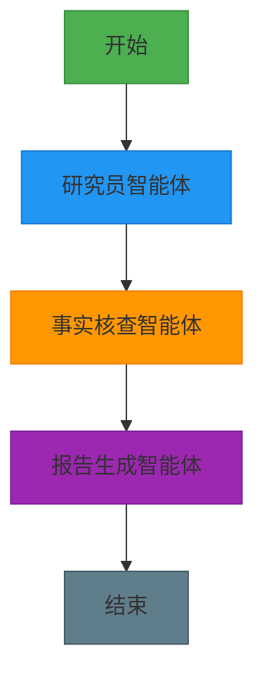
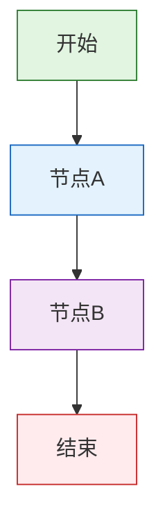
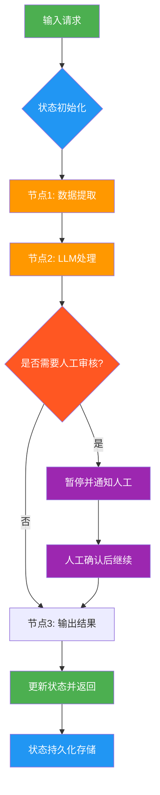
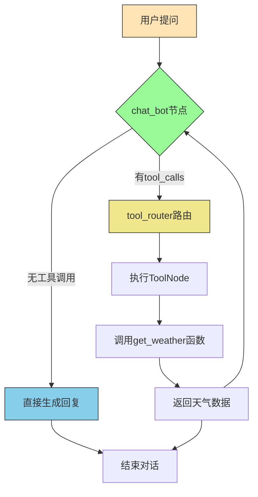
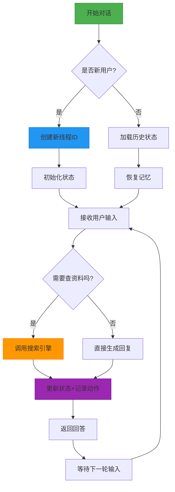

# 使用LangGraph从零构建多智能体AI系统：实现智能协作的完整指南

## 第一章. LangGraph介绍，从单智能体 到多智能体 的演进


### 1.1 、从“一个人独干(单智能体)”到“团队协作(多智能体)”的转变

以前搞AI应用，就像请了个“全能选手”——一个大模型包揽所有任务：查资料、写报告、验事实、改语法……全靠它一个人。

这听起来方便，但实际效果就像让你既当医生又当司机还兼会计——每样都能做，但哪样都不精。

而现在的趋势是：**让专业的人干专业的事**。

多智能体系统就是给AI也组建一个“专业团队”：

- 研究员智能体：专门负责找资料
- 事实核查员：专挑毛病，验证真假
- 写作助手：专注输出流畅内容
- 编辑：最后润色把关

每个AI只干自己最擅长的事，彼此配合，效率高、质量好、出错少。

打个比方：单模型像一把瑞士军刀，啥都能干；多智能体则像一套专业工具箱——螺丝刀、锤子、电钻各司其职，干活更顺手。

研究数据显示，这种分工协作的方式，在处理复杂任务时性能提升 **40%-60%**，而且更容易调试、维护和扩展。

### 1.2 一个 AI研究助手 多智能体例子

我们要做的这个AI助手，输入一个主题（比如“气候变化的影响”），它就能自动完成：

1. 拆解问题  
2. 查资料    
3. 验证信息真伪  
4. 输出一份结构清晰的研究报告

整个流程由多个AI智能体接力完成，背后靠的是 **LangGraph** 这个框架来调度协调。





### 1.3什么是 LangGraph？

 普通的 AI 智能体 应用记不住事、理不清步骤，像个没头苍蝇。

**怎么办？ 用“图”来设计 AI 流程** ：

> 把任务拆成一个个节点，用边连逻辑，靠状态存上下文。让智能体有记忆、能判断、还能断点续跑。

LangGraph 就是 **AI 的导演**，指挥模块按剧本走。

比如做个旅游助手： 问目的地 → 查天气 → 推荐穿搭 → 生成行程。

- 每一步结果都存在“状态”里，后面随时取用；

- 如果下雨，直接跳转到“提醒带伞”。

关键能力：流程清晰、状态不丢、支持循环和中断恢复。


LangGraph是LangChain团队推出的开源框架，专为构建**有状态、长时间运行**的AI工作流而生。

它不像别的工具那样,  封装太多细节.

LangGraph  给你底层控制权，像搭积木一样组装AI系统。

LangGraph 核心思想很简单：用“图”来建模AI行为，节点是动作，边是跳转逻辑，状态是记忆。

> LangGraph is a low-level orchestration framework for building, managing, and deploying long-running, stateful agents.

 

### 图结构三要素

- **节点（Nodes）**：每个节点,  是一个独立任务.  比如调用大模型、查数据库、执行工具函数。
- **边（Edges）**：每 一 边是Python函数，根据当前状态决定下一步去哪，支持条件判断和循环。
- **状态（State）**：全局共享的数据结构，记录所有关键信息，相当于AI的“短期记忆”。

有了这图结构三要素 ， 就能画出一条条清晰的执行路径，不怕逻辑混乱，也不怕断电重启丢数据。

```python
from langgraph.graph import StateGraph, END

# 示例：定义一个简单图
graph = StateGraph(dict)

def node_a(state):
    return {"value": "from A"}

def node_b(state):
    return {"value": "from B"}

graph.add_node("A", node_a)
graph.add_node("B", node_b)
graph.set_entry_point("A")
graph.add_edge("A", "B")
graph.add_edge("B", END)

app = graph.compile()
```


上面这段代码就是一个最简单的流程图：A → B → 结束。

 这是一个简单的顺序执行流程：



图结构说明：

1. **开始节点** → 由 `graph.set_entry_point("A")`设定入口
2. **节点A** → 执行 `node_a(state)`函数，返回 `{"value": "from A"}`
3. **节点B** → 执行 `node_b(state)`函数，返回 `{"value": "from B"}`
4. **结束节点** → 由 `graph.add_edge("B", END)`设定终点

 


### 1.4 LangGraph 的核心优势

LangGraph   本质是什么？  LangGraph 其实是一个 **“带记忆的、AI 任务图 、执行器”**。

更技术一点说：

它是一个**有状态、可持久化、基于图的工作流引擎**，灵感来自两种老但牛的技术：

- **数据流编程**（Dataflow Programming）：数据推着计算走

- **Actor 模型**：每个节点像个独立小演员，收到消息才行动


这就让它特别适合做复杂AI流程，比如：

- 自动规划任务
- 多Agent协作
- 出错自动重试
- 用户中途修改需求也能接得上

 

**LangGraph  的设计哲学很简单粗暴**：

> **把AI应用当成一个永远在线的“活系统”，而不是一次性的函数调用。**

你可以把它想象成一个**会记住上下文、能持续反应、还会自己做决定的智能机器人**，而不是一个“问一句答一句”的问答机。


#### LangChain 和 LangChain 的区别？

我们先来对比一下：

- **LangChain**：像是流水线工人。

  原料（输入）进来 → 经过几道工序（处理）→ 成品（输出）出去 → 完事，关机器。  下次再来？从头开始。

- **LangGraph**：像是一个值班经理，24小时在岗。

  他记得昨天客户说了啥，今天问题进展到哪了，还能根据情况叫同事帮忙、重试任务、甚至主动发消息提醒你。

  LangGraph核心是：**状态一直在线，流程可以反复跳转。**

 


### 1.5 LangGraph 的关键组件

**问题根源：**  多个AI 任务，各模块各干各的，逻辑乱、状态丢、没法 debug。

**解决思路：**  以“状态图”为核心，靠 **节点、边、状态** 三件套，构建可控可溯的工作流。

三大支柱：

- **节点（Nodes）**：执行单元，比如调大模型、查库；
- **边（Edges）**：控制流程走向，可以固定跳转，也能条件判断；
- **状态（State）**：共享内存，全程保存数据，上下文不断。

支持循环：AI 生成内容后问用户“满意吗？” 不满意就回退修改，直到通过。

支持人工干预：在流程中插入“等待确认”节点，处理完再继续。

集成 RAG，先检索再回答，不说胡话；

用 LangSmith 监控全过程，像 DevTools 一样看执行轨迹。




### 1.5 LangGraph   五大能力：


**1、状态保持、持久执行（Durable Execution）**

跑一半断电了怎么办？重头再来？那用户不得疯了？

LangGraph把每一步状态存下来，哪怕服务挂了，重启也能接着干，就像游戏存档一样靠谱。

**2、人机协同、人机协作（Human-in-the-loop）**

AI再聪明也有拿不准的时候。

这时候可以让人类插一脚，看看状态、改改参数、点个确认，然后再继续。

这种设计特别适合审批流、客服质检这类高风险场景。

**3、持久化存储、全面记忆管理（Comprehensive Memory）**

有的框架只记最近几句话，LangGraph不一样，它可以同时管：

- 短期记忆：本次会话的状态
- 长期记忆：跨会话的历史数据（结合向量库或数据库）

这就让AI不仅能“接话”，还能“认人”，提供个性化体验。

**4、调试能力（Debugging）**

复杂的AI流程就像迷宫，光看日志根本找不到问题在哪。

LangGraph配合LangSmith，能生成可视化轨迹图，每一步走到哪、状态变成啥样，清清楚楚。

**5、工具集成 & 多智能体支持**

想让AI查天气、订机票、写报告？没问题，接API就行。

而且它天生支持多个AI协同工作，比如一个负责分析，一个负责决策，一个负责汇报。

## 第二章. 使用一个LangGraph 构建基础多智能体 聊天机器人

核心痛点：想搭聊天机器人，但不会把大模型塞进一个能扩展的流程里，代码乱、状态散，没法往复杂应用走。

核心方案：用 **LangGraph** 搭个状态驱动的流水线，把大模型调用变成简单节点，实现“输入→处理→输出”的清晰控制流。

## 2.1 环境准备


做AI项目，第一步就是选个靠谱的大模型。

别一上来就烧钱，咱们先试试免费的路子。

百度千帆、通义千问、硅基流动这些平台，都有不错的国产模型可以白嫖。

**百度千帆调用**

这是目前demo里用的方式，靠 `QianfanChatEndpoint` 接入ERNIE-Speed-128K模型：


```python
import os
from langchain_community.chat_models import QianfanChatEndpoint

llm = QianfanChatEndpoint(
    model="ERNIE-Speed-128K",
    streaming=True,  # 启用流式输出
    api_key=os.getenv('QIANFAN_AK', ''),
    secret_key=os.getenv('QIANFAN_SK', '')
)
```

注册个账号，拿AK/SK密钥就能跑起来，适合新手练手。

**硅基流动调用方式**

另一个选择是硅基流动，它支持GLM、Qwen这些热门开源模型：


```python
from langchain_openai import ChatOpenAI
llm = ChatOpenAI(
    model="THUDM/glm-4-9b-chat",
    streaming=False,
    api_key=os.getenv('SILICONFLOW_API_KEY', ''), 
    base_url=os.getenv('SILICONFLOW_BASE_URL', ''),
    temperature=0.1,
)
```

换个base_url，就能当OpenAI用，兼容性好得很，迁移成本低。

**Deepseek 调用方式**

Deepseek 支持多款开源大模型（如 Deepseek-R1、Deepseek-Coder 等），且提供兼容 OpenAI API 格式的调用方式，迁移成本低，直接复用 `ChatOpenAI` 即可快速接入：


```python
from langchain_openai import ChatOpenAI
import os

# Deepseek 调用（兼容 OpenAI 接口格式）
llm = ChatOpenAI(
    model="deepseek-chat",  # 可选模型：deepseek-chat（通用）、deepseek-coder-v2（编程）等
    streaming=True,  # 支持流式输出，按需开启
    api_key=os.getenv('DEEPSEEK_API_KEY', ''),  # 从环境变量读取密钥（推荐）
    base_url="https://api.deepseek.com/v1",  # Deepseek 官方 API 基础地址
    temperature=0.7,  # 随机性调节：0~1，值越低输出越确定
    max_tokens=4096  # 单次生成最大令牌数（按需调整，不同模型上限不同）
)
```

 

**前置准备**：注册 Deepseek 账号（官网：https://www.deepseek.com/），进入「API 密钥管理」获取 `DEEPSEEK_API_KEY`，建议将密钥存入环境变量（避免硬编码），如：

```bash
# Linux/Mac
export DEEPSEEK_API_KEY="你的密钥"
# Windows（命令行）
set DEEPSEEK_API_KEY="你的密钥"
```


痛点：API 密钥写死在代码里？不安全！依赖安装慢还冲突？新手直接卡住。

解决方案：用 `uv` 快速装包，`.env` 文件管密钥，环境干净又安全，一次配好反复用。

```bash
# 安装 LangGraph 和周边依赖
uv pip install -U langgraph langchain python-dotenv typing-extensions
```

```bash
# .env 文件存密钥
DEEPSEEK_API_KEY=your_deepseek_api_key_here
```

自动加载配置，密钥不进代码，不怕泄露。

## 2.2 实现基础聊天机器人

痛点：直接调大模型？**没流程、没记忆，对话像复读机**，体验差。

解决方案：用 LangGraph 维护消息列表作为状态，串起“用户输入 → 模型回复”  的复杂路线，让对话有上下文、能连贯。

LangGraph的核心，就是把业务逻辑画成一张“流程图”。

每个节点干一件事，边来决定执行顺序。

就像工厂流水线，零件从这头进，那头出成品。


```python
from typing import Annotated

from langchain.chat_models import init_chat_model
from typing_extensions import TypedDict

from langgraph.graph import StateGraph, START
from langgraph.graph.message import add_messages

import os
from dotenv import load_dotenv

# 加载.env文件中的环境变量
load_dotenv()

class State(TypedDict):
    messages: Annotated[list, add_messages]

graph_builder = StateGraph(State)

llm = init_chat_model(
    "deepseek-chat",  # 使用DeepSeek模型
    api_key=os.environ.get("DEEPSEEK_API_KEY")
)

def chatbot(state: State):
    return {"messages": [llm.invoke(state["messages"])]}

graph_builder.add_node("chatbot", chatbot)
graph_builder.add_edge(START, "chatbot")
graph = graph_builder.compile()

def stream_graph_updates(user_input: str):
    for event in graph.stream({"messages": [{"role": "user", "content": user_input}]}):
        for value in event.values():
            print("Assistant:", value["messages"][-1].content)

while True:
    try:
        user_input = input("User: ")
        if user_input.lower() in ["quit", "exit", "q"]:
            print("Goodbye!")
            break
        stream_graph_updates(user_input)
    except KeyboardInterrupt:
        print("\nGoodbye!")
        break
```

> 一句话概括：定义状态 → 创建图 → 添加节点 → 编译运行 → 流式输出。

核心的代码如下

```

def chatbot(state: State):
    return {"messages": [llm.invoke(state["messages"])]}

graph_builder.add_node("chatbot", chatbot)
graph_builder.add_edge(START, "chatbot")
graph = graph_builder.compile()

```


## 2.3 基础聊天机器人 代码解析

痛点：LangGraph 组件太多，看不懂谁干啥，学得迷糊。

解决方案：盯死两个核心：**状态累积** 和 **流程编排**，其他都是配角。

### 1. 引入依赖

导包是第一步，为状态、模型、流程打基础。


### 2. 加载环境变量

```python
load_dotenv()
```

从 `.env` 读密钥，绝不硬编码。

### 3. 定义状态  结构 

```python
class State(TypedDict):
    messages: Annotated[list, add_messages]
```

所有消息存在一个可累加的 list 里，新消息自动追加，上下文不断。


这行代码是 **LangGraph 中定义「可自动累加对话状态」的核心语法**。专门解决之前提到的「对话历史持久化」问题 。

这行代码， 让 `messages` 字段能自动追加新消息（用户提问、AI 回复），而不是被覆盖。 

在 LangGraph 流程中，`State` 是流转的数据载体，而 `messages` 是存储「对话历史」的关键字段（比如 `[{"role": "user", "content": "你好"}, {"role": "assistant", "content": "你好！"}]`）。

这行代码的核心目的是：**让每次节点执行后，新生成的消息（如 AI 回复）自动追加到 `messages` 列表中，而非替换原有历史**，确保流程能基于完整上下文推进。

 

```python
class State(TypedDict):
    messages: Annotated[list, add_messages]
```

**1、`class State(TypedDict)`：定义强类型的状态字典**

- `TypedDict`（类型字典）：是 Python 标准库 `typing` 中的工具，用于定义「键名固定、值类型明确」的字典。作用：约束 `State` 的结构（必须有 `messages` 字段，且类型是 `list`），避免写代码时出现键名错误（如把 `messages` 写成 `message`），同时让 IDE 提供类型提示。

- 对比普通字典：如果直接用 `dict` 定义状态，无法约束字段，而 `TypedDict` 让状态结构「可预期、可校验」，是 LangGraph 推荐的状态定义方式。

  示例：符合 `State` 类型的合法数据

   

  ```python
  valid_state = {
      "messages": [
          {"role": "user", "content": "介绍 LangGraph"},
          {"role": "assistant", "content": "LangGraph 是流程编排工具"}
      ]
  }
  ```

  

2、messages: Annotated[list, add_messages] ：给  messages 字段加「自动追加规则」  add_messages。

这是关键中的关键，`Annotated` + `add_messages` 共同实现「对话历史自动累加」。

（1）`Annotated[类型, 元数据]`：Annotated给字段附加额外规则，这是 Python 3.9+ 引入的标准库工具（从typing导入），作用是「给类型添加元数据 / 规则」。

格式：

```
Annotated[基础类型, 规则1, 规则2, ...]
```

这里的「规则」会被 LangGraph 识别并生效。

这里的 `Annotated[list, add_messages]` 表示：`messages` 字段的基础类型是 `list`（存储对话消息列表），同时附加 `add_messages` 这个「特殊规则」。

（2）`add_messages`：LangGraph 定义的一个函数，是一个自定义「消息追加处理器」

- `add_messages` 是从 `langgraph.graph` 导入的核心工具（需显式导入：`from langgraph.graph import add_messages`），核心代码参考下面。
- add_messages 核心作用：自动合并「节点返回的新消息」和「原有状态中的旧消息」，具体逻辑是：
  1. 假设原有状态的 `messages` 是：`[用户提问1]`
  2. 节点函数（如之前的 `chatbot`）返回：`{"messages": [AI 回复1]}`
  3. `add_messages` 会自动将两者合并为：`[用户提问1, AI 回复1]`，并更新到新状态中
- 对比没有 `add_messages` 的情况：如果直接定义 `messages: list`，节点返回的新消息会「覆盖」原有 `messages`（原有对话历史丢失）。

LangGraph 的 `add_messages` 源码（简化后）如下 ：


```python
from typing import Any, List, Union

def add_messages(
    existing: Union[List[Any], None],  # 状态中已有的旧消息（可能为 None）
    updates: Union[List[Any], Any, None]  # 节点返回的新消息（可能是列表/单条/None）
) -> List[Any]:
    """
    合并新旧消息：旧消息列表 + 新消息（自动处理单条/列表格式）
    - 若旧消息不存在，直接返回新消息列表
    - 若新消息是单条，自动转为列表后追加
    - 若新消息为 None，返回原旧消息列表
    """
    # 初始化旧消息列表（避免 None 报错）
    current = existing.copy() if existing is not None else []
    
    # 处理新消息：统一转为列表格式
    if updates is None:
        new_messages = []
    elif isinstance(updates, list):
        new_messages = updates
    else:
        new_messages = [updates]  # 单条消息 → 列表
    
    # 合并：旧消息 + 新消息（保证顺序，不覆盖）
    return current + new_messages
```

 

 如果没有 `add_messages` 规则：

- 初始状态：`{"messages": [用户提问]}`
- 节点执行后返回：`{"messages": [AI 回复]}`
- 最终状态：`{"messages": [AI 回复]}`（用户提问被覆盖，丢失历史）

有了 `add_messages` 规则：

- 初始状态：`{"messages": [用户提问]}`
- 节点返回：`{"messages": [AI 回复]}`
- `add_messages` 自动合并：`[用户提问] + [AI 回复] = [用户提问, AI 回复]`
- 最终状态：`{"messages": [用户提问, AI 回复]}`（历史保留，后续节点可复用上下文）


这行代码的本质是：**用 `TypedDict` 约束状态结构，用 `Annotated + add_messages` 给 `messages` 字段绑定「自动追加」规则**。

最终实现「对话历史不丢失、上下文可复用」—— 这正是 LangGraph 能支持多轮对话、复杂流程的基础， 这就是提到的「不怕断电重启丢数据」（状态可持久化，历史都在 `messages` 中）。


### 状态结构的本质

传统流程像函数链：前一步输出传给下一步，**每步只能看到局部数据**。

结果？上下文断裂、逻辑难控、调试抓狂。

#### 核心解法

LangGraph 用一个**全局共享状态**，所有节点操作同一份数据。

就像工厂流水线：半成品从一站传到下一站，每一站都加工它、更新它。

```
#  错误理解：以为是函数链
def workflow():
    result1 = step1()
    result2 = step2(result1) 
    return result3(result2)

#  正确理解：是状态图
state = {"data": None}
state = node1(state)  # 每个节点都接收并返回完整状态
state = node2(state)

state = node3(state)
```

> 状态 = 公共记事本，所有人一起看、一起改。

> 不是每人一张草稿纸，最后对不上账。

#### 关键点 

- **节点不是函数，是状态转换器**：读当前状态 → 加工 → 返回新状态。
- **每一步都在提交快照**：像 Git commit，留下完整的系统瞬间。
- **状态即上下文中枢**：所有节点共用一份数据源，不丢信息，不错乱序。

LangGraph 的本质：**带记忆的自动化流水线**。  节点干活，状态流动，全程不断电。

 


### 4. 创建图构建器

```python
graph_builder = StateGraph(State)
```

初始化一个共享状态的流程图，所有节点都能看到最新消息。

这行代码是 **LangGraph 流程图的 “地基构建”**： 创建一个「绑定了状态结构」的流程图构建器。

核心作用是：明确流程图中流转的「数据格式（State）」，让后续节点、边的定义都遵循这个格式，避免数据混乱。 

先回顾代码上下文（结合之前的 `State` 定义）：


```python
# 1. 先定义状态结构（约束数据格式）
class State(TypedDict):
    messages: Annotated[list, add_messages]

# 2. 创建流程图构建器（绑定状态）
graph_builder = StateGraph(State)
```

逐部分解释：

**（1）、`StateGraph`**：

是 LangGraph 的核心类（从 `langgraph.graph` 导入），本质是「流程图构建工具」，负责管理「节点（处理步骤）」和「边（流转规则）」。

可以把它理解为「一张空白的画布」，后续的 `add_node`（加节点）、`add_edge`（加流转）都是在这张画布上画画。

**（2）、`State`**：

是我们之前定义的「强类型状态结构」（基于 `TypedDict`），明确了流程图中流转的数据必须包含 `messages` 字段，且格式是「带 `add_messages` 规则的列表」。

这里作为参数传入 `StateGraph`，表示「这张流程图的所有数据流转，都必须遵循 `State` 定义的格式」。

**（3）、`graph_builder`**：

是 `StateGraph` 类的实例（即 “构建好的空白画布”），后续所有流程图操作（加节点、加边、编译）都通过这个实例完成。

### 5. 初始化大模型

```python
llm = init_chat_model("deepseek-chat", api_key=os.environ.get("DEEPSEEK_API_KEY"))
```

接入 DeepSeek 当回答引擎，听你指挥。


### 6. 编写节点逻辑

```python
def chatbot(state: State):
    return {"messages": [llm.invoke(state["messages"])]}
```

输入当前消息，让模型生成回复，返回新消息对象。


### 7. 搭建流程图

```python
graph_builder.add_node("chatbot", chatbot)
graph_builder.add_edge(START, "chatbot")
graph = graph_builder.compile()
```

注册节点，连上起点，形成一条直线流程：问了就答。


这些代码是 **LangGraph 构建对话流程图的核心逻辑**.

核心作用是：定义一个「对话节点」，让流程从 “开始” 直接进入该节点，最终形成一个「 任务流程」（启动 → 对话 → 结束）。下面逐行拆解，结合 LangGraph 核心概念和实际作用讲清楚：

先明确两个前提

1. **State（状态）**：LangGraph 中流转的数据载体（类似 “流水线的物料”），这里的 `State` 是一个自定义数据结构（通常是字典或 Pydantic 模型），核心字段 `messages` 存储对话历史（比如用户提问、AI 回复）。
2. **llm**：之前定义的大语言模型实例（百度千帆 / 硅基流动 / Deepseek 等），负责接收对话历史并生成 AI 回复。

逐行代码解释

#### (1). 定义对话节点函数 `chatbot`

 

```python
def chatbot(state: State):
    return {"messages": [llm.invoke(state["messages"])]}
```

这是 LangGraph 的「节点函数」（节点是流程中的 “处理步骤”）.

作用是：**接收当前对话状态，调用 LLM 生成回复，更新状态并返回**。

函数参数 `state: State`：

- 接收流程中传递过来的「当前状态」，里面包含 `state["messages"]`（对话历史列表，比如 `[{"role": "user", "content": "你好"}]`）。
- 类型注解 `State` 是自定义的状态结构（确保代码规范，避免键名错误）。

核心逻辑 `llm.invoke(state["messages"])`：

- 调用 LLM 模型，传入完整的对话历史 `state["messages"]`（模型需要基于上下文生成回复，而不只是单轮提问）。
- `invoke` 是同步调用方法（如果之前开启了 `streaming=True`，这里会返回流式迭代器，需配合处理）。
- 模型返回结果是一个「AI 回复消息对象」（比如 `{"role": "assistant", "content": "你好！有什么可以帮你？"}`）。

返回值 `{"messages": [llm.invoke(...)]}`：

- LangGraph 要求节点函数返回「状态更新数据」（只需要返回要修改的字段，不需要全量状态）。
- 这里表示：将 LLM 生成的 AI 回复，添加到 `messages` 字段中（覆盖旧的 `messages`？不 ——LangGraph 会自动合并：旧 `messages` + 新 AI 回复 = 新 `messages`，具体看状态定义是否允许列表追加，默认字典结构会覆盖，实际工程中会用 `list` 追加，比如 `{"messages": state["messages"] + [llm.invoke(...)]}`，这里 demo 简化了）。

#### （2）. 向流程图添加「chatbot 节点」

```python
graph_builder.add_node("chatbot", chatbot)
```

- `graph_builder` 是 `StateGraph` 的实例（流程图构建器），负责管理节点和节点间的流转。
- add_node方法：注册一个节点到流程图中。
  - 第一个参数 `"chatbot"`：节点的「唯一标识名」（后续用这个名字指定流转关系）。
  - 第二个参数 `chatbot`：节点对应的「处理函数」（即上面定义的 `chatbot` 函数，节点被触发时会执行该函数）。

#### （3）. 定义流程的「入口节点」和「流转关系」

 `START` 是 LangGraph 内置的「起始节点」（流程的入口，类似流程图的 “开始” 符号）。

- `add_edge(START, "chatbot")`：定义一条流转规则：**流程从 START 开始后，直接进入名为 "chatbot" 的节点**。
- 这是最简单的流转关系（无分支、无条件），是线性流程的核心。

#### （4）. 编译流程图为可执行应用


```python
graph = graph_builder.compile()
```

- `compile()` 是构建器的核心方法，作用是：将前面定义的「节点」和「流转规则」，编译成一个「可执行的流程图应用」（`graph` 是编译后的实例）。

- 编译后，graph具备了「运行流程」的能力，后续可以通过graph.invoke(初始状态)启动流程，比如：

   

  ```python
  # 启动流程：传入初始对话状态（用户的第一个提问）
  result = graph.invoke({"messages": [{"role": "user", "content": "介绍一下 LangGraph"}]})
  # 输出最终状态中的 messages（包含用户提问 + AI 回复）
  print(result["messages"])
  ```

  

整个流程的执行逻辑（一句话总结）

1. 调用 `graph.invoke(初始状态)` 启动流程；
2. 流程从 `START` 节点出发，根据 `add_edge` 规则，进入 `chatbot` 节点；
3. 执行 `chatbot` 函数：读取初始状态中的用户提问 → 调用 LLM 生成回复 → 更新 `messages` 字段；
4. 由于没有定义 `chatbot` 节点之后的流转关系（比如 `add_edge("chatbot", END)`），demo 中流程会在 `chatbot` 节点执行完成后自动结束。实际工程中，会显式指定 `add_edge("chatbot", END)` 或其他节点 ；
5. 返回最终的状态（包含用户提问和 AI 回复的完整对话历史）。

核心特点 

- 「清晰执行路径」：START → chatbot → 结束，无分支、无逻辑混乱；
- 「状态可追溯」：所有对话数据都存在 `state["messages"]` 中，即使中断 / 重启，只要恢复 `state` 就能继续流程（不会丢数据）；
- 「可扩展」：后续可以添加更多节点（比如 “意图识别”“工具调用”“记忆管理”），通过 `add_edge` 定义复杂流转（比如条件分支、循环），而不需要重构核心逻辑。


### 8. 流式输出响应

```python
def stream_graph_updates(user_input: str):
    for event in graph.stream({"messages": [{"role": "user", "content": user_input}]}):
        for value in event.values():
            print("Assistant:", value["messages"][-1].content)
```

回复边生成边打印，像真人打字，体验丝滑。

这行代码是 **LangGraph 流式输出对话结果的核心函数**，核心作用是：接收用户输入，启动流程图的「流式执行」，实时捕获 AI 回复并逐段打印（而非等待完整回复生成后再输出）。 

先明确两个前提

1. **流式输出（streaming）**：LLM 生成回复时，不是一次性返回完整内容，而是「逐句 / 逐段推送」（类似 ChatGPT 的打字机效果），减少用户等待感。
2. **graph.stream()**：LangGraph 编译后的 `graph` 实例的流式执行方法，与 `graph.invoke()`（同步阻塞，等待完整结果）相对，返回的是「事件迭代器」，实时输出流程执行中的状态更新。

 非流式版本的等效代码（对比参考）：

```python
def non_stream_graph_updates(user_input: str):
    # 同步阻塞，等待完整结果
    result = graph.invoke({"messages": [{"role": "user", "content": user_input}]})
    # 打印完整回复
    print("Assistant:", result["messages"][-1].content)
```

再回到代码

```python
def stream_graph_updates(user_input: str):
    # 1. 启动流程图的流式执行，传入初始状态
    for event in graph.stream({"messages": [{"role": "user", "content": user_input}]}):
        # 2. 遍历事件中的所有节点输出（当前流程只有 chatbot 节点，所以只有一个 value）
        for value in event.values():
            # 3. 提取并打印 AI 最新回复
            print("Assistant:", value["messages"][-1].content)
```

**（1） 函数定义：`def stream_graph_updates(user_input: str):`**

函数名：`stream_graph_updates` → 语义明确：流式获取流程图的更新（即 AI 回复）。

参数 `user_input: str`：接收用户的提问（字符串类型），比如用户输入 `"介绍一下 LangGraph"`。

**（2_)  核心：`graph.stream(初始状态)` → 启动流式执行**

```python
for event in graph.stream({"messages": [{"role": "user", "content": user_input}]}):
```

`graph.stream(...)`：

- 作用：启动流程图的「流式执行」，返回一个「事件迭代器」（`event` 是迭代器的每一个元素）。
- 传入的初始状态：`{"messages": [{"role": "user", "content": user_input}]}` → 把用户输入包装成 LangChain/LLM 通用的「消息格式」（`role` 表示角色，`content` 表示内容），作为流程的起始数据。
- 流式特性：执行后不会阻塞等待完整结果，而是每生成一段 AI 回复，就产生一个 `event`，迭代器会实时返回该事件。

`for event in ...`：循环迭代流式事件.

每一个 `event` 对应「流程图中某个节点的一次状态更新」（当前流程只有 `chatbot` 节点，所以所有 `event` 都来自 `chatbot` 节点的流式输出）。

**(3) 解析事件：`for value in event.values()`**

for value in event.values():event的结构：LangGraph 的流式事件是一个「字典」，键是「节点名称」，值是「该节点的最新状态」。

- 比如当前流程中，`event` 的结构是：`{"chatbot": {"messages": [用户输入, AI 回复片段1]}}`（后续事件会是 `{"chatbot": {"messages": [用户输入, AI 回复片段1, 回复片段2]}}` 等）。

- `event.values()`：获取所有节点的最新状态（当前只有 `chatbot` 节点，所以 `values()` 只有一个元素）。
- 循环的目的：兼容多节点流程（比如后续加了「工具调用节点」，`event` 可能包含多个节点的状态，这里统一遍历解析）。

**(4) 提取并打印最新回复：`value["messages"][-1].content`**


```python
print("Assistant:", value["messages"][-1].content)
```

- `value`：即 `chatbot` 节点的最新状态（符合之前定义的 `State` 格式，包含 `messages` 字段）。
- `value["messages"]`：当前完整的对话历史（用户输入 + 已生成的 AI 回复片段）。
- `[-1]`：取列表的「最后一个元素」→ 也就是 LLM 刚刚流式推送的「最新回复片段」（因为 `add_messages` 规则，`messages` 是不断追加的，最后一个元素永远是最新的）。
- `.content`：提取消息的内容（消息对象的结构是 `{"role": "assistant", "content": "回复内容"}`，`.content` 直接获取文本）。
- 最终效果：每收到一个 AI 回复片段，就打印一次，呈现「打字机式」的实时输出。


**关键细节：为什么能实现 “实时输出”？**

1. 依赖 LLM 的 `streaming=True`：之前定义 LLM 时开启了 `streaming=True`（比如 Deepseek / 百度千帆的调用代码），LLM 才会支持流式推送回复片段。
2. 依赖 `graph.stream()`：LangGraph 会把 LLM 的流式输出「封装成事件迭代器」，确保每一个回复片段都能被实时捕获。
3. 依赖 `messages` 的追加规则：`add_messages` 确保每一个新的回复片段都追加到 `messages` 列表末尾，通过 `[-1]` 能精准取到最新片段。

对比：流式输出 vs 非流式输出

为了更直观，对比 `graph.stream()`（流式）和 `graph.invoke()`（非流式）的差异：

| 方式       | 核心函数         | 执行效果                     | 适用场景                                 |
| ---------- | ---------------- | ---------------------------- | ---------------------------------------- |
| 流式输出   | `graph.stream()` | 逐段实时打印，类似打字机     | 交互类场景（如聊天机器人），提升用户体验 |
| 非流式输出 | `graph.invoke()` | 等待完整回复生成后一次性打印 | 批量处理（如批量生成报告），无需实时交互 |


### 9. 主循环交互

```python
while True:
    try:
        user_input = input("User: ")
        if user_input.lower() in ["quit", "exit", "q"]:
            print("Goodbye!")
            break
        stream_graph_updates(user_input)
    except KeyboardInterrupt:
        print("\nGoodbye!")
        break
```

> 命令行入口，支持持续对话，按 q 或 Ctrl+C 优雅退出。


这行代码是 **对话机器人的「交互循环入口」**，核心作用是：创建一个「持续运行的命令行交互环境」，让用户能反复输入提问、接收 AI 流式回复，同时支持正常退出和异常中断，是连接用户输入与 LangGraph 流程的 “桥梁”。下面逐行拆解逻辑、循环原理和边界处理：

这行代码的本质是：**搭建一个「持续运行、支持多轮交互、优雅退出」的命令行对话入口**，将用户的手动输入转化为 LangGraph 流程的触发信号，最终实现 “用户提问 → AI 实时回复” 的完整交互闭环，是对话机器人从 “代码片段” 变成 “可使用工具” 的关键一步。 

## 2.4 运行聊天机器人

痛点：跑完不知道成没成功？一脸懵。

解决方案：运行脚本，输入问题，看到流式回复——就成了！

```bash
uv run 1-build-basic-chatbot.py
```

示例输出：

```js
User: who are you?
Assistant: I’m DeepSeek Chat, your AI assistant created by **DeepSeek**!  
```

大模型已通，基本对话能力到手。


### 小结

痛点：教程太碎，学完还是不会搭真正的 AI 应用。

解决方案：记住三个词：**状态、节点、边** —— 这就是 LangGraph 的骨架。

这个机器人虽小，五脏俱全：
- **状态**：存上下文（比如聊天记录）
- **节点**：干活的（比如调模型）
- **边**：定流程（下一步去哪）

往后要加记忆、分支、工具调用？直接往上堆就行。

 


## 第三章.  使用 Langgraph  完成工具调用

我们之前用 LangGraph 做了个聊天机器人，但它只能“空想”，没法查天气、搜资料、算数学。

现在要让它**能思考，也能动手**——比如你问“明天天气咋样？”，它会主动去“查一下”再告诉你。

 想让大 模型 查新鲜事、找实时数据？得给它接个“外挂大脑”。这外挂，就是工具（Tools）。   接上了，大模型就能上网搜、调接口、拿最新信息，不再靠死记硬背过日子。

这就叫 **工具调用（Tool Calling）**。

先给出完整可运行代码

```python
# 1. 基础依赖导入
import asyncio
from typing import Literal, List
from langchain_core.tools import tool
from langchain_core.messages import SystemMessage, HumanMessage, ToolMessage
from langchain_core.utils.function_calling import convert_to_openai_function
from langgraph.graph import StateGraph, END, MessagesState  # MessagesState是LangGraph内置的消息状态类
from langgraph.prebuilt import ToolNode
# 导入LLM（以Deepseek为例，可替换为百度千帆/硅基流动等，用法一致）
from langchain_openai import ChatOpenAI
import os

# 2. 初始化LLM（需提前配置环境变量 DEEPSEEK_API_KEY）
llm = ChatOpenAI(
    model="deepseek-chat",
    api_key=os.getenv("DEEPSEEK_API_KEY", ""),
    base_url="https://api.deepseek.com/v1",
    streaming=True,  # 支持流式输出
    temperature=0.3  # 降低随机性，让工具调用更稳定
)

# 3. 定义工具：用@tool装饰器将普通函数转为AI可识别的工具
@tool  # 核心装饰器：自动生成工具描述，供LLM判断是否调用
def get_weather(query: str) -> List[str]:
    """
    用于获取指定地区、指定时间的天气信息（工具描述很重要！LLM靠这个判断是否调用）
    :param query: 查询条件，格式示例："北京 今明两天天气"、"上海 明天是否下雨"
    :return: 天气信息列表，包含每天的天气描述
    """
    # 这里是模拟工具返回（真实场景替换为调用天气API，如高德/百度天气接口）
    if "今明两天" in query or "今天" in query or "明天" in query:
        return ["今天天气晴朗，温度20~28℃，微风", "明天天气多云转晴，温度22~30℃，南风3级"]
    elif "后天" in query:
        return ["后天天气小雨，温度18~25℃，东北风2级"]
    else:
        return [f"已查询到：{query} 的天气为晴朗，温度20~28℃（模拟数据）"]

# 工具列表：可添加多个工具（如搜索、计算等）
tools = [get_weather]

# 4. 绑定工具到LLM：告诉模型"你现在拥有这些工具"
# bind_tools：LangChain的工具绑定方法，让LLM能识别工具并生成工具调用指令
llm_with_tools = llm.bind_tools(tools)
# convert_to_openai_function：将工具转为OpenAI格式的函数描述（兼容多数LLM）
functions = [convert_to_openai_function(tool) for tool in tools]

# 5. 定义对话节点（chat_bot）：让模型判断"要不要调工具"
async def chat_bot(state: MessagesState):
    """
    核心思考节点：接收对话状态，让LLM判断是否调用工具，或直接生成回复
    :param state: 流程状态，包含messages（对话历史）
    :return: 更新后的状态（添加LLM的思考结果）
    """
    # 从状态中获取完整对话历史
    messages = state["messages"]
    
    # 调用绑定工具的LLM，关键参数说明：
    # ainvoke：异步调用（适配流式和异步流程）
    # functions：工具的OpenAI格式描述，供LLM参考
    # function_call="auto"：让LLM自主决定：直接回复 或 调用工具
    response = await llm_with_tools.ainvoke(
        messages,
        functions=functions,
        function_call="auto"
    )
    
    # 返回更新后的状态：将LLM的响应（思考结果）添加到对话历史
    return {"messages": [response]}

# 6. 定义路由节点（tool_router）：判断"下一步去哪"（分流逻辑）
def tool_router(state: MessagesState) -> Literal["tools", "__end__"]:
    """
    流程路由（类似交通交警）：根据LLM的输出，决定下一个节点
    :param state: 流程状态
    :return: 下一个节点名称（"tools" 或 END）
    """
    # 获取最新一条消息（LLM的思考结果）
    messages = state["messages"]
    last_message = messages[-1]
    
    # 关键判断：如果最新消息包含tool_calls（工具调用指令），则跳转到工具节点
    if last_message.tool_calls:
        return "tools"  # 去工具节点执行工具调用
    return END  # 没有工具调用，直接结束流程

# 7. 创建工具节点（ToolNode）：执行工具调用的"操作员"
# ToolNode是LangGraph预构建节点，功能：解析tool_calls → 调用对应工具 → 生成ToolMessage
tool_node = ToolNode(tools)

# 8. 编排完整流程（状态图）：将节点和路由串成流水线
# StateGraph(MessagesState)：创建状态图，指定状态格式为MessagesState（内置的消息列表结构）
workflow = StateGraph(MessagesState)

# 8.1 添加节点
workflow.add_node("chat_bot", chat_bot)  # 思考节点：判断是否调工具
workflow.add_node("tools", tool_node)    # 工具节点：执行工具调用

# 8.2 设置流程入口：流程从chat_bot节点开始（用户提问后先让模型思考）
workflow.set_entry_point("chat_bot")

# 8.3 定义节点流转规则
# 工具节点执行完成后，返回chat_bot节点：让模型基于工具结果生成最终回复
workflow.add_edge("tools", "chat_bot")

# 条件流转：从chat_bot节点出发，由tool_router决定下一步
workflow.add_conditional_edges(
    source="chat_bot",  # 起点：chat_bot节点
    condition=tool_router,  # 条件判断函数：tool_router
    # 无需手动映射目标节点（tool_router直接返回节点名）
)

# 8.4 编译流程：生成可执行的流程图应用
app_graph = workflow.compile()

# 9. 测试：流式运行流程（实时查看每一步输出）
async def run_streaming_demo():
    """流式运行工具调用流程，模拟用户交互"""
    # 初始对话状态：系统提示 + 用户提问
    initial_messages = [
        SystemMessage(content="你是一个智能助手，能回答问题和调用工具。"
                             "如果需要查询天气，请调用get_weather工具，不要瞎编数据。"),
        HumanMessage(content="帮我查一下深圳今明两天的天气，谢谢～")
    ]
    initial_state = {"messages": initial_messages}

    print("=== 工具调用流程启动（流式输出）===")
    print(f"User: {initial_messages[-1].content}")
    print("Assistant: ", end="", flush=True)

    # 异步流式迭代流程输出（stream_mode='messages'：按消息粒度输出，便于调试）
    async for event in app_graph.astream(initial_state, stream_mode='messages'):
        # 解析事件：LangGraph的流式事件是元组，第一个元素是消息块
        if isinstance(event, tuple):
            chunk = event[0]
            # 只打印AI的回复内容（过滤工具调用、系统消息等中间过程）
            if isinstance(chunk, HumanMessage):
                continue  # 跳过用户消息
            elif isinstance(chunk, ToolMessage):
                # 工具调用结果（用户不可见，可选打印用于调试）
                print(f"\n[调试] 工具返回结果：{chunk.content}", flush=True)
            elif chunk.type == 'AIMessageChunk':
                # 流式输出AI的最终回复（打字机效果）
                print(chunk.content, end="", flush=True)
    print("\n=== 流程结束 ===")

# 10. 运行测试（异步函数需用asyncio.run启动）
if __name__ == "__main__":
    asyncio.run(run_streaming_demo())
```

接下来，开始代码核心组件详解（按执行顺序）

## 3.1、先搞个“假”天气工具：让AI知道它能干啥

**痛点：**模型不知道自己有啥技能，就像助理没说明书，啥也不会干。

**方案：**用 `@tool` 给函数打标签，变成 AI 能识别的“工具”。

```python
 

# 3. 定义工具：用@tool装饰器将普通函数转为AI可识别的工具
@tool  # 核心装饰器：自动生成工具描述，供LLM判断是否调用
def get_weather(query: str) -> List[str]:
    """
    用于获取指定地区、指定时间的天气信息（工具描述很重要！LLM靠这个判断是否调用）
    :param query: 查询条件，格式示例："北京 今明两天天气"、"上海 明天是否下雨"
    :return: 天气信息列表，包含每天的天气描述
    """
    # 这里是模拟工具返回（真实场景替换为调用天气API，如高德/百度天气接口）
    if "今明两天" in query or "今天" in query or "明天" in query:
        return ["今天天气晴朗，温度20~28℃，微风", "明天天气多云转晴，温度22~30℃，南风3级"]
    elif "后天" in query:
        return ["后天天气小雨，温度18~25℃，东北风2级"]
    else:
        return [f"已查询到：{query} 的天气为晴朗，温度20~28℃（模拟数据）"]

# 工具列表：可添加多个工具（如搜索、计算等）
tools = [get_weather]

# 4. 绑定工具到LLM：告诉模型"你现在拥有这些工具"
# bind_tools：LangChain的工具绑定方法，让LLM能识别工具并生成工具调用指令
llm_with_tools = llm.bind_tools(tools)
# convert_to_openai_function：将工具转为OpenAI格式的函数描述（兼容多数LLM）
functions = [convert_to_openai_function(tool) for tool in tools]
  
# 7. 创建工具节点（ToolNode）：执行工具调用的"操作员"
# ToolNode是LangGraph预构建节点，功能：解析tool_calls → 调用对应工具 → 生成ToolMessage
tool_node = ToolNode(tools)
```

- `@tool`：把普通函数包装成 AI 工具

- `bind_tools`：告诉模型“你现在会这些技能”

- `ToolNode`：负责真正执行工具调用，相当于给机器人配了“工具箱 + 操作员”


**LLM 工具绑定（`bind_tools`）**

- **`llm.bind_tools(tools)`**：给 LLM “挂载” 工具，让模型知道自己拥有这些能力，能生成符合工具调用格式的指令（如`tool_calls: [{"name": "get_weather", "args": {"query": "深圳今明两天天气"}}]`）
- **`convert_to_openai_function`**：将工具转为 OpenAI 标准的函数描述格式，兼容绝大多数支持工具调用的 LLM（避免因模型格式差异导致调用失败）


**创建 工具执行节点  ToolNode** 

ToolNode  角色 是  流程的 “手脚”，负责执行工具调用的全流程（无需手动写解析逻辑）

ToolNode  内置逻辑：

1. 解析 LLM 的`tool_calls`指令（提取工具名、参数）
2. 调用对应的工具函数（如`get_weather("深圳今明两天天气")`）
3. 将工具返回结果包装为`ToolMessage`（LangChain 的工具消息类型）
4. 自动将`ToolMessage`添加到对话历史，供后续节点使用

**ToolNode 优势**：无需关心工具调用的细节（如参数解析、异常处理），LangGraph 已封装好


## 3.2、改造 chat_bot：让模型学会“要不要动手”

**痛点：**模型只会硬答，不会判断“这事我能不能办”，要么瞎编，要么说“我不知道”。

**方案：**让它输出“我要调哪个工具”，而不是直接回复。

```python


# 5. 定义对话节点（chat_bot）：让模型判断"要不要调工具"
async def chat_bot(state: MessagesState):
    """
    核心思考节点：接收对话状态，让LLM判断是否调用工具，或直接生成回复
    :param state: 流程状态，包含messages（对话历史）
    :return: 更新后的状态（添加LLM的思考结果）
    """
    # 从状态中获取完整对话历史
    messages = state["messages"]
    
    # 调用绑定工具的LLM，关键参数说明：
    # ainvoke：异步调用（适配流式和异步流程）
    # functions：工具的OpenAI格式描述，供LLM参考
    # function_call="auto"：让LLM自主决定：直接回复 或 调用工具
    response = await llm_with_tools.ainvoke(
        messages,
        functions=functions,
        function_call="auto"
    )
    
    # 返回更新后的状态：将LLM的响应（思考结果）添加到对话历史
    return {"messages": [response]}
```

关键是 `function_call="auto"`：让模型自己决定是否调工具

它不再嘴硬，而是说：“我要调 `get_weather`，参数是‘今明两天天气’”


## 3.3、加个  add_conditional_edges  条件边，实现节点路由

**痛点：**模型有时直接回，有时要调工具，系统懵了：接下来该干啥？

**方案：**加个判断器，看消息里有没有 `tool_calls`，有就调工具，没有就结束。

```python

# 6. 定义路由节点（tool_router）：判断"下一步去哪"（分流逻辑）
def tool_router(state: MessagesState) -> Literal["tools", "__end__"]:
    """
    流程路由（类似交通交警）：根据LLM的输出，决定下一个节点
    :param state: 流程状态
    :return: 下一个节点名称（"tools" 或 END）
    """
    # 获取最新一条消息（LLM的思考结果）
    messages = state["messages"]
    last_message = messages[-1]
    
    # 关键判断：如果最新消息包含tool_calls（工具调用指令），则跳转到工具节点
    if last_message.tool_calls:
        return "tools"  # 去工具节点  tool_node  执行工具调用
    return END  # 没有工具调用，直接结束流程

# 7. 创建工具节点（ToolNode）：执行工具调用的"操作员"
# ToolNode是LangGraph预构建节点，功能：解析tool_calls → 调用对应工具 → 生成ToolMessage
tool_node = ToolNode(tools)

# 8. 编排完整流程（状态图）：将节点和路由串成流水线
# StateGraph(MessagesState)：创建状态图，指定状态格式为MessagesState（内置的消息列表结构）
workflow = StateGraph(MessagesState)

# 8.1 添加节点
workflow.add_node("chat_bot", chat_bot)  # 思考节点：判断是否调工具
workflow.add_node("tools", tool_node)    # 工具节点：执行工具调用

# 条件流转：从chat_bot节点出发，由tool_router决定下一步
workflow.add_conditional_edges(
    source="chat_bot",  # 起点：chat_bot节点
    condition=tool_router,  # 条件判断函数：tool_router
    # 无需手动映射目标节点（tool_router直接返回节点名）
)

```


核心节点：`chat_bot`（思考节点）

核心节点：`tool_node`（工具节点）

路由条件：`tool_router`（分流逻辑）

**路由条件角色**：流程的 “交通警察”，解决 “下一步去哪” 的问题

**路由条件角色**：判断逻辑， 检查 LLM 的最新输出是否包含  tool_calls（工具调用指令）：

- 有 → 跳转到`tools`节点执行工具调用
- 无 → 直接结束流程（返回最终回复）

**返回值**：严格指定为`Literal["tools", "__end__"]`，确保类型安全，避免流转错误


流程编排（`StateGraph`）核心逻辑：构建 “思考→判断→执行→再思考” 的闭环：

```plaintext
入口 → chat_bot（思考）→ tool_router（判断）→ 
① 无工具调用 → 结束
② 有工具调用 → tools（执行）→ chat_bot（基于工具结果生成回复）→ 结束
```


回顾langgraph  关键 API：  

- `add_node`：添加节点（思考节点、工具节点）
- `set_entry_point`：设置流程入口（从`chat_bot`开始）
- `add_edge`：固定流转（工具执行后返回`chat_bot`）
- `add_conditional_edges`：条件流转（由`tool_router`决定下一步）


## 3.4、工具到底怎么被调的？拆开看流程

**痛点：**中间环节太多，容易断链，结果丢了都不知道。

**方案：**`ToolNode` 一把梭，  解析 → 执行 → 返回结果，全自动接回对话。

当模型输出：
```python
tool_calls=[{'name': 'get_weather', 'args': {'query': '今明两天天气'}}]
```
→ 路由发现 `tool_calls` → 跳转到 `tool_node`

→ 自动调本地方法 `get_weather()`

→ 结果作为 `ToolMessage` 写入历史

→ 再回到 `chat_bot`，模型结合真实数据生成最终回复


## 3.5 、串成完整工作流：大脑 + 手脚 合体

**痛点：**逻辑散，不成环，难维护。

**方案：**用状态图把“思考→判断→执行→再思考”串成自动流水线。

```python
workflow = StateGraph(MessagesState)

workflow.add_node("chat_bot", chat_bot)
workflow.set_entry_point("chat_bot")

workflow.add_node("tools", tool_node)
workflow.add_edge("tools", "chat_bot")

workflow.add_conditional_edges(
    "chat_bot",
    tool_router,
)

app_graph = workflow.compile()
```

>  两条路径自动切换：
- 直接回答 → 结束
- 需查数据 → 调工具 → 回模型 → 出答案

相当于给AI装上了“手脚”，从嘴炮王变实干家


## 3.6 、测试运行：看看它是怎么一步步干活的

**痛点：**看不到过程，出问题没法 debug。

**方案：**开流式输出，实时监听每一步。

```python
async def run_streaming_chain():
    messages = [
        SystemMessage(content="你是一个智能助手..."),
        HumanMessage(content="帮我查一下今明两天的天气")
    ]
  

    initial_state = {"messages": messages}
  

    async for event in app_graph.astream(initial_state, stream_mode='messages'):
        if isinstance(event, tuple):
            chunk = event[0]
            if chunk.type == 'AIMessageChunk':
                print('event里监听到的流式输出------>', chunk.content)
```

`stream_mode='messages'`：逐字打印输出，调试神器


## 3.7、自验证：看看结果长啥样

**痛点：**用户以为模型“天生就知道”，根本看不出用了工具。

**方案：**通过日志看清全过程：指令 → 执行 → 回复。

用户输入：

> 帮我查一下今明两天的天气

模型第一步不是回答，而是发指令：
```python
last_message.tool_calls ------> 
[{'name': 'get_weather', 'args': {'query': '今明两天天气'}, ...}]
```

→ 触发工具 → 获取真实数据 → 模型整合输出：

> “好的，我来帮您查询一下。经过查询，今天天气晴朗，温度20度，明天天气多云，温度25度……”

>  用户无感，但背后已完成一次“AI + 工具”的协同作业


### 核心流程图



>  两条路自动走：能干就干，不能就调工具，全程无人干预


### 总结：工具调用核心五步

| 步骤 | 组件 | 干啥用 |
|------|------|--------|
| 1. 定义工具 | `@tool` | 把函数变成 AI 能调的“能力” |
| 2. 绑定工具 | `bind_tools()` | 告诉模型：“你现在有这技能” |
| 3. 判断是否调 | `tool_router` | 看有没有 `tool_calls`，决定走哪条路 |
| 4. 执行工具 | `ToolNode` | 自动跑函数，拿结果回来 |
| 5. 整合回复 | 回到 `chat_bot` | 模型基于真实数据生成人话 |

>  从此，机器人从“只会说”升级为“又能说又能做”

可接入数据库、搜索、计算器……想连啥连啥。

 

## 第四章： 为langgraph应用 添加记忆功能

 在写聊天机器人时，没有记忆就像金鱼，游两下就忘了自己是谁。

咱们上一节给机器人装了工具，能查资料、能干活，但它还是记不住聊过啥。

这不行啊，用户说一遍名字，下次还得重新介绍，体验直接掉地上。

所以这一节，咱给它加上“脑子”，让它记住对话历史，真正实现多轮连贯交流。


### 4.1. 添加记忆功能

加记忆功能，不需要额外装包，LangGraph 自带这个本事。

它用的是 `langgraph.checkpoint.memory` 模块里的 `MemorySaver`，说白了就是个内存快照工具。

每次对话一结束，它就把当前状态拍个照存起来，下次接着用。

开发阶段用它正合适，简单又省事，就跟手机临时存图一样。

#### 解决方案：

用 LangGraph 的 `MemorySaver` 当临时笔记本，自动存对话记录。  靠 `thread_id` 区分不同用户，互不串台。

LangGraph 自带 `MemorySaver`  它就像一个会自动记笔记的助理：每次聊完记一笔，下次见你先翻本子再开口。

#### 怎么加记忆？三步搞定：

**（1）定义状态：消息列表支持累积**

```python
class State(TypedDict):
    messages: Annotated[list, add_messages]
```
> `add_messages` 是关键：新消息不是覆盖，而是追加到历史里，上下文不断档。

**（2）创建 MemorySaver，当内存记事本**

```python
memory = MemorySaver()
```

**（3）编译图时传 checkpointer，开启自动保存**

```python
graph = graph_builder.compile(checkpointer=memory)
```

每次对话结束，系统自动拍个“状态快照”存进去，下次按 `thread_id` 找回来继续聊。


#### 多人聊天不串台？靠 thread_id

每个用户分配唯一 `thread_id`，相当于独立聊天室：

```python
config = {"configurable": {"thread_id": "1"}}
```

- 用户A用 `"1"`，B用 `"2"` → 各聊各的，不干扰

- 回到 `"1"` → 记忆还在，接着上次聊

注意：开发阶段 用 `MemorySaver`（内存存储），重启就丢。生产建议换 `SqliteSaver` 或数据库持久化。：


### 4.2 使用记忆增强聊天机器人

新建一个文件叫 `3-add-memory.py`，开始搞有记忆的机器人。

```python
"""LangGraph 教程: 添加记忆功能的聊天机器人

本示例展示了如何使用 LangGraph 的检查点功能为聊天机器人添加记忆功能，
使其能够记住对话历史并在多轮对话中保持上下文。
"""

from typing import Annotated

from langchain.chat_models import init_chat_model
from langchain_tavily import TavilySearch
from langchain_core.messages import BaseMessage
from typing_extensions import TypedDict

# 导入 MemorySaver 用于实现记忆功能
from langgraph.checkpoint.memory import MemorySaver
from langgraph.graph import StateGraph
from langgraph.graph.message import add_messages
from langgraph.prebuilt import ToolNode, tools_condition

import os
from dotenv import load_dotenv

# 加载.env文件中的环境变量
load_dotenv()

# 定义状态类型，使用 add_messages 注解来自动合并消息列表
class State(TypedDict):
    messages: Annotated[list, add_messages]  # 消息列表将使用 add_messages reducer 自动合并


# 初始化 DeepSeek 聊天模型
llm = init_chat_model(
    "deepseek-chat",  # 使用DeepSeek模型
    api_key=os.environ.get("DEEPSEEK_API_KEY")  # 从环境变量中获取API密钥
)

# 创建状态图构建器
graph_builder = StateGraph(State)

# 初始化Tavily搜索工具
print("\n初始化Tavily搜索工具...")
tool = TavilySearch(max_results=2)  # 设置最多返回2个搜索结果
tools = [tool]

# 将工具绑定到LLM
llm_with_tools = llm.bind_tools(tools)

# 定义聊天机器人节点函数
def chatbot(state: State):
    """LLM节点函数，处理用户输入并生成响应"""
    return {"messages": [llm_with_tools.invoke(state["messages"])]}

# 添加聊天机器人节点
graph_builder.add_node("chatbot", chatbot)

# 添加工具节点
tool_node = ToolNode(tools=[tool])
graph_builder.add_node("tools", tool_node)

# 添加条件边
graph_builder.add_conditional_edges(
    "chatbot",
    tools_condition,
)
# 工具调用完成后，返回到聊天机器人节点
graph_builder.add_edge("tools", "chatbot")
graph_builder.set_entry_point("chatbot")

print("\n构建图并添加记忆功能...")

# 创建内存保存器
print("\n创建 MemorySaver 实例作为检查点保存器...")
memory = MemorySaver()  # 在内存中保存状态，适用于开发和测试

# 使用内存保存器编译图
print("使用检查点保存器编译图...")
graph = graph_builder.compile(checkpointer=memory)  # 将内存保存器传递给图

# 打印图结构
print("\n图结构如下：")
print(graph.get_graph().draw_mermaid())

# 定义对话线程ID
print("\n设置对话线程 ID = '1'...")
config = {"configurable": {"thread_id": "1"}}  # 使用线程ID来标识和区分不同的对话

# 示例 1: 第一次对话
print("\n示例 1: 第一次对话 - 用户介绍自己")
user_input = "Hi there! My name is Will."
print(f"\n用户输入: '{user_input}'")

# 注意: config 是 stream() 函数的第二个参数!
print("使用线程 ID '1' 调用图...")
events = graph.stream(
    {"messages": [{"role": "user", "content": user_input}]},
    config,  # 传递包含 thread_id 的配置
    stream_mode="values",
)

print("\n助理回应:")
for event in events:
    event["messages"][-1].pretty_print()  # 打印助理的回应

# 示例 2: 测试记忆功能
print("\n\n示例 2: 第二次对话 - 测试记忆功能")
user_input = "Remember my name?"
print(f"\n用户输入: '{user_input}'")

# 使用相同的线程ID再次调用图
print("使用相同的线程 ID '1' 再次调用图...")
events = graph.stream(
    {"messages": [{"role": "user", "content": user_input}]},
    config,  # 使用相同的配置，图将加载之前保存的状态
    stream_mode="values",
)

print("\n助理回应 (应该记得用户名字):")
for event in events:
    event["messages"][-1].pretty_print()

# 示例 3: 新对话线程
print("\n\n示例 3: 新对话线程 - 测试线程隔离")
print("创建新的线程 ID = '2'...")

# 使用不同的线程ID
print("使用新的线程 ID '2' 调用图...")
events = graph.stream(
    {"messages": [{"role": "user", "content": user_input}]},
    {"configurable": {"thread_id": "2"}},  # 使用新的线程ID
    stream_mode="values",
)

print("\n助理回应 (不应该记得用户名字):")
for event in events:
    event["messages"][-1].pretty_print()

# 示例 4: 返回第一个线程
print("\n\n示例 4: 返回第一个线程 - 验证记忆持久性")
print(f"\n用户输入: '{user_input}'")

# 再次使用第一个线程ID
print("再次使用线程 ID '1' 调用图...")
events = graph.stream(
    {"messages": [{"role": "user", "content": user_input}]},
    config,  # 使用原始线程ID
    stream_mode="values",
)

print("\n助理回应 (应该仍然记得用户名字):")
for event in events:
    event["messages"][-1].pretty_print()
```


### 4.3 代码解析


#### 关键改动点

```python
from langgraph.checkpoint.memory import MemorySaver
```

这是新加的核心依赖，相当于给机器人配了个“小本本”。

以前每次对话都像第一次见面，现在它会翻本本看看你们之前聊了啥。

```python
memory = MemorySaver()
graph = graph_builder.compile(checkpointer=memory)
```

这两行是关键操作：

第一行，创建一个内存记录员；

第二行，把这个记录员塞进图里，让它自动拍照存档每一步状态。

只要你不关服务，它就能一直记住。

> 生产环境别用这个，得换成数据库版的 `SqliteSaver` 或 `PostgresSaver`，不然重启就全丢了。

```python
config = {"configurable": {"thread_id": "1"}}
```

这个 `thread_id` 就像是对话身份证。  同一个 ID，读的是同一份记忆；换个 ID，就是全新对话。

多用户场景下，靠它实现隔离，不会张冠李戴。

```python
events = graph.stream(..., config, stream_mode="values")
```

注意啊，`config` 是第二个参数，位置不能错。

传进去之后，图就知道该去哪找之前的快照，而不是从头开始。


### 4.4 运行聊天机器人

运行命令：

```bash
uv run 3-add-memory.py
```

你会看到输出长这样：

```js
设置对话线程 ID = '1'...

示例 1: 第一次对话 - 用户介绍自己

用户输入: 'Hi there! My name is Will.'
...
Assistant:
Hi Will! It's great to meet you. How can I assist you today?

示例 2: 第二次对话 - 测试记忆功能

用户输入: 'Remember my name?'
...
Assistant:
Of course, Will! I’ll remember your name for the rest of our conversation.

示例 3: 新对话线程 - 测试线程隔离

用户输入: 'Remember my name?'
...
Assistant:
I don’t have the ability to remember personal details like names between interactions.

示例 4: 返回第一个线程 - 验证记忆持久性

用户输入: 'Remember my name?'
...
Assistant:
Got it, Will! I’ll keep your name in mind while we chat.
```

你看：

- 同一个线程 ID，第二次还能叫出“Will”；
- 换个 ID，立马变脸不认人；
- 回到原来的 ID，记忆还在，没丢。

这就是线程级记忆的威力。

### 4.5   LangGraph 中 thread_id（线程 ID）

在 LangGraph 中，**thread_id（线程 ID）的隔离能力核心依赖「检查点（Checkpointer）」的状态分区机制**—— 

简单说：`thread_id` 是状态的「唯一索引」，不同 `thread_id` 对应独立的对话状态存储，彼此互不干扰。


简单记：**LangGraph 的 thread_id 管 “对话记忆”，理论上叫做memory_id，和 Python  “并发干活”的线程 ID  ，八竿子打不着**。


#### （1）先明确memory_id核心前提

要理解隔离，先搞懂两个关键概念：

1. **检查点（Checkpoint）**：LangGraph 中用于「持久化存储对话状态」的核心机制，本质是「状态快照」—— 每次流程执行后，会把最新的 `state`（比如 `messages` 对话历史）保存起来，下次执行时可恢复。
2. **thread_id（理论的memory_id）**：给「每一组独立对话」分配的唯一标识，相当于对话的「身份证」，用于区分不同用户 / 不同会话的状态。

#### （2）隔离的核心原理：`thread_id` 作为状态的「隔离键」

LangGraph 的 `Checkpointer`（这里用的是 `MemorySaver`）会把所有对话状态，按照 `thread_id` 进行「分区存储」—— 不同 `thread_id` 的状态存在完全独立的「命名空间」里，彼此不会覆盖或混淆。

可以把它想象成「文件柜」：

- `Checkpointer` = 一个文件柜
- `thread_id` = 文件柜里的「抽屉编号」
- 每个抽屉（`thread_id`）里存放对应对话的状态（`messages` 等）
- 打开抽屉时，只能看到当前 `thread_id` 下的文件（状态），看不到其他抽屉的内容

关键逻辑：状态的「存储」与「读取」都绑定 `thread_id`

1. **存储时**：流程执行后，`Checkpointer` 会把更新后的 `state` 与传入的 `thread_id` 绑定，存入对应分区；
2. **读取时**：下次调用流程传入相同 `thread_id`，`Checkpointer` 会自动加载该分区下的历史状态，继续推进对话；
3. **隔离时**：不同 `thread_id` 对应不同分区，加载状态时只会读取自己分区的内容，自然实现隔离。

#### （3）核心组件：`MemorySaver` 如何实现分区存储？

代码中用的 `MemorySaver` 是 LangGraph 提供的「内存级检查点实现」（适用于开发测试），其内部维护了一个「字典结构」，专门用于按 `thread_id` 分区存储状态。

`MemorySaver` 的简化内部逻辑（伪代码）

 

```python
class MemorySaver:
    def __init__(self):
        # 核心存储结构：key=thread_id，value=该线程的最新状态（checkpoint）
        self.storage = {}

    # 保存状态：绑定 thread_id
    def save_checkpoint(self, thread_id, state):
        self.storage[thread_id] = state  # 按 thread_id 存入对应键值对

    # 读取状态：按 thread_id 提取
    def get_checkpoint(self, thread_id):
        return self.storage.get(thread_id, None)  # 只返回当前 thread_id 的状态
```

结合 的代码看：

- 当 传入 `config = {"configurable": {"thread_id": "1"}}` 时，`MemorySaver` 会把对话状态存入 `self.storage["1"]`；
- 后续传入相同 `thread_id="1"`，会读取 `self.storage["1"]` 中的历史状态（比如第一次对话的 `Hi there! My name is Will.`）；
- 当传入 `thread_id="2"` 时，会读取 `self.storage["2"]`（初始为空，所以不记得名字）。

#### (4)、完整执行流程：用你的代码示例验证隔离逻辑

以你代码中的 4 个示例为例，一步步看 `thread_id` 如何隔离：

示例 1：第一次对话（thread_id="1"）

1. 传入 `config={"configurable": {"thread_id": "1"}}` 和用户输入 `Hi there! My name is Will.`；
2. `graph.stream()` 启动流程，`Checkpointer` 检查 `thread_id="1"` 的存储：无历史状态；
3. 执行 `chatbot` 节点，生成回复（比如 `Hello Will! Nice to meet you!`）；
4. `Checkpointer` 把更新后的 `state`（包含用户输入 + AI 回复）存入 `storage["1"]`；
5. 输出回复，流程结束。

示例 2：测试记忆（thread_id="1"）

1. 传入相同 `config`（`thread_id="1"`）和用户输入 `Remember my name?`；
2. `Checkpointer` 读取 `storage["1"]` 中的历史状态（包含第一次的对话）；
3. `chatbot` 节点基于历史状态生成回复（`Yes! Your name is Will.`）；
4. 更新后的状态（追加本次对话）再次存入 `storage["1"]`；
5. 输出回复，记忆生效。

示例 3：新线程（thread_id="2"）

1. 传入 `config={"configurable": {"thread_id": "2"}}` 和用户输入 `Remember my name?`；
2. `Checkpointer` 检查 `storage["2"]`：无历史状态（新线程）；
3. `chatbot` 节点没有历史上下文，生成回复（`I don't think we've met before. Could you tell me your name?`）；
4. 状态存入 `storage["2"]`；
5. 输出回复，实现隔离（不记得名字）。

示例 4：返回旧线程（thread_id="1"）

1. 再次传入 `thread_id="1"`，`Checkpointer` 读取 `storage["1"]` 中的历史状态（包含前两次对话）；
2. `chatbot` 节点基于历史状态，仍然记得名字，生成正确回复；
3. 验证记忆持久性和隔离性。

#### (4)、关键细节：为什么必须通过 `config` 传入 `thread_id`？

LangGraph 中，`config` 是「流程配置的统一入口」，`configurable` 字段用于传递「可配置的全局参数」，其中 `thread_id` 是 LangGraph 约定的「状态隔离关键字」—— 只有通过 `config={"configurable": {"thread_id": "xxx"}}` 传入，`Checkpointer` 才能识别并用于状态分区。

如果不传入 `thread_id`：

- `Checkpointer` 会使用默认的 `thread_id`（通常是一个随机值或固定值）；
- 所有对话会共享同一个状态，无法实现隔离（比如新用户会看到上一个用户的对话历史）。

#### (6)、生产环境扩展：除了 MemorySaver，还有哪些 Checkpointer？

`MemorySaver` 是内存级实现，程序重启后状态会丢失，适用于开发测试。

生产环境中，为了实现「持久化隔离」，可以使用以下 `Checkpointer`：

1. **`RedisSaver`**：基于 Redis 存储状态，支持分布式部署，`thread_id` 作为 Redis 的 key；
2. **`SQLiteSaver`**：基于 SQLite 数据库存储，适合轻量生产环境；
3. **`PostgresSaver`**：基于 PostgreSQL 数据库存储，适合大规模生产环境。

它们的隔离原理完全一致 —— 都是以 `thread_id` 作为「隔离键」，只是存储介质不同，确保不同对话的状态独立存储。

#### (7)、核心总结

`thread_id` 的隔离能力，本质是「Checkpointer 按 thread_id 分区存储对话状态」：

1. `thread_id` 是对话的唯一标识，作为状态存储的「分区键」；
2. `Checkpointer`（如 `MemorySaver`）内部维护按 `thread_id` 划分的存储结构；
3. 相同 `thread_id` 复用历史状态，不同 `thread_id` 从零开始，实现完全隔离；
4. 隔离的核心价值：支持多用户 / 多会话同时使用，彼此不干扰，且能保持各自的对话上下文。

这种设计让 LangGraph 能够轻松支持「多用户聊天机器人」「会话级记忆」等场景，是生产级对话系统的核心能力之一。

#### (8)、这个thread_id（线程 ID） 和 python的线程id 有关系吗

**完全没有关系**！这是两个名字碰巧都带 “线程”，但语义、作用、实现逻辑完全独立的概念 —— 可以理解为 “同名不同姓”，毫无关联。

下面用表格和通俗解释，帮你彻底分清：

| 对比维度     | LangGraph 的 `thread_id`（对话线程 ID）                      | Python 的 `threading.Thread.ident`（系统线程 ID）            |
| ------------ | ------------------------------------------------------------ | ------------------------------------------------------------ |
| **核心作用** | 区分「不同的对话会话」，实现对话状态隔离（记忆隔离）         | 区分「操作系统中的执行线程」，实现并发任务调度               |
| **本质**     | 对话的「唯一标识 / 身份证」（字符串 / 数字均可）             | 操作系统分配给线程的「执行单元编号」（整数）                 |
| **使用场景** | 多用户 / 多会话聊天机器人（比如用户 A 和用户 B 的对话互不干扰） | Python 程序中并发执行多个任务（比如同时下载文件 + 处理数据） |
| **存储关联** | 与 LangGraph 的 `Checkpointer`（状态存储）绑定，用于分区存储对话历史 | 与操作系统的线程调度器绑定，用于标识执行上下文               |
| **生命周期** | 随对话存在（可手动指定，比如 `thread_id="user_123"` 可长期有效） | 随 Python 线程启动而创建，线程结束而销毁                     |
| **示例取值** | `"1"`、`"user_888"`、`"session_xyz"`（自定义字符串 / 数字）  | `140703324567360`（操作系统分配的整数，不可自定义）          |

通俗解释：两个 “线程” 的本质区别

1. LangGraph 的 `thread_id`：对话的 “专属文件夹”

- 它不是 “执行任务的线程”，而是「对话会话的唯一标识」。
- 类比：你在聊天软件上和 A 朋友、B 朋友的对话，会存在两个独立的 “聊天窗口”（文件夹），`thread_id` 就是这两个窗口的编号 —— 确保你和 A 的聊天记录不会出现在和 B 的窗口里。
- 核心：**用于 “数据隔离”（对话状态 / 记忆隔离）**。

2. Python 的线程 ID：程序的 “干活工人编号”

- 它是操作系统层面的「执行单元标识」，对应一个 “干活的工人”。
- 类比：你让程序同时 “下载文件” 和 “处理数据”，操作系统会分配两个 “工人”（线程），每个工人有唯一编号（线程 ID），负责独立完成任务，互不干扰。
- 核心：**用于 “并发执行”（任务调度隔离）**。

代码层面的直观对比

（1）LangGraph 的 `thread_id`（对话隔离）


```python
# 两个不同的对话会话，用 thread_id 隔离
config_user_a = {"configurable": {"thread_id": "user_a"}}  # 用户A的对话标识
config_user_b = {"configurable": {"thread_id": "user_b"}}  # 用户B的对话标识

# 两个会话的状态独立存储，互不干扰
graph.stream({"messages": [{"role": "user", "content": "我是A"}]}, config_user_a)
graph.stream({"messages": [{"role": "user", "content": "我是B"}]}, config_user_b)
```

（2）Python 的线程 ID（并发执行）


```python
import threading

def task(name):
    # 获取当前 Python 线程的 ID（操作系统分配）
    print(f"任务 {name} 运行在 Python 线程 ID: {threading.get_ident()}")

# 启动两个并发线程，各自有独立的线程 ID
thread1 = threading.Thread(target=task, args=("下载文件",))
thread2 = threading.Thread(target=task, args=("处理数据",))

thread1.start()  # 输出：任务 下载文件 运行在 Python 线程 ID: 140703324567360
thread2.start()  # 输出：任务 处理数据 运行在 Python 线程 ID: 140703324567361
```

关键结论

1. 两者**无任何技术关联**：LangGraph 的 `thread_id` 是 LangGraph 框架自定义的「对话标识」，Python 的线程 ID 是操作系统分配的「执行单元标识」；
2. 作用完全不同：一个管「对话数据隔离」（记忆不混淆），一个管「程序并发执行」（任务不干扰）；
3. 可以叠加使用：比如用 Python 多线程同时处理 100 个用户的对话，每个用户的对话用独立的 `thread_id` 隔离状态 —— 此时 Python 线程 ID 是 “工人编号”，LangGraph 的 `thread_id` 是 “每个工人处理的对话文件夹编号”，互不冲突。

简单记：**LangGraph 的 thread_id 管 “对话记忆”，Python 的线程 ID 管 “并发干活”，八竿子打不着**。


### 4.6 小结

没记忆的AI，就像断片的人，聊一句忘一句。

加了 `MemorySaver`，它就开始记事了，能维持上下文，像个正常人聊天。

我们用了三个核心东西：

一是 `MemorySaver`，内存存状态，开发够用；

二是 `thread_id`，区分不同用户的对话流；

三是 `checkpointer`，让图自动保存和恢复。

这三个组合起来，才算真正迈进了多轮对话的大门。

面试官要是问你怎么做上下文管理，你就拿这套流程怼上去。

> 流程：读历史 → 推理 → 工具调用 → 保存状态。一次完整带记忆的交互。

 

### 第四章小节：LangGraph总结与展望

通过这个教程，我们从零造出一个能聊、能查、能记事的聊天机器人。

一开始它只会回话，后来学会了查资料、记事情，还能同时跟好几个人聊不串台。

整个过程像搭积木，一步接一步，核心靠的就是 **LangGraph** —— 它像个智能调度员，把各个功能串起来，让机器人真正“活”了起来。


###  LangGraph 五件事 小节 


我们搞清了五件事：

1. **LangGraph 是怎么工作的？**

   对话像流水线，每个环节是“节点”（比如理解问题、调工具），用“边”连执行顺序，“状态”带着数据一路传。结构清晰，逻辑可控。

2. **上下文怎么记住？**

   用户说“改成后天”，机器人得知道改的是之前的订票。靠统一的状态管理，每次更新“记忆容器”，让它像人一样记得前因后果。

3. **怎么让它会用工具？**

   遇到不会的问题，就去搜——我们接了搜索引擎。只要提前配置：“这类问题找这个工具”，它就能主动动手解决。

4. **跨会话记忆怎么实现？**

   第一次说“我叫小王”，下次还能认出你。不是魔法，是给每个用户存独立状态，相当于给机器人配了个小本本，见面就翻记录。

5. **多人聊天不串台？**

   靠“线程ID”区分不同用户。系统按ID加载对应状态，就像服务员看号码牌服务，张三的问题不会被李四听到。



> 图解：识别身份 → 加载记忆 → 判断是否需查资料 → 更新状态并回复。颜色代表：初始化（绿）、线程处理（蓝）、工具执行（橙）、状态操作（紫），数据流向一目了然。


### 4.6 LangGraph 展望

痛点：现在机器人还是“本地玩具”：记忆一重启就丢、不能协作、也没安全机制，离上线还差得远。


以 LangGraph 状态机为核心，扩展持久化、协同和人工干预能力，升级成可落地的AI系统。


下一步可以深挖这些方向：

1. **长期记忆落地**

   当前状态存在内存里，重启全丢。应该接入 Redis 或 PostgreSQL，实现持久存储——把便签本换成保险柜。

2. **关键操作让人把关**

   转账、发布等敏感操作，不让AI自己决定。流程暂停，等人确认再继续，实现“人在回路”的安全兜底。

3. **多个AI组队干活**

   一个干不过来？那就组团。比如一个接待、一个查资料、一个写报告。用 LangGraph 编排多个智能体协作，打造“AI员工团队”。

4. **对话支持“撤销”**

   借助完整状态快照，能回到任意时刻，查看或修改中间步骤。就像加了个“Ctrl+Z”，调试优化超方便。

5. **上生产环境扛高并发**

   本地跑得好，线上可能崩。要结合检查点 + 容器化部署，加上监控、容错、负载均衡，才能撑住真实流量。


LangGraph 正在飞速进化，功能越来越多。但万变不离其宗：**用状态机管理AI流程**。掌握了这一点，你就拿到了构建高级AI系统的钥匙。

不管你是做企业客服、办公助手，还是玩AI项目，这套方法都通用。大模型越强，越需要有人来组织和调度它们——谁掌握编排，谁就掌握未来。


## 第五章：langgraph 常见陷阱和解决方案


### 5.1. 工具调用失败？三个坑别踩

**问题在哪？**LLM 没调工具，或参数乱传，功能直接“瘫痪”。

**怎么解决？**记住三件事：

- 要绑定：`llm.bind_tools(tools)` 必须接返回值；

- 要传参：工具函数只收基本类型（如 `content: str`），别传整个 state；

- 要保留消息链：返回时带上 `messages=[generation]`，让后续能看到调用指令。

```python
# 正确绑定
llm_with_tools = llm.bind_tools(tools)

# 返回完整消息链
def generate_response(state):
    generation = llm_with_tools.invoke([...])
    return {
        "generation": generation.content,
        "messages": [generation]  #  包含tool_calls
    }

# 工具函数只接收简单参数
@tool
def good_tool(content: str) -> dict:
    pass
```


### 5.2. 状态数据丢了？别乱覆盖！

**问题在哪？**  一更新状态，别的字段变 None？你可能“顺手删了”不该删的。

**怎么解决？**只返回你要改的字段！  就像换灯泡，不用拆房子。

```python
#  错误：清空了其他字段
def bad_node(state):
    return {
        "field_a": "new_value",
        "field_b": None  #  这会覆盖原有值
    }

#  正确：只更新需要的
def good_node(state):
    return {
        "field_a": "new_value"  # 其他字段原样保留
    }
```


### 5.3. 对话历史没了？别手动替换！

**问题在哪？**

AI 忘事？因为你把 `messages` 列表整个替换了，历史全丢。

**怎么解决？**

不要赋新列表，而是“追加”消息。

只要字段用了 `Annotated[..., add_messages]`，框架自动帮你接在后面。

```python
#  错误：清空历史
def bad_node(state):
    new_message = AIMessage(content="回答")
    return {"messages": [new_message]}  #  历史没了

#  正确：自动追加
def good_node(state):
    new_message = AIMessage(content="回答")    

    return {"messages": [new_message]}  #  接到末尾
```

> 就像微信群聊，你是发一条新消息，不是把聊天记录全删了重写。


### 5.4：如何调试和诊断


#### 1. 状态追踪：出问题？先打印看看

**问题在哪？**

不知道状态哪一步变了，查 bug 全靠猜。

**怎么解决？**   加个打印节点，进来看输入，出去看输出，一目了然。

```python
def debug_node(state):
    print(f"进入节点时的状态: {state}")
    result = {"new_field": "value"}
    print(f"节点返回: {result}")
    return result
```

复杂流程建议临时加几个，跑一遍就知道卡在哪。


#### 2. 工具没调用？先看 LLM 有没有“想调”

**问题在哪？**

工具没反应，到底是模型没决策，还是后续断了？

**怎么解决？**

第一步：打印生成结果，看有没有 `tool_calls`。

没有？说明 AI 根本没打算调——要么 prompt 不够强，要么工具描述太模糊。

```python
def generate_response(state):
    generation = llm_with_tools.invoke([...])
    print(f"LLM回复内容: {generation.content}")
    print(f"是否有工具调用: {hasattr(generation, 'tool_calls')}")
    if hasattr(generation, 'tool_calls'):
        print(f"工具调用详情: {generation.tool_calls}")
    return {"generation": generation.content, "messages": [generation]}
```


#### 3. 流程卡住了？检查图结构！

**问题在哪？**跑着跑着不动了？可能是节点连错了，或者成了“孤岛”。

**怎么解决？**

上线前做一次图连通性检查：

- 每个节点都有入口（除了起点）

- 每个节点都有出口（除了终点）

- 没有孤立无用的节点

```python
def validate_graph(): 

    # 检查边是否连对

    # 确保无断路、无悬空节点  

    pass
```

就像电路通电前测通断——提前发现90%的硬伤。


## 第六章：为什么 需要 多智能体？


**问题来了：单个AI搞不定复杂任务，怎么办？**

别再指望一个AI“全能通吃”。

现实是：它容易瞎编、没依据、逻辑漏洞多。就像让一个人干整个团队的活，结果只能是凑合。

那怎么破？  上**多智能体**——让多个AI分工协作，像专业团队一样干活。


#### 1. 技术成熟了，搭智能体像搭积木

以前搞多智能体，通信、调度、容错全得自己写，太难。

现在有 **LangGraph 这类框架**，流程编排几行代码搞定。

```python
# 定义一个简单的agent流程
from langgraph.graph import StateGraph, END

def agent_node_1(state):
    return {"result": "任务1完成"}

def agent_node_2(state):
    return {"result": "任务2完成"}

workflow = StateGraph(dict)
workflow.add_node("node1", agent_node_1)
workflow.add_node("node2", agent_node_2)
workflow.set_entry_point("node1")
workflow.add_edge("node1", "node2")
workflow.add_edge("node2", END)

app = workflow.compile()
```
（几行代码定义多个agent协作流程）

**效果：原来几周的开发，现在几小时跑通。多智能体从实验室走进项目实战。**


#### 2. 用户要的是靠谱答案，不是瞎猜

用户问：“分析这个财报”，你给一段胡扯的总结？不行。

要用**多智能体流水线**：
- 研究员查数据
- 分析师做解读
- 校对员验逻辑

输出一份带引用、结构清、可追溯的专业报告。这才是“真靠谱”。


#### 3. 未来属于“AI会诊”模式

单个AI闭门造车，容易错、没多样性。

未来的AI是怎么工作的？——**一群专家开会决策**。

一个提方案，一个挑毛病，一个综合拍板。

就像医院会诊，集体智慧更可靠。

这不是科幻，是正在发生的现实。

 


## 第七章（大实操）：使用LangGraph从零构建多智能体AI系统：实现智能协作的完整指南


尼恩团队即将推出， 基于langgraph的java 运维智能体， 包括 智能日志分析agent， 智能bug 定位agent， 智能指标分析agent

 在当今快速发展的AI领域，单一的大语言模型（LLM）已经难以满足复杂、多步骤的业务需求。多智能体（Multi-Agent）系统应运而生，它通过将多个专用的子智能体（sub-agent）组合起来，协同完成一项复杂任务，从而显著提升了系统的鲁棒性、可扩展性和问题解决能力。
本文将以一个**智能 运维助手**的实际场景为例，深入探讨如何使用强大的[图计算框架， 从零开始构建一个功能完备的多Agent系统。

我们将覆盖从基础架构设计、状态与记忆管理、人机回环 ），到最终使用开源可观测性平台 **LangFuse** 进行系统评测的全过程。

- **指标查询Agent (metric Status Agent)** ：负责连接 Prometheus 数据库 ，查询的实时运行参数，如cpu、内存、jvm gc等。
- **日志查询Agent (log search  Agent)** ：负责连接 Elasticsearch'日志数据库 ，查询的error 日志。
- **问题定位Agent (question alanasys  Agent)** ：负责根据日志和指标，分析的error 日志的根因。
- **工单任务调度Agent (Maintenance Scheduler Agent)** ：负责与工单系统（Ticketing System）交互，根据故障信息创建、查询和更新维保任务。
- **主管Agent (Supervisor)** ：作为总协调者，负责理解用户意图，并将任务路由给合适的子Agent。它不直接执行工具，而是“指挥”其他Agent工作。


这个第 八章（大实操），即将结合 尼恩团队后续 的langgraph  学习圣经推出，敬请期待。
