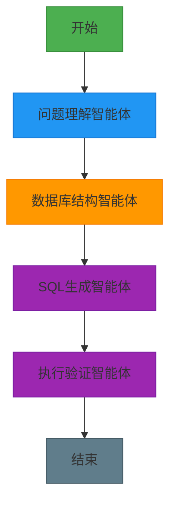
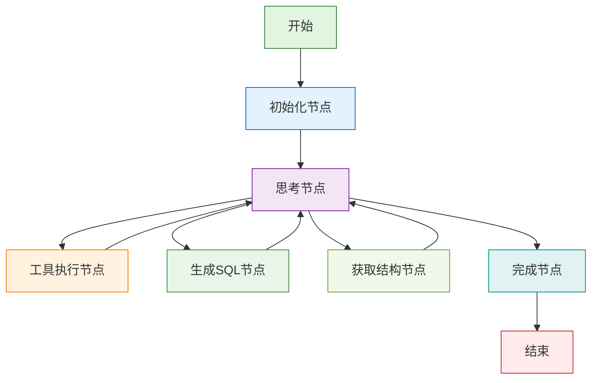
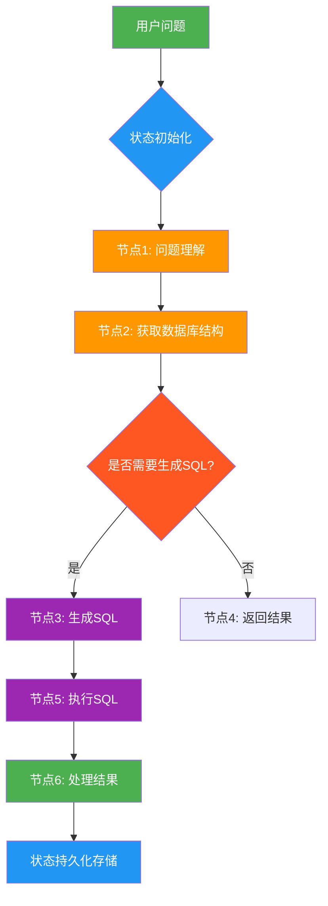
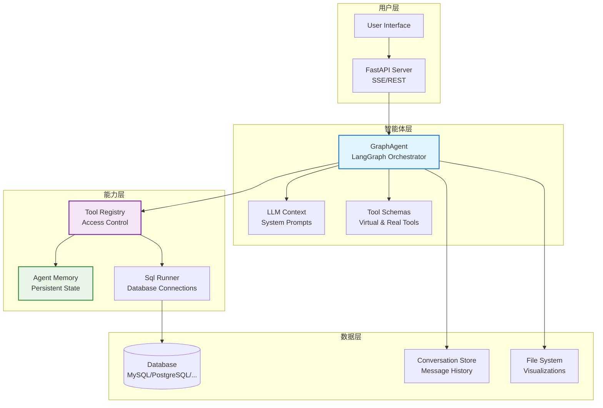

# 使用Vanna从零构建数据库智能体：实现智能SQL查询的完整指南

## 第一章. Vanna介绍，从传统SQL到智能数据库交互的演进

### 1.1 、从"手动写SQL(传统方式)"到"自然语言查询(Vanna智能体)"的转变

以前搞数据库查询，就像请了个"全能选手"——一个开发人员包揽所有任务：理解需求、写SQL、优化查询、验证结果……全靠人工。

这听起来全能，但实际效果就像让你既当业务分析师又当数据库专家还兼数据科学家——每样都能做，但哪样都不精。

而现在的趋势是：**让专业AI干专业的事**。

Vanna智能体系统就是给数据库也组建一个"AI团队"：

- 问题理解智能体：专门负责解析用户自然语言
- 数据库结构智能体：专精获取表结构和字段信息
- SQL生成智能体：专注语法转换，生成高效SQL
- 结果验证智能体：最后校验与美化展示

每个AI只干自己最擅长的事，彼此配合，效率高、质量好、出错少。

打个比方：手写SQL像一把瑞士军刀，啥都能干；Vanna则像一套专业工具箱——螺丝刀、锤子、电钻各司其职，干活更顺手。

研究数据显示，这种分工协作的方式，在处理复杂业务查询时性能提升 **50%-70%**，而且更容易调试、维护和扩展。

### 1.2 一个 数据库AI助手 Vanna例子

我们要做的这个AI助手，输入一个自然语言问题（比如"显示前5个客户的名字"），它就能自动完成：

1. 拆解用户意图
2. 获取数据库结构
3. 生成对应的SQL
4. 执行查询并验证结果
5. 输出结构化数据与可视化

整个流程由多个AI智能体接力完成，背后靠的是 **Vanna** 这个框架来调度协调。




### 1.3什么是 Vanna？

 普通的 SQL 查询应用 记不住事、理不清步骤，像个没头苍蝇。

**怎么办？ 用"智能体"来设计 数据库交互流程** ：

> 把查询拆成一个个节点，用工具链连逻辑，靠状态存上下文。让智能体有记忆、能判断、还能断点续跑。

Vanna 就是 **数据库的智能助手**，指挥模块按剧本走。

比如做个销售数据分析： 问客户 → 查订单 → 验证权限 → 生成报告。

- 每一步结果都存在"状态"里，后面随时取用；

- 如果缺少权限，直接跳转到"权限验证"。

关键能力：流程清晰、状态不丢、支持循环和中断恢复。

Vanna是专门为构建**自然语言到SQL转换**的AI工作流而生。

它不像别的工具那样， 封装太多细节。

Vanna  给你底层控制权，像搭积木一样组装AI系统。

Vanna 核心思想很简单：用"图"来建模数据库交互行为，节点是动作，边是跳转逻辑，状态是记忆。

> Vanna is a low-level orchestration framework for building, managing, and deploying long-running, stateful database agents.

### 图结构三要素

- **节点（Nodes）**：每个节点,  是一个独立任务.  比如调用大模型、查数据库、执行工具函数。
- **边（Edges）**：每 一 边是Python函数，根据当前状态决定下一步去哪，支持条件判断和循环。
- **状态（State）**：全局共享的数据结构，记录所有关键信息，相当于AI的"短期记忆"。

有了这图结构三要素 ， 就能画出一条条清晰的执行路径，不怕逻辑混乱，也不怕断电重启丢数据。

```python
from vanna.core.agent.graph_agent import GraphAgent

# 示例：定义一个Vanna图
graph = GraphAgent()

def node_a(state):
    return {"value": "from A"}

def node_b(state):
    return {"value": "from B"}

# Vanna内部使用LangGraph构建流程
workflow = StateGraph(AgentState)

workflow.add_node("initialize", self._node_initialize)
workflow.add_node("get_schema", self._node_get_schema)  
workflow.add_node("think", self._node_think)
workflow.add_node("generate_sql", self._node_generate_sql) 
workflow.add_node("execute_sql", self._node_execute_sql)
workflow.add_node("execute_tools", self._node_execute_tools)  
workflow.add_node("finalize", self._node_finalize)

workflow.set_entry_point("initialize")
workflow.add_conditional_edges("think", self._router_analyze_response, {
  "tools": "execute_tools", "done": "finalize",
  "get_schema": "get_schema", "generate_sql": "generate_sql", "execute_sql": "execute_sql"
})
workflow.add_edge("finalize", END)

app = graph.compile()
```


上面这段代码就是一个最简单的流程图：初始化 → 思考 → 执行工具/生成SQL/获取结构 → 结束。

 这是一个简单的顺序执行流程：



图结构说明：

1. **开始节点** → 由 `workflow.set_entry_point("initialize")`设定入口
2. **初始化节点** → 执行 `node_initialize(state)`函数，准备用户上下文
3. **思考节点** → 执行 `node_think(state)`函数，决定下一步动作
4. **工具执行节点** → 执行 `node_execute_tools(state)`函数，运行真实工具
5. **生成SQL节点** → 执行 `node_generate_sql(state)`函数，生成SQL查询
6. **获取结构节点** → 执行 `node_get_schema(state)`函数，查询数据库结构
7. **完成节点** → 处理结果并结束流程


### 1.4 Vanna 的核心优势

Vanna   本质是什么？  Vanna 其实是一个 **“带记忆的、数据库AI任务图 、执行器”**。

更技术一点说：

它是一个**有状态、可持久化、基于图的工作流引擎**，灵感来自两种老但牛的技术：

- **数据流编程**（Dataflow Programming）：数据推着计算走

- **Actor 模型**：每个节点像个独立小演员，收到消息才行动


这就让它特别适合做复杂数据库查询流程，比如：

- 自动理解用户意图
- 多步骤查询构建
- 出错自动重试
- 用户中途修改需求也能接得上


**Vanna  的设计哲学很简单粗暴**：

> **把数据库查询当成一个永远在线的"活系统"，而不是一次性的SQL执行。**

你可以把它想象成一个**会记住上下文、能持续反应、还会自己做决定的数据库机器人**，而不是一个"问一句写一句SQL"的问答机。


#### 传统Agent 与 GraphAgent 的区别？

我们先来对比一下：

- **传统Agent**：像是单线程工人。

  原料（输入）进来 → 经过几道工序（处理）→ 成品（输出）出去 → 完事。  逻辑简单，但复杂流程跑不了。

- **GraphAgent**：像是一个智能调度中心。

  他记得当前状态，知道下一步该做什么，还能根据情况调用不同工具、循环重试、甚至智能决策。

  GraphAgent核心是：**状态一直在线，流程可以反复跳转，支持复杂的决策循环。**

### 1.5 Vanna 的关键组件

**问题根源：**  多个数据库 任务，各模块各干各的，逻辑乱、状态丢、没法 debug。

**解决思路：**  以"状态图"为核心，靠 **节点、边、状态** 三件套，构建可控可溯的数据库工作流。

三大支柱：

- **节点（Nodes）**：执行单元，比如调大模型、查数据库；
- **边（Edges）**：控制流程走向，可以固定跳转，也能条件判断；
- **状态（State）**：共享内存，全程保存数据，上下文不断。

支持循环：AI 生成SQL后验证结构不合适，回退修改，直到通过。

支持人工干预：在流程中插入"等待确认"节点，处理完再继续。

集成 RAG，先检索再回答，不说胡话；

用审计日志 监控全过程，像 DevTools 一样看执行轨迹。




### 1.5 Vanna   五大能力：


**1、状态保持、持久执行（Durable Execution）**

跑一半断电了怎么办？重头再来？那用户不得疯了？

Vanna把每一步状态存下来，哪怕服务挂了，重启也能接着干，就像游戏存档一样靠谱。

**2、人机协同、人机协作（Human-in-the-loop）**

AI再聪明也有拿不准的时候。

这时候可以让人类插一脚，看看状态、改改参数、点个确认，然后再继续。

这种设计特别适合金融、医疗这类高风险场景。

**3、持久化存储、全面记忆管理（Comprehensive Memory）**

有的框架只记最近几句话，Vanna不一样，它可以同时管：

- 短期记忆：本次会话的状态
- 长期记忆：跨会话的SQL模式（结合向量库或数据库）

这就让AI不仅能"接话"，还能"认数据"，提供个性化体验。

**4、调试能力（Debugging）**

复杂的数据库AI流程就像迷宫，光看日志根本找不到问题在哪。

Vanna结合日志系统，能生成可视化轨迹图，每一步走到哪、状态变成啥样，清清楚楚。

**5、工具集成 & 多智能体支持**

想让AI查询数据、生成图表、执行复杂操作？没问题，接API就行。

而且它天生支持多个AI协同工作，比如一个负责分析，一个负责决策，一个负责汇报。

## 第二章. 传统Agent 与 GraphAgent 的对比分析

### 2.1 传统Agent 的实现方式

痛点：传统Agent逻辑都写在单个方法里，代码越来越复杂？

解决方案：传统Agent采用线性处理流程，所有逻辑都在一个方法中！

传统Agent的实现方式是**顺序处理**：

- 用户输入 → 理解 → 获取工具 → 构建提示 → 调用LLM → 处理工具调用 → 返回结果
- 整个流程是**线性的**，没有循环或复杂分支
- 代码逻辑写在 `_send_message` 方法中，逐步执行每个步骤

```python
class Agent:
    """传统Agent实现 - 顺序处理流程"""
    
    async def _send_message(
        self,
        request_context: RequestContext,
        message: str,
        *,
        conversation_id: Optional[str] = None,
    ) -> AsyncGenerator[UiComponent, None]:
        # 1. 解析用户身份
        user = await self.user_resolver.resolve_user(request_context)
        
        # 2. 处理会话
        conversation = await self.conversation_store.get_conversation(conversation_id, user)
        
        # 3. 准备上下文
        tool_context = ToolContext(...)
        
        # 4. 构建系统提示
        system_prompt = await self.system_prompt_builder.build_system_prompt(user, tool_schemas)
        
        # 5. 发送LLM请求
        llm_request = LlmRequest(messages=conversation.messages, system_prompt=system_prompt)
        llm_response = await self.llm_service.send_request(llm_request)
        
        # 6. 处理工具调用
        if llm_response.tool_calls:
            for tool_call in llm_response.tool_calls:
                result = await self.tool_registry.execute(tool_call, tool_context)
                # ... 处理结果
        
        # 7. 返回结果
        yield result_component
```

**传统Agent 的特点：**

- **简单直观**：逻辑清晰，按步骤执行
- **易于理解**：所有代码在同一个方法中
- **限制明显**：复杂流程难以处理，如循环、条件分支等
- **扩展困难**：添加新功能需要修改现有方法

### 2.2 GraphAgent 的实现方式

痛点：复杂数据库查询需要多次交互、循环验证，传统方式处理不了？

解决方案：GraphAgent用图结构，节点处理不同任务，边控制流程走向！

GraphAgent的实现方式是**图驱动**：

- 用户输入 → 初始化 → 思考 → 获取结构/生成SQL/执行工具 → 思考 → ... → 完成
- 整个流程是**循环的**，根据LLM响应决定下一步动作
- 使用**LangGraph**构建状态图，各节点独立处理特定任务

```python
class GraphAgent:
    """GraphAgent实现 - 图驱动流程"""
    
    def _build_graph(self) -> Any:
        """构建LangGraph状态机"""
        workflow = StateGraph(AgentState)
        
        # 添加不同功能节点
        workflow.add_node("initialize", self._node_initialize)        # 初始化节点
        workflow.add_node("get_schema", self._node_get_schema)        # 获取结构节点
        workflow.add_node("think", self._node_think)                  # LLM思考节点
        workflow.add_node("generate_sql", self._node_generate_sql)    # 生成SQL节点
        workflow.add_node("execute_sql", self._node_execute_sql)      # 执行SQL节点
        workflow.add_node("execute_tools", self._node_execute_tools)  # 通用工具节点
        workflow.add_node("finalize", self._node_finalize)            # 完成节点
        
        workflow.set_entry_point("initialize")
        
        # 条件路由：根据LLM响应决定下一步
        workflow.add_conditional_edges("think", self._router_analyze_response, {
            "get_schema": "get_schema",    # 如果LLM需要获取结构，跳转到get_schema节点
            "generate_sql": "generate_sql", # 如果LLM需要生成SQL，跳转到generate_sql节点
            "execute_sql": "execute_sql",   # 如果LLM需要执行SQL，跳转到execute_sql节点
            "tools": "execute_tools",       # 如果LLM需要执行其他工具，跳转到execute_tools节点
            "done": "finalize"              # 如果完成，跳转到finalize节点
        })
        
        workflow.add_edge("get_schema", "think")      # 所有操作节点都返回think节点继续决策
        workflow.add_edge("generate_sql", "think")
        workflow.add_edge("execute_sql", "think")
        workflow.add_edge("execute_tools", "think")
        
        workflow.add_edge("finalize", END)
        
        return workflow.compile()
```

**GraphAgent 的特点：**

- **灵活控制**：根据LLM响应动态调整流程
- **可扩展**：容易添加新节点和路由逻辑
- **复杂流程**：支持循环、条件分支、并行执行
- **状态管理**：全局状态，所有节点共享数据

### 2.3 两种Agent的详细对比

| 特性 | 传统Agent | GraphAgent |
|------|-----------|------------|
| **架构模式** | 顺序执行 | 图驱动循环 |
| **流程控制** | 固定路径 | 动态路由 |
| **代码结构** | 单方法处理 | 多节点分离 |
| **复杂度支持** | 简单线性流程 | 复杂循环分支 |
| **调试难度** | 相对简单 | 依赖图可视化 |
| **扩展性** | 需要修改主方法 | 添加新节点 |
| **状态管理** | 局部变量 | 全局状态图 |
| **适用场景** | 简单对话 | 复杂数据库交互 |

### 2.4 传统Agent 的节点实现

```python
# 传统Agent在处理工具调用时的代码结构
async def _send_message(self, ...):
    # ... 其他代码 ...
    
    # 直接调用LLM
    llm_response = await self.llm_service.send_request(llm_request)
    
    # 处理工具调用
    if llm_response.tool_calls:
        for tool_call in llm_response.tool_calls:
            result = await self.tool_registry.execute(tool_call, context)
            # 直接处理结果，没有循环验证
            conversation.add_message(Message(
                role="tool",
                content=result.result_for_llm,
                tool_call_id=tool_call.id
            ))
    
    # 继续下一步，无法根据结果调整流程
```

### 2.5 GraphAgent 的节点实现

```python
# GraphAgent中不同节点的专门处理
async def _node_think(self, state: AgentState) -> PartialAgentState:
    """思考节点：决定下一步行动"""
    # 1. 定义虚拟工具（引导LLM按照预设路径行动）
    virtual_tools = [
        ToolSchema(name="query_schema_metadata", ...),
        ToolSchema(name="generate_sql", ...),
        ToolSchema(name="execute_current_sql", ...)
    ]
    
    # 2. 调用LLM
    response = await self.llm_service.send_request(llm_request)
    
    # 3. 更新状态，返回控制权给图调度器
    return {"llm_response": response}

async def _node_get_schema(self, state: AgentState) -> PartialAgentState:
    """获取结构节点：专门处理数据库结构查询"""
    # 从LLM响应中提取SQL参数
    schema_sql = extract_sql_from_tool_call(state["llm_response"])
    
    # 执行SQL查询结构
    result = await execute_schema_query(schema_sql)
    
    # 更新状态，供后续节点使用
    return {"schema_metadata": result}

# 路由器决定下一步去哪个节点
def _router_analyze_response(self, state: AgentState) -> Literal["tools", "done", "get_schema", "generate_sql", "execute_sql"]:
    response = state["llm_response"]
    if response and response.is_tool_call():
        for tool_call in response.tool_calls:
            if tool_call.name == "query_schema_metadata":
                return "get_schema"      # 需要获取数据库结构
            if tool_call.name == "generate_sql":
                return "generate_sql"    # 需要生成SQL
            if tool_call.name == "execute_current_sql":
                return "execute_sql"     # 需要执行SQL
            # ... 其他情况
    return "done"  # 完成
```

## 第三章. Vanna 核心架构详解

### 3.1 Vanna 智能体架构图

痛点：Vanna 有那么多组件，关系复杂理不清？

解决方案：看图说话，一目了然！




### 3.2 GraphAgent 智能体核心流程

痛点：GraphAgent 内部怎么工作的？像黑盒。

解决方案：拆解流程，层层深入！

GraphAgent 是 Vanna 的核心编排引擎，基于 LangGraph 实现，包含以下核心节点：

- **初始化节点 (initialize)**：解析用户身份，加载会话，准备上下文环境
- **思考节点 (think)**：LLM 决策，可能触发虚拟工具调用  
- **获取结构节点 (get_schema)**：执行数据库元数据查询
- **生成SQL节点 (generate_sql)**：根据上下文生成业务SQL
- **执行SQL节点 (execute_sql)**：运行SQL并返回表格结果
- **通用工具节点 (execute_tools)**：执行其他真实工具（非虚拟）
- **完成节点 (finalize)**：收尾与保存

```python
# GraphAgent 核心编排逻辑
workflow = StateGraph(AgentState)

# 添加节点
workflow.add_node("initialize", self._node_initialize)
workflow.add_node("get_schema", self._node_get_schema)
workflow.add_node("think", self._node_think)
workflow.add_node("generate_sql", self._node_generate_sql)
workflow.add_node("execute_sql", self._node_execute_sql)
workflow.add_node("execute_tools", self._node_execute_tools)
workflow.add_node("finalize", self._node_finalize)

workflow.set_entry_point("initialize")

# 条件路由
workflow.add_conditional_edges("think", self._router_analyze_response, {
  "tools": "execute_tools", "done": "finalize",
  "get_schema": "get_schema", "generate_sql": "generate_sql", "execute_sql": "execute_sql"
})

# 固定边
workflow.add_edge("finalize", END)
```

### 3.3 虚拟工具系统详解

痛点：虚拟工具是什么？为什么要用？

解决方案：虚拟工具强制LLM按正确流程工作，先了解结构再生成SQL！

Vanna 使用虚拟工具系统实现智能的SQL生成流程：

- **`query_schema_metadata(sql=...)`**：虚拟工具，触发主动模式数据库结构获取
- **`generate_sql(instruction=...)`**：虚拟工具，委托SQL生成任务
- **`execute_current_sql()`**：虚拟工具，执行已生成的SQL

这些虚拟工具强制LLM按照"先了解结构 → 再生成SQL → 最后执行"的流程工作。

```python
# 虚拟工具定义示例
virtual_tools = [
    ToolSchema(
        name="query_schema_metadata",
        description="CRITICAL: Use this tool FIRST to retreive the database schema (tables/columns) before generating any SQL.",
        parameters={
          "type": "object",
          "properties": {
              "sql": {"type": "string", "description": "The SQL query to inspect schema (e.g. 'SELECT name, sql FROM sqlite_master WHERE type=\"table\"')"}
          },
          "required": ["sql"]
       }
    ),
    ToolSchema(
        name="generate_sql", 
        description="Generate a business logic SQL query based on the schema and user question.",
        parameters={
          "type": "object", "properties": {"instruction": {"type": "string"}}, "required": ["instruction"]
        }
    ),
    ToolSchema(
        name="execute_current_sql",
        description="Execute the currently generated SQL query.",
        parameters={
          "type": "object", "properties": {}, "required": []
        }
    )
]
```

### 3.4 ToolRegistry 工具管理与权限控制

痛点：多个工具怎么管理？怎么控制权限？

解决方案：ToolRegistry统一管理，按组控制访问！

ToolRegistry 是 Vanna 的工具管理核心：

- **统一抽象**：所有工具都继承 `Tool[T]` 抽象基类
- **权限控制**：按用户组控制工具访问
- **执行流程**：注册 → 权限校验 → 参数校验 → 执行 → 审计
- **审计日志**：记录工具调用、参数和结果

```python
# ToolRegistry 执行逻辑
async def execute(self, tool_call: ToolCall, context: ToolContext) -> ToolResult:
    tool = await self.get_tool(tool_call.name)
    if not await self._validate_tool_permissions(tool, context.user):
        return ToolResult(success=False, result_for_llm="Insufficient group access", error="...")
    
    args_model = tool.get_args_schema()
    validated_args = args_model.model_validate(tool_call.arguments)
    transform_result = await self.transform_args(tool, validated_args, context.user, context)
    result = await tool.execute(context, transform_result)
    return result
```

## 第四章. 从零开始构建 Vanna 智能体

### 4.1 环境准备与依赖

痛点：依赖多、版本冲突，环境配置卡住？

解决方案：用包管理器，配置环境变量，一次搞定！

要构建一个 Vanna 智能体，首先需要安装核心依赖：

```bash
uv pip install -U vanna[all]
```

主要依赖包括：
- `langgraph` 和 `langchain-core`：智能体编排引擎
- `pydantic`：配置和数据验证
- `fastapi`：Web服务器
- 各种数据库驱动

### 4.2 基础智能体构建

痛点：从零开始不知道怎么搭？代码一团乱？

解决方案：分步搭建，每个组件独立配置！

让我们从一个完整的 GraphAgent 实例开始：

```python
from vanna.core.agent.graph_agent import GraphAgent
from vanna.core.registry import ToolRegistry
from vanna.integrations.openai import OpenAILlmService
from vanna.integrations.sqlite import SqliteRunner
from vanna.tools import RunSqlTool, LocalFileSystem
from vanna.integrations.local.agent_memory import DemoAgentMemory
from vanna.core.user.resolver import UserResolver
from vanna.core.user.models import User
from vanna.core.user import RequestContext

# 1. 配置LLM服务
llm = OpenAILlmService(
    model="gpt-4",
    api_key=os.getenv("OPENAI_API_KEY")
)

# 2. 配置数据库
sqlite_runner = SqliteRunner(database_path="example.db")
file_system = LocalFileSystem(working_directory="./data")
sql_tool = RunSqlTool(sql_runner=sqlite_runner, file_system=file_system)

# 3. 配置工具注册表
tool_registry = ToolRegistry()
tool_registry.register_local_tool(sql_tool, access_groups=['admin', 'user'])

# 4. 配置记忆系统
agent_memory = DemoAgentMemory(max_items=1000)

# 5. 配置用户解析器
class SimpleUserResolver(UserResolver):
    def __init__(self, cookie_name: str = "vanna_email"):
        self.cookie_name = cookie_name

    async def resolve_user(self, request_context: RequestContext) -> User:
        user_email = request_context.get_cookie(self.cookie_name) or 'guest@example.com'
        group = 'admin' if user_email == 'admin@example.com' else 'user'
        return User(id=user_email, email=user_email, group_memberships=[group])

user_resolver = SimpleUserResolver()

# 6. 创建智能体
agent = GraphAgent(
    llm_service=llm,
    tool_registry=tool_registry,
    user_resolver=user_resolver,
    agent_memory=agent_memory
)
```

### 4.3 用户身份解析与权限控制

痛点：用户身份怎么处理？权限怎么管理？

解决方案：实现UserResolver，按组控制工具访问！

Vanna 支持灵活的用户身份解析机制：

```python
# 用户解析器实现
class SimpleUserResolver(UserResolver):
    def __init__(self, cookie_name: str = "vanna_email"):
        self.cookie_name = cookie_name

    async def resolve_user(self, request_context: RequestContext) -> User:
        user_email = request_context.get_cookie(self.cookie_name) or 'guest@example.com'
        group = 'admin' if user_email == 'admin@example.com' else 'user'
        return User(id=user_email, email=user_email, group_memberships=[group])

# 工具权限控制
tool_registry.register_local_tool(sql_tool, access_groups=['admin', 'user'])

# 参数级转换（实现行级安全）
async def transform_args(self, tool, args, user, context):
    # 根据用户身份修改SQL查询
    if user.group == 'sales':
        args.sql += " AND sales_person = '" + user.id + "'"
    return args
```

### 4.4 消息处理与流式响应

痛点：用户输入怎么处理？结果怎么返回？

解决方案：用流式组件，实时返回不同类型的信息！

Vanna 支持流式消息处理，实时返回结果组件：

```python
# 处理用户消息
async for component in agent.send_message(
    request_context=request_context,
    message="Show me the first 5 customers",
    conversation_id="conversation-123",
):
    # 处理不同类型的UI组件
    if hasattr(component, "simple_component") and component.simple_component:
        if hasattr(component.simple_component, "text"):
            print("Assistant (Simple):", component.simple_component.text)
    elif hasattr(component, "rich_component") and component.rich_component:
        if hasattr(component.rich_component, "content") and component.rich_component.content:
            print("Assistant (Rich):", component.rich_component.content)
        elif hasattr(component.rich_component, "title"):
            print(f"Assistant (Card): [{component.rich_component.status}] {component.rich_component.title}")
```

## 第五章. Vanna 高级特性与扩展

### 5.1 自定义工具开发

痛点：想加自己的功能？不知道怎么扩展？

解决方案：继承Tool基类，实现execute方法，注册到系统中！

Vanna 支持开发自定义工具扩展功能：

```python
from vanna.core.tool.base import Tool
from pydantic import BaseModel

class CustomAnalysisToolArgs(BaseModel):
    metric: str
    time_range: str

class CustomAnalysisTool(Tool[CustomAnalysisToolArgs]):
    @property
    def name(self) -> str:
        return "analyze_custom_metrics"
    
    @property
    def description(self) -> str:
        return "Analyze custom business metrics"
    
    def get_args_schema(self) -> type[CustomAnalysisToolArgs]:
        return CustomAnalysisToolArgs
    
    async def execute(self, context: ToolContext, args: CustomAnalysisToolArgs) -> ToolResult:
        # 实现自定义逻辑
        result = f"Analysis for {args.metric} in {args.time_range}: [result]"
        return ToolResult(success=True, result_for_llm=result)

# 注册自定义工具
custom_tool = CustomAnalysisTool()
tool_registry.register_local_tool(custom_tool, access_groups=['admin'])
```

### 5.2 权限控制与行级安全

痛点：不同用户需要不同权限？怎么实现数据隔离？

解决方案：ToolRegistry内置权限控制，transform_args实现行级安全！

Vanna 提供细粒度的权限控制机制：

```python
# 工具级权限控制
tool_registry.register_local_tool(sql_tool, access_groups=['admin'])

# 参数级转换（实现行级安全）
async def transform_args(
    self,
    tool: Tool[T],
    args: T,
    user: User,
    context: ToolContext,
) -> Union[T, ToolRejection]:
    """Transform and validate tool arguments based on user context."""
    # 根据用户组修改SQL查询
    if user.group == 'sales':
        args.sql += f" WHERE sales_person_id = '{user.id}'"
    elif user.group == 'manager':
        args.sql += f" WHERE department_id = '{user.department_id}'"
    return args
```

### 5.3 记忆与上下文管理

痛点：会话状态怎么保留？历史查询怎么复用？

解决方案：AgentMemory提供持久化记忆，工具系统自动管理上下文！

Vanna 的记忆系统可以保存和检索历史交互：

```python
from vanna.integrations.local.agent_memory import DemoAgentMemory

# 配置记忆系统
agent_memory = DemoAgentMemory(max_items=1000)

# 在工具中使用记忆
class SaveQuestionToolArgsTool(Tool):
    async def execute(self, context: ToolContext, args: Any) -> ToolResult:
        # 保存用户问题和SQL生成历史
        await context.agent_memory.save_question_sql_pair(
            question=context.conversation_id,
            sql=args.sql,
            user_id=context.user.id
        )
        return ToolResult(success=True, result_for_llm="Question saved")
```

## 第六章. 完整示例：构建数据库AI助手

### 6.1 完整的 GraphAgent 配置示例

痛点：实际项目怎么组织代码？配置这么复杂？

解决方案：参考完整示例，分模块组织，结构清晰！

```python
import asyncio
import os
from vanna.core.agent.graph_agent import GraphAgent
from vanna.core.registry import ToolRegistry
from vanna.core.user.resolver import UserResolver
from vanna.integrations.openai import OpenAILlmService
from vanna.integrations.sqlite import SqliteRunner
from vanna.tools import RunSqlTool, VisualizeDataTool, LocalFileSystem
from vanna.integrations.local.agent_memory import DemoAgentMemory
from vanna.core.user import RequestContext
from vanna.core.user.models import User

async def create_database_assistant():
    # 1. 配置 LLM
    llm = OpenAILlmService(
        model=os.getenv("OPENAI_MODEL", "gpt-4"),
        api_key=os.getenv("OPENAI_API_KEY")
    )

    # 2. 配置数据库
    sqlite_runner = SqliteRunner(database_path=os.getenv("DATABASE_PATH", "Chinook.sqlite"))
    file_system = LocalFileSystem(working_directory="./data")
    sql_tool = RunSqlTool(sql_runner=sqlite_runner, file_system=file_system)

    # 3. 配置工具注册表
    tool_registry = ToolRegistry()
    tool_registry.register_local_tool(sql_tool, access_groups=['admin', 'user'])
    
    # 4. 注册可视化工具
    try:
        viz_tool = VisualizeDataTool(file_system=file_system)
        tool_registry.register_local_tool(viz_tool, access_groups=['admin', 'user'])
    except ImportError:
        pass  # 可视化工具不可用

    # 5. 配置用户解析器
    class SimpleUserResolver(UserResolver):
        def __init__(self, cookie_name: str = "vanna_email"):
            self.cookie_name = cookie_name

        async def resolve_user(self, request_context: RequestContext) -> User:
            user_email = request_context.get_cookie(self.cookie_name) or 'guest@example.com'
            group = 'admin' if user_email == 'admin@example.com' else 'user'
            return User(id=user_email, email=user_email, group_memberships=[group])

    user_resolver = SimpleUserResolver()

    # 6. 创建智能体
    agent = GraphAgent(
        llm_service=llm,
        tool_registry=tool_registry,
        user_resolver=user_resolver,
        agent_memory=DemoAgentMemory(max_items=1000)
    )

    return agent
```

### 6.2 用户交互与会话管理

痛点：用户会话怎么管理？多用户同时使用怎么办？

解决方案：用RequestContext管理上下文，每个请求独立处理！

```python
from vanna.core.user import RequestContext

# 模拟用户请求
request_context = RequestContext(
    cookies={"vanna_email": "demo-user@example.com"},
    metadata={"demo": True},
    remote_addr="127.0.0.1",
)

# 处理用户查询
async def handle_user_query(agent, question: str):
    async for component in agent.send_message(
        request_context=request_context,
        message=question,
        conversation_id="session-123",
    ):
        # 处理流式返回的UI组件
        if component.rich_component:
            print(f"Rich Component: {component.rich_component}")
        elif component.simple_component:
            print(f"Text: {component.simple_component.text}")
```

### 6.3 部署与服务化

痛点：开发完了怎么部署？怎么对外提供服务？

解决方案：用VannaFastAPIServer，一键启动Web服务！

Vanna 提供 FastAPI 服务支持：

```python
from vanna.servers.fastapi import VannaFastAPIServer

# 创建并运行服务器
async def main():
    agent = await create_database_assistant()
    server = VannaFastAPIServer(agent)
    server.run(host="0.0.0.0", port=8080)

if __name__ == "__main__":
    asyncio.run(main())
```

## 第七章. Vanna 最佳实践

### 7.1 性能优化

痛点：响应慢、查询效率低？用户体验差？

解决方案：连接池、缓存、异步处理，全方位优化！

- **连接池管理**：使用数据库连接池避免频繁连接开销
- **查询缓存**：对重复查询结果进行缓存
- **异步处理**：充分利用异步IO提升并发处理能力
- **SQL优化**：在生成SQL时考虑性能因素

### 7.2 安全考虑

痛点：SQL注入、权限泄露？安全风险高？

解决方案：参数校验、权限控制、审计日志，层层防护！

- **SQL注入防护**：通过工具参数校验和权限控制
- **访问控制**：基于用户组的细粒度权限管理
- **数据脱敏**：对敏感数据进行脱敏处理
- **审计日志**：记录所有操作用于安全审计

### 7.3 监控与可观测性

痛点：出了问题怎么排查？系统状态怎么监控？

解决方案：内置监控与审计，问题无处遁形！

Vanna 集成了全面的监控和审计功能：

```python
from vanna.core.audit import AuditLogger
from vanna.core.observability import ObservabilityProvider

# 配置审计
audit_logger = AuditLogger()
agent = GraphAgent(
    # ... 其他参数
    audit_logger=audit_logger,
    observability_provider=observability_provider
)
```

## 总结

痛点：学了这么多，还是没搞明白Vanna到底解决了什么问题？

解决方案：Vanna把复杂的数据库查询变成简单的自然语言对话！

Vanna 通过智能体架构，实现了从自然语言到SQL的无缝转换。其核心优势在于：

1. **结构化流程**：通过虚拟工具强制LLM按照"理解 → 获取结构 → 生成SQL → 执行"的流程工作
2. **可扩展架构**：基于LangGraph的图结构，支持复杂业务逻辑扩展
3. **安全性**：内置权限控制、行级安全和审计功能
4. **可观察性**：完整的日志和监控支持
5. **用户体验**：流式响应和富UI组件支持

通过本指南的学习，你应该已经掌握了构建和扩展 Vanna 智能体的完整知识体系。

核心要点：**状态、节点、边** —— 这就是 Vanna 的骨架，记住这三点，任何复杂的数据库AI应用都不在话下！