# GraphAgent 实现计划 (已完成并扩展)

本文档概述了 `src/vanna/core/agent/graph_agent.py` 的**已完成**实现。`GraphAgent` 类使用 **LangGraph** 进行宏观编排,实现了代理式 Text-to-SQL 工作流。

## ✅ 阶段 1: 准备与依赖

1.  **依赖检查**: 需要 `langgraph` 和 `langchain-core` 依赖。
2.  **文件创建**: 已创建 `src/vanna/core/agent/graph_agent.py`。
3.  **导入**: 从 `vanna.core` 导入所有必要类型以确保 API 兼容性。

## ✅ 阶段 2: 状态定义 (`AgentState`)

4.  **定义 `AgentState` TypedDict**,包含以下字段:
    - `request_context`: `RequestContext`
    - `user`: `User`
    - `conversation`: `Conversation`
    - `conversation_id`: `Optional[str]`
    - `message`: `str` (用户输入)
    - `messages`: `List[LlmMessage]` (格式化后的 LLM 历史记录)
    - `tool_schemas`: `List[ToolSchema]`
    - `tool_context`: `ToolContext`
    - `system_prompt`: `str`
    - `llm_response`: `Optional[LlmResponse]`
    - `tool_iterations`: `int`
    - `max_tool_iterations`: `int`
    - `is_complete`: `bool`
    - `should_stop`: `bool`
    - `ui_queue`: `asyncio.Queue[UiComponent]`
    - **模式与 SQL 字段** (用于代理流程):
      - `schema_metadata`: `Optional[str]`
      - `generated_sql`: `Optional[str]`
      - `sql_result`: `Optional[str]`

5.  **UI 通信**: 使用 `asyncio.Queue` 模式将 `UiComponent` 从节点流式传输到生成器。

## ✅ 阶段 3: `GraphAgent` 类结构

6.  **初始化 (`__init__`)**:
    - 镜像 `Agent` 的初始化逻辑,用于所有组件。
    - 通过 `_build_graph()` 编译 LangGraph 并存储为 `self.graph`。
    - 记录图结构(Mermaid 图表)用于调试。

7.  **`send_message` 实现**:
    - 创建 `asyncio.Queue` 用于 UI 组件流式传输。
    - 使用初始状态调用编译后的图 (`self.graph.ainvoke`)。
    - 在图执行的同时从队列中产出 UI 组件。
    - 处理错误并发出错误 UI 组件。

## ✅ 阶段 4: 图节点 (增强实现)

### 核心节点

8.  **`_node_initialize`** (合并节点):
    - **之前**: 分离的 `initialize` 和 `prepare_context` 节点。
    - **当前**: 合并的初始化处理:
      1. 用户解析 (`user_resolver.resolve_user`)
      2. 会话加载/创建
      3. 工作流处理器 (启动 UI、自定义流程)
      4. 生命周期钩子 (`before_message`)
      5. **上下文准备** (原独立节点):
         - 创建包含 UI 功能的工具上下文
         - 上下文增强
         - 获取工具模式
         - 构建系统提示
         - LLM 上下文增强
         - 消息过滤和转换

9.  **`_node_think`** (LLM 编排):
    - **增强**: 为代理式 SQL 流程注入**虚拟工具**:
      - `query_schema_metadata(sql=...)`: 触发主动模式自省
      - `generate_sql(instruction=...)`: 委托 SQL 生成
      - `execute_current_sql()`: 执行生成的 SQL
    - **过滤**实际的 `run_sql` 工具,强制使用结构化流程。
    - **关键修复**: 始终将 Assistant 消息(包括 `tool_calls`)追加到 `state["messages"]`,即使 `content` 为 `None`。
    - 处理流式响应和中间件。

### 专用代理节点

10. **`_node_get_schema`** (主动模式检索):
    - **之前**: 被动内存搜索。
    - **当前**: 
      - 执行 LLM 提供的 SQL(通过 `query_schema_metadata` 虚拟工具调用)。
      - 直接调用 `run_sql` 工具查询数据库元数据(如 `sqlite_master`)。
      - 将查询结果存储在 `schema_metadata` 状态中。
      - **关键修复**: 追加带有正确 `tool_call_id` 的 `role="tool"` 消息。
      - 通过响应所有 ID 处理并行工具调用(满足 OpenAI API 要求)。

11. **`_node_generate_sql`** (专用 SQL 生成):
    - 由 LLM 调用 `generate_sql` 虚拟工具触发。
    - **严格模式**: 向 LLM 发送 `tools=None` 的请求,强制文本输出(仅 SQL 代码)。
    - **关键修复**: 在发出新 LLM 请求之前,通过追加 `role="tool"` "继续中..." 消息关闭工具调用循环。
    - 清理 SQL 输出(删除 markdown 标记)。

12. **`_node_execute_sql`** (SQL 执行):
    - 执行状态中存储的 `generated_sql`。
    - 使用真实的 `run_sql` 工具实例。
    - **关键修复**: 
      - 将 SQL 执行结果作为带有正确 `tool_call_id` 的 `role="tool"` 消息追加。
      - 所有错误路径返回 `role="tool"` 消息(而非 `role="system"`)以维护有效的消息历史。
      - 处理并发工具调用。

13. **`_node_execute_tools`** (通用工具执行):
    - **增强**: 过滤虚拟工具(`query_schema_metadata`, `generate_sql`, `execute_current_sql`),因为它们由专用节点处理。
    - 从注册表执行标准工具。
    - 运行生命周期钩子 (`before_tool`, `after_tool`)。

14. **`_node_finalize`**:
    - 运行 `after_message` 钩子。
    - 如果启用自动保存则保存会话。
    - 设置 `is_complete = True`。

## ✅ 阶段 5: 图连接

15. **`_build_graph`** (增强结构):
    - **入口点**: `initialize` (合并节点)
    - **节点注册**使用 `_node_wrapper` 钩子:
      - 所有节点都用日志/钩子机制包装
      - 记录入口/出口以实现可观察性
    - **边**:
      ```
      initialize -> think (通过条件 check_stop)
      
      think -> (条件 analyze_response):
        - "get_schema" -> get_schema -> think
        - "generate_sql" -> generate_sql -> think
        - "execute_sql" -> execute_sql -> think
        - "tools" -> execute_tools -> think
        - "done" -> finalize -> END
      ```
    - **代理循环**: 所有动作节点返回到 `think`,允许 LLM 持续评估并决定下一步。

### 路由逻辑

16. **条件路由器**:
    - `_router_check_stop`: 检查 `should_stop` 标志(用于工作流处理器)。
    - `_router_analyze_response`: 
      - **优先级**: `get_schema` > `generate_sql` > `execute_sql` > 通用 `tools` > `done`
      - 通过名称检测虚拟工具调用并相应路由。

## 🔧 阶段 6: 关键修复与增强

### OpenAI API 合规性

17. **消息历史验证**:
    - **问题**: OpenAI API 要求每条带有 `tool_calls` 的 `Assistant` 消息后必须跟随每个 `tool_call_id` 的 `Tool` 消息。
    - **解决方案**:
      - `_node_think` 始终将 Assistant 消息追加到历史记录(即使 `content=None`)。
      - 所有工具节点(`get_schema`, `generate_sql`, `execute_sql`)响应消息中的所有工具调用 ID。
      - 并发/未处理的工具调用获得虚拟响应("此步骤中忽略工具调用")。
      - 错误路径使用 `role="tool"`(而非 `role="system"`)以维护有效结构。

### 系统提示增强

18. **强化指令** (`default.py`):
    - **CRITICAL** 警告强制在 SQL 生成前使用 `query_schema_metadata`。
    - 工具描述更新: "首先使用此工具检索数据库模式..."
    - 明确的工作流程:
      1. **查找模式** (强制性,除非已知)
      2. **生成 SQL** (基于模式上下文)
      3. **执行 SQL**
      4. **分析**结果

## ✅ 阶段 7: 验证

19. **测试**:
    - `src/vanna/examples/graph_agent_example.py` 运行成功。
    - 验证:
      - 通过主动 SQL 查询的模式查找
      - 严格模式下的 SQL 生成
      - 带有适当结果处理的 SQL 执行
      - 代理循环 (think -> action -> think)
      - 消息历史完整性
    - **日志**: 启用 INFO 级别日志显示节点入口/出口和结果状态。

## 📊 架构总结

```mermaid
graph TD
    START([开始]) --> INIT[初始化<br/>用户 + 上下文 + 工具]
    INIT --> THINK{思考<br/>LLM 决策}
    
    THINK -->|query_schema| SCHEMA[获取模式<br/>执行元数据 SQL]
    THINK -->|generate_sql| GENSQL[生成 SQL<br/>严格模式]
    THINK -->|execute_current_sql| EXECSQL[执行 SQL<br/>运行查询]
    THINK -->|tool_calls| TOOLS[执行工具<br/>通用]
    THINK -->|done| FINAL[完成<br/>保存 & 钩子]
    
    SCHEMA --> THINK
    GENSQL --> THINK
    EXECSQL --> THINK
    TOOLS --> THINK
    
    FINAL --> END([结束])
    
    style THINK fill:#e1f5ff
    style SCHEMA fill:#fff4e1
    style GENSQL fill:#ffe1f5
    style EXECSQL fill:#e1ffe1
```



## 🎯 关键设计原则

1. **代理式优于反应式**: LLM 使用虚拟工具编排整个流程,而非硬编码逻辑。
2. **主动优于被动**: 模式检索执行 SQL 而非搜索静态内存。
3. **严格验证**: 消息历史严格遵守 OpenAI API 要求。
4. **可观察**: 包装器钩子和日志提供对图执行的完全可见性。
5. **模块化**: 用于模式、SQL 生成和执行的专用节点实现清晰的关注点分离。

## 📝 未来增强

- **内存持久化**: 将模式查询结果存储在 `AgentMemory` 中以供长期重用。
- **多数据库支持**: 扩展虚拟工具以处理数据库选择/切换。
- **查询优化**: 在 SQL 生成和执行之间添加验证/优化步骤。
- **并行工具执行**: 当前是顺序的;可以批处理独立的工具调用。

## 🔍 实现细节

### 消息历史管理

**关键挑战**: 维护符合 OpenAI API 要求的消息历史结构。

**解决方案**:
```python
# _node_think 中
assistant_msg = LlmMessage(
    role="assistant", 
    content=response.content or "",  # 处理 None
    tool_calls=response.tool_calls
)
state["messages"].append(assistant_msg)

# _node_get_schema 中
# 必须响应所有工具调用
if target_tool_id:
    state["messages"].append(LlmMessage(
        role="tool", 
        content=result_msg, 
        tool_call_id=target_tool_id
    ))
# 处理其他工具调用
for ot_id in other_tool_ids:
    state["messages"].append(LlmMessage(
        role="tool", 
        content="此步骤中忽略工具调用。", 
        tool_call_id=ot_id
    ))
```

### 虚拟工具机制

虚拟工具允许 LLM 表达意图而不直接调用真实工具,然后触发 LangGraph 工作流中的特定节点。

```python
virtual_tools = [
    ToolSchema(
        name="query_schema_metadata",
        description="关键:在生成任何 SQL 之前首先使用此工具检索数据库模式...",
        parameters={
            "type": "object", 
            "properties": {
                "sql": {"type": "string", "description": "检查模式的 SQL 查询"}
            }, 
            "required": ["sql"]
        }
    ),
    # ... 其他虚拟工具
]

# 过滤真实工具
real_tools = [t for t in state["tool_schemas"] if t.name != "run_sql"]
available_tools = real_tools + virtual_tools
```

### 节点包装器钩子

所有节点通过 `_node_wrapper` 包装以实现可观察性和未来的中间件扩展:

```python
def _node_wrapper(self, node_name: str, func):
    @functools.wraps(func)
    async def wrapper(state: AgentState):
        logger.info(f"进入节点: {node_name}")
        result = await func(state)
        logger.info(f"节点: {node_name}, 结果: {result}")
        return result
    return wrapper
```

## 🐛 已知问题与解决方案

### 问题 1: "messages with role 'tool' must be a response..."

**原因**: Assistant 消息带有 `tool_calls` 但后续 Tool 消息缺失或 ID 不匹配。

**解决**: 
- 确保 `_node_think` 追加完整的 Assistant 消息
- 所有工具节点响应所有工具调用 ID
- 错误路径使用 `role="tool"` 而非 `role="system"`

### 问题 2: LlmMessage 验证错误 (content=None)

**原因**: Pydantic 模型要求 `content` 为字符串,但当仅有 `tool_calls` 时可能为 `None`。

**解决**: 使用 `response.content or ""` 确保始终为字符串。

### 问题 3: 并发工具调用处理

**原因**: 如果 LLM 在一条消息中调用多个工具,但路由器仅处理一个,其他工具调用会"悬挂"。

**解决**: 所有工具节点现在遍历所有工具调用并为未处理的调用追加虚拟响应。
