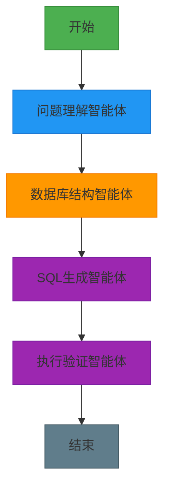
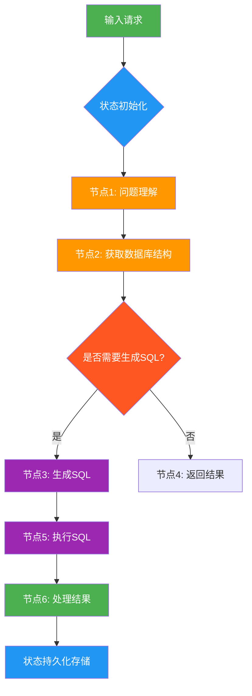
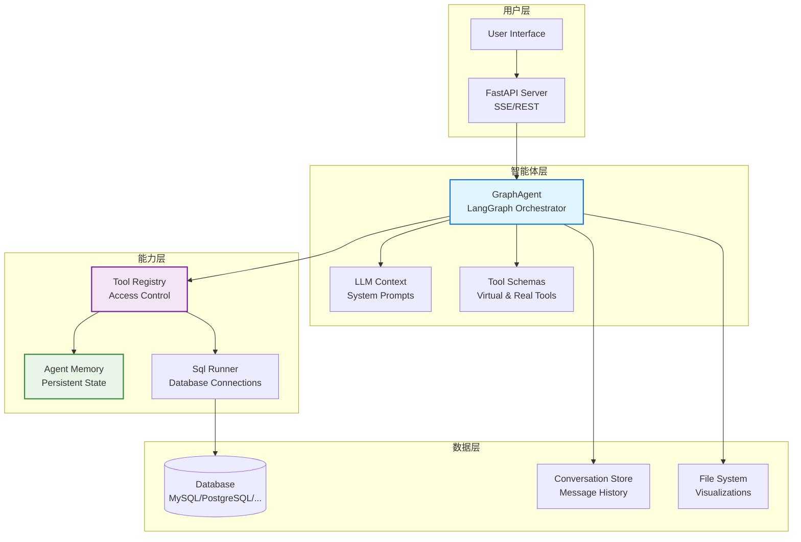
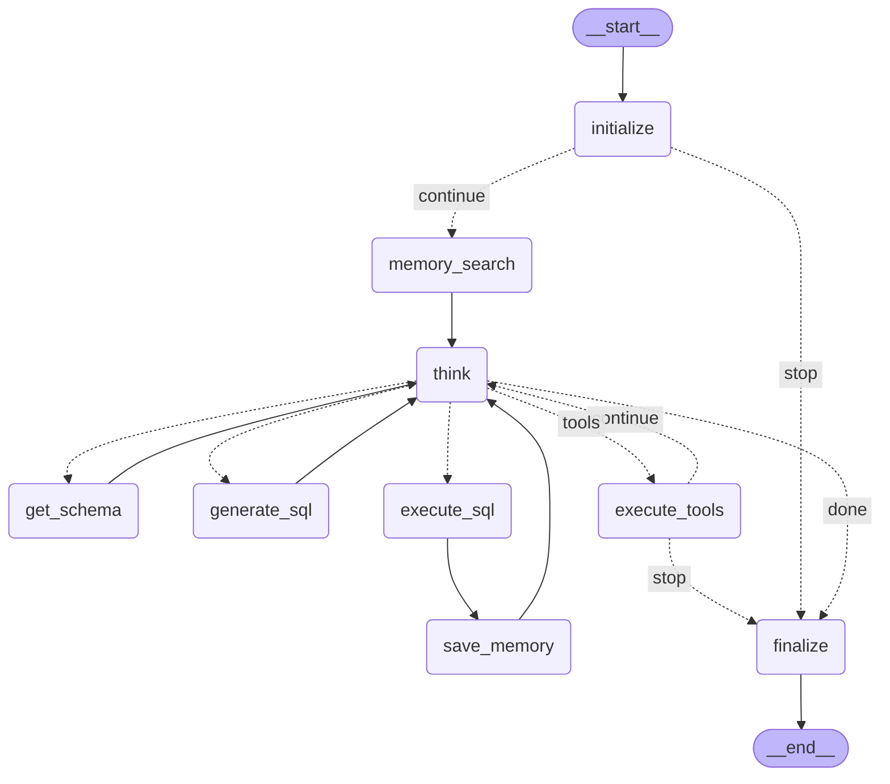
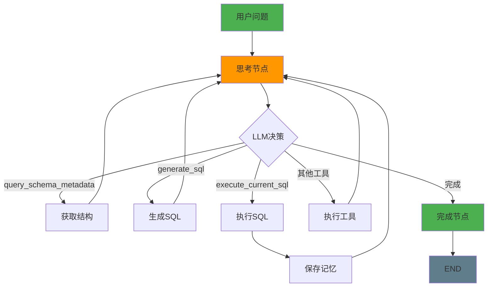

# 使用 Vanna 从零构建数据库智能体：实现智能 SQL 查询的完整指南

## 第一章. Vanna 概述与核心概念

### 1.1 从"手动写 SQL(传统方式)"到"自然语言查询(Vanna 智能体)"的转变

痛点：数据库查询太复杂，需要专业 DBA？开发效率低，业务人员难以快速获取数据？

解决方案：构建自然语言到 SQL 的智能转换系统，让业务人员也能轻松查询数据！

以前搞数据库查询，就像请了个"全能选手"——一个开发人员包揽所有任务：理解需求、写 SQL、优化查询、验证结果……全靠人工。

这听起来全能，但实际效果就像让你既当业务分析师又当数据库专家还兼数据科学家——每样都能做，但哪样都不精。

而现在的趋势是：**让专业 AI 干专业的事**。

Vanna 智能体系统就是给数据库也组建一个"AI 团队"：

- 问题理解智能体：专门负责解析用户自然语言
- 数据库结构智能体：专精获取表结构和字段信息
- SQL 生成智能体：专注语法转换，生成高效 SQL
- 结果验证智能体：最后校验与美化展示

每个 AI 只干自己最擅长的事，彼此配合，效率高、质量好、出错少。

打个比方：手写 SQL 像一把瑞士军刀，啥都能干；Vanna 则像一套专业工具箱——螺丝刀、锤子、电钻各司其职，干活更顺手。

研究数据显示，这种分工协作的方式，在处理复杂业务查询时性能提升 **50%-70%**，而且更容易调试、维护和扩展。

### 1.2 一个 数据库 AI 助手 Vanna 例子

痛点：想实现一个智能数据库查询助手，但不知道从何入手？

解决方案：理解 Vanna 的完整工作流程，从问题到结果的端到端实现！

我们要做的这个 AI 助手，输入一个自然语言问题（比如"显示前 5 个客户的名字"），它就能自动完成：

1. **拆解用户意图** → 识别关键实体：客户、前 5 个、名字
2. **获取数据库结构** → 查找用户表、字段定义
3. **生成对应的 SQL** → 构建 `SELECT name FROM customers LIMIT 5`
4. **执行查询并验证结果** → 运行 SQL，检查数据完整性
5. **输出结构化数据与可视化** → 返回结果表格或图表

整个流程由多个 AI 智能体接力完成，背后靠的是 **Vanna** 这个框架来调度协调。



**实际工作流程示例：**

```
用户输入："销售金额最高的前10个产品"
     ↓ (问题理解)
Vanna识别：实体="产品"，指标="销售金额"，排序="最高"，数量="前10"
     ↓ (结构查询)
Vanna获取：数据库中"products"表、"orders"表及其字段
     ↓ (SQL生成)
Vanna输出：SELECT p.name, SUM(o.amount) as total FROM products p JOIN orders o ON p.id=o.product_id GROUP BY p.name ORDER BY total DESC LIMIT 10
     ↓ (执行验证)
Vanna执行：运行查询并返回结果
     ↓ (结果展示)
Vanna展示：表格形式的前10个产品销售金额排名
```

### 1.3 什么是 Vanna？

痛点：普通 SQL 查询应用记不住事、理不清步骤，像个没头苍蝇？

解决方案：用"图"来设计数据库交互流程，让智能体有记忆、能判断、还能断点续跑！

普通的 SQL 查询应用 记不住事、理不清步骤，像个没头苍蝇。

**怎么办？ 用"智能体"来设计 数据库交互流程** ：

> 把查询拆成一个个节点，用工具链连逻辑，靠状态存上下文。让智能体有记忆、能判断、还能断点续跑。

LangGraph 就是 **数据库的智能助手**，指挥模块按剧本走。

比如做个销售数据分析： 问客户 → 查订单 → 验证权限 → 生成报告。

- 每一步结果都存在"状态"里，后面随时取用；

- 如果缺少权限，直接跳转到"权限验证"。

关键能力：流程清晰、状态不丢、支持循环和中断恢复。

Vanna 是专门为构建**自然语言到 SQL 转换**的 AI 工作流而生。

它不像别的工具那样， 封装太多细节。

Vanna 给你底层控制权，像搭积木一样组装 AI 系统。

Vanna 核心思想很简单：用"图"来建模数据库交互行为，节点是动作，边是跳转逻辑，状态是记忆。

> Vanna is a low-level orchestration framework for building, managing, and deploying long-running, stateful database agents.

#### 图结构三要素

**痛点：** 多个数据库 任务，各模块各干各的，逻辑乱、状态丢、没法 debug。

**解决思路：** 以"状态图"为核心，靠 **节点、边、状态** 三件套，构建可控可溯的数据库工作流。

三大支柱：

- **节点（Nodes）**：执行单元，比如调用大模型、查数据库；
- **边（Edges）**：控制流程走向，可以固定跳转，也能条件判断；
- **状态（State）**：共享内存，全程保存数据，上下文不断。

支持循环：AI 生成 SQL 后验证结构不合适，回退修改，直到通过。

支持人工干预：在流程中插入"等待确认"节点，处理完再继续。

集成 RAG，先检索再回答，不说胡话；

用审计日志 监控全过程，像 DevTools 一样看执行轨迹。



### 1.4 Vanna 的核心优势

痛点：传统数据库查询工具复杂、效率低、扩展困难？

解决方案：Vanna 用有状态、可持久化、基于图的工作流引擎解决这些问题！

Vanna 本质是什么？ Vanna 其实是一个 **“带记忆的、数据库 AI 任务图 、执行器”**。

更技术一点说：

它是一个**有状态、可持久化、基于图的工作流引擎**，灵感来自两种老但牛的技术：

- **数据流编程**（Dataflow Programming）：数据推着计算走

- **Actor 模型**：每个节点像个独立小演员，收到消息才行动

这就让它特别适合做复杂数据库查询流程，比如：

- 自动理解用户意图
- 多步骤查询构建
- 出错自动重试
- 用户中途修改需求也能接得上

**Vanna 的设计哲学很简单粗暴**：

> **把数据库查询当成一个永远在线的"活系统"，而不是一次性的 SQL 执行。**

你可以把它想象成一个**会记住上下文、能持续反应、还会自己做决定的数据库机器人**，而不是一个"问一句写一句 SQL"的问答机。

#### 传统方式 VS Vanna 的区别？

我们先来对比一下：

- **传统方式**：像是流水线工人。

  原料（输入）进来 → 经过几道工序（处理）→ 成品（输出）出去 → 完事。 逻辑简单，但复杂流程跑不了。

- **Vanna**：像是一个值班经理，24 小时在岗。

  他记得昨天客户说了啥，今天问题进展到哪了，还能根据情况叫同事帮忙、重试任务、甚至主动发消息提醒你。

  Vanna 核心是：**状态一直在线，流程可以反复跳转，支持复杂的决策循环。**

### 1.5 Vanna 五大核心能力：

痛点：AI 应用缺乏记忆、状态易丢、难以调试，怎么办？

解决方案：Vanna 提供五种核心能力，构建可控的数据库 AI 应用！

**1、状态保持、持久执行（Durable Execution）**

痛点：跑一半断电了怎么办？重头再来？那用户不得疯了？

解决方案：Vanna 把每一步状态存下来，哪怕服务挂了，重启也能接着干，就像游戏存档一样靠谱。

- **实现方式**：所有节点操作状态都保存在 `AgentState` 中
- **优势**：支持流程中断后恢复执行，用户无感知
- **应用场景**：长时间数据库查询、复杂分析任务

**2、人机协同、人机协作（Human-in-the-loop）**

痛点：AI 再聪明也有拿不准的时候，怎么让人类插一脚？

解决方案：在流程中插入"等待确认"节点，处理完再继续。

这种设计特别适合金融、医疗这类高风险场景。

- **实现方式**：工具调用前的人工确认节点、复杂决策的多步骤验证
- **优势**：人机协作，提高准确性和安全性
- **应用场景**：敏感数据查询、金融交易验证

**3、持久化存储、全面记忆管理（Comprehensive Memory）**

痛点：有的框架只记最近几句话，Vanna 如何实现全面记忆？

解决方案：Vanna 可以同时管：

- 短期记忆：本次会话的 `AgentState` 状态
- 长期记忆：跨会话的 SQL 模式（结合向量库或数据库）

这就让 AI 不仅能"接话"，还能"认数据"，提供个性化体验。

- **记忆类型**：会话记忆、模式记忆、知识记忆
- **实现方式**：AgentMemory 接口 + 专用工具体系
- **优势**：历史查询模式复用，持续优化查询质量

**4、调试能力（Debugging）**

痛点：复杂的数据库 AI 流程就像迷宫，光看日志根本找不到问题在哪。

解决方案：Vanna 结合日志系统，能生成可视化轨迹图，每一步走到哪、状态变成啥样，清清楚楚。

- **调试特性**：节点执行日志、状态变化追踪、可视化流程图、错误定位
- **优势**：快速定位失败节点，提升开发效率
- **应用场景**：生产环境监控、问题排查

**5、工具集成 & 多智能体支持**

痛点：想让 AI 查询数据、生成图表、执行复杂操作？

解决方案：接 API 就行，而且天生支持多个 AI 协同工作。

- **工具集成能力**：数据库工具、可视化工具、自定义工具、多 Agent 协作
- **优势**：功能丰富、扩展性强
- **应用场景**：数据分析、报表生成、监控告警

### 1.5 小结

本章介绍了 Vanna 的核心概念和架构思想，我们了解到：

- **Vanna 的设计哲学**：通过图结构让数据库交互变得更智能、可控、可扩展
- **五大核心能力**：状态持久化、人机协同、记忆管理、调试能力和工具集成
- **与传统方式的区别**：从线性处理到图状流程，从静态到动态，从简单到复杂场景支持
- **架构优势**：支持循环、条件分支、并行执行、错误恢复等复杂流程

这些基础知识为我们深入理解 Vanna 的工作原理奠定了坚实基础。

## 第二章. Vanna 整体架构详解

### 2.1 Vanna 智能体架构图

痛点：Vanna 有那么多组件，关系复杂理不清？

解决方案：看图说话，一目了然！



**架构详解：**

1. **用户层**：

   - **User Interface**：Vanna 的 Web 界面，用户输入自然语言问题
   - **FastAPI Server**：提供 RESTful API 和 SSE 流式响应接口

2. **智能体层**：

   - **GraphAgent**：核心编排引擎，基于 LangGraph 实现
   - **LLM Context**：大语言模型上下文管理，构建系统提示词
   - **Tool Schemas**：虚拟工具和真实工具的定义集合

3. **能力层**：

   - **Tool Registry**：统一的工具注册与权限管理系统
   - **Agent Memory**：持久化记忆系统，存储历史查询模式
   - **Sql Runner**：数据库连接与查询执行器

4. **数据层**：
   - **Database**：业务数据库，支持多种类型（MySQL/PostgreSQL/SQLite 等）
   - **Conversation Store**：会话历史存储，支持长期记忆
   - **File System**：文件系统，用于结果存储和可视化

### 2.2 AgentState 详解

痛点：GraphAgent 中状态如何流转？各个节点如何共享数据？

解决方案：AgentState 是全局共享数据结构，所有节点都共享这个状态！

在 GraphAgent 中，**AgentState** 是整个工作流的核心数据结构，所有的节点都共享这个状态。这个状态包含了整个对话过程中的所有信息：

```python
class AgentState(TypedDict):
    # 上下文信息
    request_context: RequestContext        # 请求上下文
    user: User                            # 当前用户信息
    conversation_id: str                  # 会话ID
    request_id: str                       # 请求ID
    conversation: Conversation            # 会话对象
    agent_memory: AgentMemory             # 智能体记忆
    observability_provider: Optional[ObservabilityProvider]  # 可观测性提供者

    # 输入信息
    message: str                          # 用户输入的消息

    # 工作流数据
    ui_queue: asyncio.Queue              # UI组件队列，用于流式输出
    is_starter_request: bool             # 是否为启动请求
    should_stop: bool                    # 是否应该停止

    # LLM交互数据
    tool_schemas: List[ToolSchema]       # 可用工具定义
    system_prompt: Optional[str]         # 系统提示词
    messages: List[LlmMessage]           # 对话消息历史
    llm_request: Optional[LlmRequest]    # LLM请求对象
    llm_response: Optional[LlmResponse]  # LLM响应对象

    # 执行控制
    tool_iterations: int                 # 工具迭代次数
    tool_context: Optional[ToolContext]  # 工具执行上下文

    # 模型与SQL专用字段
    schema_metadata: Optional[str]       # 数据库结构元数据
    generated_sql: Optional[str]         # 生成的SQL语句
    sql_result: Optional[str]            # SQL执行结果
```

**状态结构剖析：**

1. **上下文信息**：包含用户、会话、记忆等基础信息，为所有节点提供统一的上下文
2. **输入信息**：用户输入的原始消息，作为流程的起点
3. **工作流数据**：控制流程执行的队列、请求等数据
4. **LLM 交互数据**：与大语言模型交互的消息、提示词等
5. **执行控制**：工具执行的相关信息和计数器
6. **SQL 专用字段**：数据库查询相关的特定数据

**状态的本质：**

传统流程像函数链：前一步输出传给下一步，**每步只能看到局部数据**。

结果？上下文断裂、逻辑难控、调试抓狂。

**核心解法**

Vanna 用一个**全局共享状态**，所有节点操作同一份数据。

就像工厂流水线：半成品从一站传到下一站，每一站都加工它、更新它。

```
#  错误理解：以为是函数链
def workflow():
    result1 = step1()
    result2 = step2(result1)
    return result3(result2)

#  正确理解：是状态图
state = {"data": None}
state = node1(state)  # 每个节点都接收并返回完整状态
state = node2(state)
state = node3(state)
```

> 状态 = 公共记事本，所有人一起看、一起改。

> 不是每人一张草稿纸，最后对不上账。

**关键点：**

- **节点不是函数，是状态转换器**：读当前状态 → 加工 → 返回新状态。
- **每一步都在提交快照**：像 Git commit，留下完整的系统瞬间。
- **状态即上下文中枢**：所有节点共用一份数据源，不丢信息，不错乱序。

Vanna 的本质：**带记忆的自动化流水线**。 节点干活，状态流动，全程不断电。

### 2.3 GraphAgent 智能体核心流程

痛点：GraphAgent 内部怎么工作的？像黑盒？

解决方案：拆解流程，层层深入！

GraphAgent 是 Vanna 的核心编排引擎，基于 LangGraph 实现，包含以下核心节点：

- **初始化节点 (initialize)**：解析用户身份，加载会话，准备上下文环境
- **记忆搜索节点 (memory_search)**：检索历史记忆，获取相关上下文
- **思考节点 (think)**：LLM 决策，可能触发虚拟工具调用
- **获取结构节点 (get_schema)**：执行数据库元数据查询
- **生成 SQL 节点 (generate_sql)**：根据上下文生成业务 SQL
- **执行 SQL 节点 (execute_sql)**：运行 SQL 并返回表格结果
- **保存记忆节点 (save_memory)**：将成功操作保存到长期记忆
- **通用工具节点 (execute_tools)**：执行其他真实工具（非虚拟）
- **完成节点 (finalize)**：收尾与保存



**流程详解：**

**1. 初始化阶段：**

- `initialize` 节点：解析用户身份，加载会话历史，准备工具上下文
- 条件判断：如果需要记忆，则跳转到 `memory_search`；否则直接进入 `think` 节点

**2. 记忆检索阶段：**

- `memory_search` 节点：使用 `search_saved_correct_tool_uses` 工具检索历史相似查询
- 将检索结果注入到系统消息中，引导后续 SQL 生成

**3. 核心决策阶段：**

- `think` 节点：LLM 分析当前状态，决定下一步行动
- 根据 LLM 的工具调用决定跳转到不同节点

**4. 工具执行阶段：**

- `get_schema`：获取数据库结构
- `generate_sql`：生成 SQL 语句
- `execute_sql`：执行 SQL 并保存记忆
- `execute_tools`：执行其他工具

**5. 收尾阶段：**

- `finalize` 节点：保存会话状态，返回最终结果

### 2.4 工作流实现

痛点：Vanna 的核心编排逻辑是如何实现的？

解决方案：StateGraph + 节点 + 条件路由，构建图状工作流！

```python
# GraphAgent 核心编排逻辑
def _build_graph(self) -> Any:
    # 创建状态图（基于 AgentState 结构）
    workflow = StateGraph(AgentState)

    # 添加节点（每个节点是一个独立的函数）
    workflow.add_node("initialize", self._node_initialize)        # 初始化节点
    workflow.add_node("memory_search", self._node_memory_search)  # 记忆搜索节点
    workflow.add_node("get_schema", self._node_get_schema)        # 获取结构节点
    workflow.add_node("think", self._node_think)                  # LLM思考节点
    workflow.add_node("generate_sql", self._node_generate_sql)    # 生成SQL节点
    workflow.add_node("execute_sql", self._node_execute_sql)      # 执行SQL节点
    workflow.add_node("save_memory", self._node_save_memory)      # 保存记忆节点
    workflow.add_node("execute_tools", self._node_execute_tools)  # 通用工具节点
    workflow.add_node("finalize", self._node_finalize)            # 完成节点

    # 设置入口点
    workflow.set_entry_point("initialize")

    # 初始化阶段的条件路由（根据是否需要停止决定下一步）
    workflow.add_conditional_edges(
        "initialize",
        self._router_check_stop,  # 路由函数返回 "stop" 或 "continue"
        {
            "stop": "finalize",            # 如果需要停止，直接跳到完成
            "continue": "memory_search"    # 如果继续，跳转到记忆搜索
        }
    )

    # 简单的固定边（直接连接）
    workflow.add_edge("memory_search", "think")  # 记忆搜索后进入思考节点

    # 所有动作节点最终回到思考节点（形成循环）
    workflow.add_edge("get_schema", "think")
    workflow.add_edge("generate_sql", "think")

    # 执行SQL后先保存记忆，然后回思考节点
    workflow.add_edge("execute_sql", "save_memory")
    workflow.add_edge("save_memory", "think")

    # 条件路由：根据LLM响应决定下一步（核心路由逻辑）
    workflow.add_conditional_edges(
        "think",
        self._router_analyze_response,  # 分析 LLM 响应的路由函数
        {
            "tools": "execute_tools",       # 如果需要执行其他工具，跳转到 execute_tools 节点
            "done": "finalize",             # 如果完成，跳转到 finalize 节点
            "get_schema": "get_schema",     # 如果需要获取结构，跳转到 get_schema 节点
            "generate_sql": "generate_sql", # 如果需要生成SQL，跳转到 generate_sql 节点
            "execute_sql": "execute_sql"    # 如果需要执行SQL，跳转到 execute_sql 节点
        }
    )

    # 从工具执行节点的条件边（根据迭代次数限制决定是否继续）
    workflow.add_conditional_edges(
        "execute_tools",
        self._router_check_limit,  # 检查工具迭代次数限制
        {
            "continue": "think",    # 如果未达到限制，继续思考
            "stop": "finalize"      # 如果达到限制，结束流程
        }
    )

    # 设置终点
    workflow.add_edge("finalize", END)

    # 编译图，返回可执行的应用
    return workflow.compile()
```

**关键概念解释：**

1. **StateGraph(AgentState)**：创建一个带状态的图，状态结构由 AgentState 定义
2. **add_node**：添加节点，每个节点是一个函数，接收状态并返回状态更新
3. **set_entry_point**：设置流程的起始节点
4. **add_edge**：添加固定连接，从一个节点直接跳转到另一个节点
5. **add_conditional_edges**：添加条件路由，根据函数返回值决定下一步跳转
6. **END**：流程的终点标识

**编译后的图本质：**

- **状态机**：所有节点共享同一份状态数据
- **事件驱动**：根据 LLM 响应动态决定执行路径
- **可持久化**：状态可以保存和恢复，支持中断续跑

## 第三章. Vanna 核心模块设计详解

### 3.1 工具与注册模块（ToolRegistry）

痛点：多个工具怎么管理？怎么控制权限？如何确保工具安全执行？

解决方案：ToolRegistry 统一管理，按组控制访问，提供完整工具执行链路！

ToolRegistry 是 Vanna 的工具管理核心：

- **统一抽象**：所有工具都继承 `Tool[T]` 抽象基类
- **权限控制**：按用户组控制工具访问
- **执行流程**：注册 → 权限校验 → 参数校验 → 执行 → 审计
- **审计日志**：记录工具调用、参数和结果

```python
# ToolRegistry 执行逻辑
async def execute(self, tool_call: ToolCall, context: ToolContext) -> ToolResult:
    # 1. 获取工具实例
    tool = await self.get_tool(tool_call.name)

    # 2. 权限校验
    if not await self._validate_tool_permissions(tool, context.user):
        return ToolResult(
            success=False,
            result_for_llm="Insufficient group access",
            error="User lacks permission to access this tool"
        )

    # 3. 参数校验与转换
    args_model = tool.get_args_schema()
    validated_args = args_model.model_validate(tool_call.arguments)

    # 4. 参数转换（实现行级安全等高级功能）
    transform_result = await self.transform_args(tool, validated_args, context.user, context)

    # 5. 执行工具
    result = await tool.execute(context, transform_result)
    return result
```

**ToolRegistry 核心组件：**

1. **Tool 抽象基类：**

   - 定义工具的统一接口：`name`、`description`、`get_args_schema`、`execute`
   - 支持泛型，类型安全地处理参数

2. **Tool Call 结构：**

   - `name`：工具名称
   - `arguments`：工具参数，JSON 格式
   - `id`：调用唯一标识符

3. **Tool Context：**

   - 包含执行环境信息：用户、会话 ID、请求 ID、记忆、可观测性提供者等

4. **权限控制：**
   - 基于用户组的访问控制
   - 支持动态权限校验

#### 3.1.1 虚拟工具系统详解

痛点：如何确保 LLM 按照正确的流程工作？避免乱用工具？

解决方案：虚拟工具强制 LLM 按照"理解 → 获取结构 → 生成 SQL → 执行"的流程工作！

虚拟工具系统是 Vanna 的核心创新，它强制 LLM 按照预设的流程工作：

- **`query_schema_metadata(sql=...)`**：虚拟工具，强制 LLM 先了解数据库结构再生成 SQL
- **`generate_sql(instruction=...)`**：虚拟工具，专门用于生成业务 SQL
- **`execute_current_sql()`**：虚拟工具，执行已生成的 SQL

这些虚拟工具确保 LLM 按照"先了解结构 → 再生成 SQL → 最后执行"的正确流程工作。

```python
# 虚拟工具定义示例
virtual_tools = [
    ToolSchema(
        name="query_schema_metadata",
        description="CRITICAL: Use this tool FIRST to retreive the database schema (tables/columns) before generating any SQL.",
        parameters={
          "type": "object",
          "properties": {
              "sql": {"type": "string", "description": "The SQL query to inspect schema (e.g. 'SELECT name, sql FROM sqlite_master WHERE type=\"table\"')"}
          },
          "required": ["sql"]
       }
    ),
    ToolSchema(
        name="generate_sql",
        description="Generate a business logic SQL query based on the schema and user question.",
        parameters={
          "type": "object", "properties": {"instruction": {"type": "string"}}, "required": ["instruction"]
        }
    ),
    ToolSchema(
        name="execute_current_sql",
        description="Execute the currently generated SQL query.",
        parameters={
          "type": "object", "properties": {}, "required": []
        }
    )
]
```

**虚拟工具工作原理：**

1. **系统提示词引导**：在系统提示词中告诉 LLM 可用的虚拟工具
2. **LLM 响应工具调用**：LLM 选择合适的虚拟工具并提供参数
3. **路由机制**：根据工具调用决定跳转到相应节点
4. **执行与反馈**：节点完成任务后更新状态，反馈给 LLM

### 3.2 数据库模块（SqlRunner & RunSqlTool）

痛点：如何统一管理不同数据库的连接和查询？如何处理各种数据库的差异性？

解决方案：实现统一的 SqlRunner 接口，支持多种数据库连接，封装数据库差异！

Vanna 设计了统一的数据库操作接口：

- **SqlRunner**：抽象数据库连接与查询实现
- **RunSqlTool**：将数据库查询封装为工具，便于集成
- **支持多种数据库**：SQLite、MySQL、PostgreSQL、MSSQL 等

```python
# RunSqlTool 的实现示例
class RunSqlTool(Tool[RunSqlToolArgs]):
    def __init__(self, sql_runner: SqlRunner, file_system: LocalFileSystem):
        self.sql_runner = sql_runner
        self.file_system = file_system

    async def execute(self, context: ToolContext, args: RunSqlToolArgs) -> ToolResult:
        try:
            # 1. 执行SQL查询
            result = await self.sql_runner.run_sql(args.sql)

            # 2. 将查询结果保存为文件（便于后续可视化）
            result_file_path = await self.file_system.save_data(result)

            # 3. 返回结果
            return ToolResult(
                success=True,
                result_for_llm=f"Query executed successfully. Data saved to {result_file_path}",
                ui_component=...  # 返回富组件用于展示
            )
        except Exception as e:
            return ToolResult(
                success=False,
                result_for_llm=f"SQL execution failed: {str(e)}",
                error=str(e)
            )
```

**SqlRunner 接口设计：**

```python
class SqlRunner(ABC):
    """数据库查询执行器的抽象基类"""

    @abstractmethod
    async def run_sql(self, sql: str) -> Any:
        """执行SQL查询并返回结果"""
        pass

    @abstractmethod
    def get_schema(self) -> str:
        """获取数据库模式信息"""
        pass
```

**具体实现示例：**

1. **SQLiteRunner：**

   ```python
   class SqliteRunner(SqlRunner):
       def __init__(self, database_path: str):
           self.database_path = database_path

       async def run_sql(self, sql: str) -> Any:
           async with aiosqlite.connect(self.database_path) as db:
               async with db.execute(sql) as cursor:
                   return await cursor.fetchall()
   ```

2. **MySQLRunner：**

   ```python
   class MySQLRunner(SqlRunner):
       def __init__(self, host: str, user: str, password: str, database: str):
           # 初始化连接参数
           pass
   
       async def run_sql(self, sql: str) -> Any:
           # 实现 MySQL 查询逻辑
           pass
   ```

### 3.3 大模型服务模块（LLM Services）

痛点：如何适配不同 LLM 服务提供商？如何统一管理不同模型的差异？

解决方案：统一 LLM 服务接口，支持 OpenAI、Anthropic、Azure 等！

- **LlmService**：统一 LLM 服务接口
- **中间件支持**：请求/响应拦截、缓存、监控
- **流式响应**：支持实时返回结果

```python
# LLM 中间件系统
class LlmMiddleware:
    async def before_llm_request(self, request: LlmRequest) -> LlmRequest:
        # 请求前置处理：日志记录、缓存检查等
        pass

    async def after_llm_response(self, request: LlmRequest, response: LlmResponse) -> LlmResponse:
        # 响应后置处理：缓存存储、结果增强等
        pass
```

**LlmService 接口设计：**

```python
class LlmService(ABC):
    @abstractmethod
    async def send_request(self, request: LlmRequest) -> LlmResponse:
        """发送请求并返回响应"""
        pass

    @abstractmethod
    def stream_request(self, request: LlmRequest) -> AsyncGenerator[LlmResponseChunk, None]:
        """流式发送请求"""
        pass
```

**具体实现示例：**

1. **OpenAILlmService：**

   ```python
   class OpenAILlmService(LlmService):
       def __init__(self, model: str, api_key: str, base_url: str = None):
           # 初始化 OpenAI 客户端
           pass
   
       async def send_request(self, request: LlmRequest) -> LlmResponse:
           # 调用 OpenAI API
           pass
   ```

### 3.4 Integrations 设计

痛点：各种功能模块如何扩展？如何支持不同的数据库、记忆系统、LLM 提供商？

解决方案：采用插件化集成设计，支持多种能力扩展！

**集成能力包括：**

- **数据库集成**：SQLite、MySQL、PostgreSQL、MSSQL、Oracle 等
- **记忆系统集成**：ChromaDB、FAISS、Pinecone、Qdrant、Weaviate 等
- **LLM 提供商集成**：OpenAI、Anthropic、Google/Gemini、Ollama 等
- **可视化集成**：图表生成、数据展示等

**插件化设计原则：**

1. **统一接口**：所有集成实现同一套接口
2. **配置驱动**：通过配置文件选择集成实现
3. **即插即用**：支持动态加载和替换

### 3.5 生命周期模块（Lifecycle Hook）

痛点：如何在关键节点插入自定义逻辑？如何实现审计、监控、自定义处理等功能？

解决方案：设计生命周期钩子，支持在不同阶段执行自定义逻辑！

```python
class LifecycleHook:
    async def before_message(self, user: User, message: str) -> Optional[str]:
        """消息处理前的钩子 - 可以修改输入消息"""
        # 例如：敏感词过滤、消息预处理
        pass

    async def after_message(self, conversation: Conversation) -> None:
        """消息处理后的钩子 - 可以进行后续处理"""
        # 例如：统计分析、审计日志记录
        pass

    async def before_tool(self, tool: Tool, context: ToolContext) -> None:
        """工具执行前的钩子 - 可以进行前置验证"""
        # 例如：访问控制检查、资源配额验证
        pass

    async def after_tool(self, result: ToolResult) -> Optional[ToolResult]:
        """工具执行后的钩子 - 可以修改工具结果"""
        # 例如：结果脱敏、后处理
        pass
```

**钩子系统工作流程：**

1. **消息处理钩子**：在消息处理前后插入逻辑
2. **工具执行钩子**：在工具执行前后插入逻辑
3. **会话管理钩子**：在会话创建、结束时插入逻辑
4. **错误处理钩子**：在错误发生时插入逻辑

### 3.6 安全设计

痛点：如何保证数据安全和访问控制？如何防止 SQL 注入等安全问题？

解决方案：多层次安全设计，从用户认证到数据访问！

**安全层次：**

- **用户认证**：UserResolver 统一用户解析，支持多种认证方式
- **权限控制**：工具级别的访问控制，基于用户组
- **数据脱敏**：敏感数据处理，防止敏感信息泄露
- **审计日志**：完整操作记录，便于安全审计

**具体安全措施：**

1. **参数校验**：使用 Pydantic 模型严格校验所有输入参数
2. **SQL 注入防护**：参数化查询，避免直接拼接 SQL
3. **行级安全**：通过 `transform_args` 实现行级数据访问控制
4. **访问控制**：基于角色的权限管理
5. **审计追踪**：记录所有操作日志

```python
# 行级安全示例
async def transform_args(
    self,
    tool: Tool[T],
    args: T,
    user: User,
    context: ToolContext,
) -> Union[T, ToolRejection]:
    """Transform and validate tool arguments based on user context."""
    # 根据用户组修改SQL查询，限制数据访问范围
    if user.group == 'sales':
        args.sql += f" WHERE sales_person_id = '{user.id}'"
    elif user.group == 'manager':
        args.sql += f" WHERE department_id = '{user.department_id}'"
    return args
```

### 3.6 小结

本章详细介绍了 Vanna 的核心模块设计，我们掌握了：

- **ToolRegistry 系统**：统一的工具管理、权限控制、执行流程和审计功能
- **数据库模块**：统一的 SqlRunner 接口、RunSqlTool 封装、多数据库支持
- **LLM 服务模块**：统一接口、中间件支持、流式响应处理
- **Integrations 设计**：插件化架构、统一接口、即插即用
- **生命周期钩子**：在关键节点插入自定义逻辑的机制

这些核心模块构成了 Vanna 的能力层，为构建强大的数据库 AI 应用提供了坚实基础。

## 第四章. 传统 Agent 设计和不足

### 4.1 传统 Agent 的实现方式

痛点：传统 Agent 逻辑都写在单个方法里，代码越来越复杂，难以维护？

解决方案：传统 Agent 采用线性处理流程，所有逻辑都在一个方法中，简单但局限！

传统 Agent 的实现方式是**顺序处理**：

- 用户输入 → 理解 → 获取工具 → 构建提示 → 调用 LLM → 处理工具调用 → 返回结果
- 整个流程是**线性的**，没有循环或复杂分支
- 代码逻辑写在 `_send_message` 方法中，逐步执行每个步骤

```python
class Agent:
    """传统Agent实现 - 顺序处理流程"""

    async def _send_message(
        self,
        request_context: RequestContext,
        message: str,
        *,
        conversation_id: Optional[str] = None,
    ) -> AsyncGenerator[UiComponent, None]:
        # 1. 解析用户身份
        user = await self.user_resolver.resolve_user(request_context)

        # 2. 处理会话
        conversation = await self.conversation_store.get_conversation(conversation_id, user)

        # 3. 准备上下文
        tool_context = ToolContext(
            user=user,
            conversation_id=conversation_id,
            request_id=str(uuid.uuid4()),
            agent_memory=self.agent_memory,
            observability_provider=self.observability_provider
        )

        # 4. 构建系统提示
        tool_schemas = await self.tool_registry.get_schemas(user)
        system_prompt = await self.system_prompt_builder.build_system_prompt(user, tool_schemas)

        # 5. 构建LLM请求
        messages = [LlmMessage(role="user", content=message)]
        llm_request = LlmRequest(
            messages=messages,
            tools=tool_schemas if tool_schemas else None,
            user=user,
            system_prompt=system_prompt
        )

        # 6. 发送LLM请求
        llm_response = await self.llm_service.send_request(llm_request)

        # 7. 处理工具调用
        if llm_response.is_tool_call():
            for tool_call in llm_response.tool_calls:
                # 执行工具
                result = await self.tool_registry.execute(tool_call, tool_context)

                # 将结果添加到会话历史
                conversation.add_message(Message(
                    role="tool",
                    content=result.result_for_llm,
                    tool_call_id=tool_call.id
                ))

                # 重新构建请求并再次调用LLM
                updated_messages = [LlmMessage(role="user", content=message)] + [
                    LlmMessage(role="assistant", content="", tool_calls=llm_response.tool_calls)
                ] + [
                    LlmMessage(role="tool", content=result.result_for_llm, tool_call_id=tool_call.id)
                ]

                final_request = LlmRequest(
                    messages=updated_messages,
                    tools=tool_schemas if tool_schemas else None,
                    user=user,
                    system_prompt=system_prompt
                )

                final_response = await self.llm_service.send_request(final_request)
                yield self._create_response_component(final_response)
        else:
            # 直接返回LLM响应
            yield self._create_response_component(llm_response)

    def _create_response_component(self, response: LlmResponse) -> UiComponent:
        """创建UI组件"""
        return UiComponent(
            rich_component=RichTextComponent(content=response.content),
            simple_component=SimpleTextComponent(text=response.content)
        )
```

**传统 Agent 的特点：**

- **简单直观**：逻辑清晰，按步骤执行
- **易于理解**：所有代码在同一个方法中
- **限制明显**：复杂流程难以处理，如循环、条件分支等
- **扩展困难**：添加新功能需要修改现有方法
- **状态管理差**：难以管理复杂的状态转换
- **调试困难**：错误定位复杂，难以追踪执行路径

### 4.2 传统 Agent 的节点实现和不足

痛点：传统 Agent 如何处理复杂流程？工具调用后无法做出智能决策？

解决方案：通过具体例子理解传统 Agent 的局限性，为什么工具调用后无法动态调整流程！

让我们通过一个具体的例子来理解传统 Agent 的实现和局限：

**场景：用户询问 "我需要查看最近销售额最高的前 5 个产品，但如果数据有问题，请重新获取表结构"**

**传统 Agent 的处理方式：**

```python
# 传统Agent在处理工具调用时的代码结构
async def _send_message(self, ...):
    """传统Agent的单方法处理流程演示"""

    # ... 初始设置代码 ...
    print("1. 开始处理用户请求")

    # 直接调用LLM
    print("2. 调用LLM获取响应")
    llm_response = await self.llm_service.send_request(llm_request)

    # 假设LLM返回了工具调用：先获取表结构
    if llm_response.tool_calls:
        print("3. 检测到工具调用，开始执行...")
        for tool_call in llm_response.tool_calls:
            print(f"  - 执行工具: {tool_call.name}")
            print(f"  - 工具参数: {tool_call.arguments}")

            # 执行工具
            result = await self.tool_registry.execute(tool_call, context)
            print(f"  - 工具执行结果: {result.success}, 内容: {result.result_for_llm[:50]}...")

            # 直接处理结果，没有循环验证
            conversation.add_message(Message(
                role="tool",
                content=result.result_for_llm,
                tool_call_id=tool_call.id
            ))

        # 传统方式的问题：即使工具执行失败，也继续执行，无法动态调整
        print("4. 工具执行完成，继续下一步")

        # 无法根据工具结果动态决定下一步
        # 即使上面的获取表结构失败，也会继续尝试生成SQL
        next_response = await self.llm_service.send_request(next_llm_request)
        print("5. 无论如何都继续执行下一个请求")

    # 传统方式无法处理的场景：如果SQL执行失败，无法回退到"重新获取表结构"
    return result_component

# 传统Agent处理流程的具体例子


```

**传统 Agent 的具体问题演示：**

让我们看一个更具体的例子，展示传统 Agent 的局限性：

```python
# 传统 Agent 无法处理的循环决策场景
class TraditionalAgentExample:
    async def handle_complex_query(self, user_input: str):
        """传统方式处理复杂查询的示例"""

        # 1. 第一步：LLM 决定需要获取数据库结构
        llm_response = await self.call_llm_for_schema(user_input)

        # 2. 执行获取结构工具
        schema_result = await self.execute_schema_tool(llm_response)

        # 传统方式的问题：这里没有检查结果是否成功
        # 即使 schema_result.success == False，也会继续下一步

        if not schema_result.success:
            print("❌ 问题：虽然获取结构失败了，但传统Agent还是会继续")
            # 传统方式无法在这里决定："重新获取结构" 或 "使用备用方案"
            # 而是继续执行下面的步骤，导致后续全部失败

        # 3. 生成SQL（基于可能失败的结构信息）
        sql_response = await self.generate_sql_based_on_schema(user_input)

        # 4. 执行SQL
        sql_execution_result = await self.execute_sql(sql_response)

        # 传统方式无法处理：如果SQL执行结果为空或异常，无法回退
        if sql_execution_result.is_empty:
            print("❌ 问题：SQL执行结果为空，但无法回退到前面的步骤重新尝试")

        # 5. 返回结果（无论成功失败）
        return self.format_response(sql_execution_result)

# 对比 GraphAgent 的处理方式
class GraphAgentExample:
    """GraphAgent 如何智能处理同样的场景"""

    async def node_get_schema(self, state):
        """获取结构节点"""
        schema_result = await self.execute_schema_query(state)

        if not schema_result.success:
            # GraphAgent 可以决定下一步：重试、跳过、或报告错误
            return {
                "schema_status": "failed",
                "retry_count": state.get("retry_count", 0) + 1
            }
        else:
            return {
                "schema_status": "success",
                "schema_data": schema_result.data
            }

    async def router_analyze_schema_response(self, state):
        """分析获取结构的结果，决定下一步"""
        schema_status = state.get("schema_status")
        retry_count = state.get("retry_count", 0)

        if schema_status == "failed":
            if retry_count < 3:  # 如果重试次数少于3次
                print("🔄 决定：回退到重新获取结构")
                return "get_schema"  # 回到获取结构节点
            else:
                print("⚠️  决定：重试次数过多，通知用户")
                return "finalize"  # 结束流程
        else:
            print("✅ 决定：结构获取成功，继续生成SQL")
            return "generate_sql"  # 继续到生成SQL节点

"""
传统 Agent vs GraphAgent 的对比：

传统 Agent：
输入 → LLM决定 → 执行工具 → （不管结果）→ 继续下一步 → ... → 输出
      ↑                    ↑
      |                    |
    无法决策            无法回退

GraphAgent：
输入 → [初始化] → [获取结构] → {检查结果} → [重试/生成SQL/结束]
                  ↑           ↑
                  |           |
              可以失败     可以决策
              可以重试     可以回退
"""
```

**传统 Agent 不足之处的具体体现：**

1. **线性执行无法动态调整**：

   - ✅ 传统方式：获取结构 → 生成 SQL → 执行 SQL → 结束（固定流程）
   - 🔁 GraphAgent：根据每个步骤的结果动态决定下一步走向

2. **错误处理能力弱**：

   - ❌ 传统方式：工具失败 → 不检查结果 → 继续执行 → 整个流程失败
   - ✅ GraphAgent：工具失败 → 检查结果 → 决定重试/跳过/结束 → 智能恢复

3. **状态管理混乱**：

   - ❌ 传统方式：所有状态变量都在一个方法里，难以追踪变化
   - ✅ GraphAgent：统一的 AgentState，所有节点共享和更新

4. **扩展性差**：
   - ❌ 传统方式：添加新功能需要在大方法中插入逻辑，容易出错
   - ✅ GraphAgent：添加新节点，通过路由连接，不影响其他功能

### 4.3 传统 Agent 的局限性分析

痛点：传统 Agent 在处理复杂数据库查询时表现不佳，为什么？

解决方案：通过具体场景和对比分析，理解传统 Agent 的根本局限性！

**4.3.1 流程刚性问题 - 无法适应复杂查询需求**

**场景举例：** 用户查询 "帮我找出销售额下降超过 20%的产品，如果有异常数据请标记出来"

**传统 Agent 的僵化处理：**

```python
# 传统 Agent 必须按预定顺序执行
def traditional_approach(self):
    """
    传统方式的固定流程：
    1. 获取表结构 → 2. 生成SQL → 3. 执行查询 → 4. 返回结果
    """
    print("流程固定：获取结构 → 生成SQL → 执行 → 返回")

    # 如果 LLM 发现需要"先检查数据质量"，但流程中没有这个步骤
    # 传统 Agent 无法临时增加这个步骤
    return "按固定顺序执行，无法变通"

# 实际例子：如果查询过程中发现表结构过时
"""
传统 Agent 流程：
用户："查销售数据"
→ 1. 获取当前表结构
→ 2. 生成SQL（基于旧结构）
→ 3. 执行SQL（失败，因字段已改变）
→ 4. 返回错误（无法自动获取新结构重试）
"""

# GraphAgent 的灵活处理：
"""
GraphAgent 流程：
用户："查销售数据"
→ 1. 获取表结构
→ 2. [检查结构有效性] → 结构无效
→ 3. [决策节点] → 重新获取最新结构
→ 4. [生成SQL] → [执行] → [返回正确结果]
"""
```

**4.3.2 记忆机制缺失 - 无法学习和复用历史经验**

**场景举例：** 同样的查询重复出现

**传统 Agent 的问题：**

```python
# 每次查询都像第一次一样处理
def handle_repeat_query(self, query: str):
    """
    传统方式：每次都是全新处理
    """
    print(f"第1次: 收到查询 '{query}', 开始分析...")
    # 完整的分析流程：获取结构 → 生成SQL → 执行 → 返回
    result1 = self.full_process(query)

    print(f"第2次: 收到相同查询 '{query}', 再次分析...")
    # 同样的完整流程：获取结构 → 生成SQL → 执行 → 返回
    result2 = self.full_process(query)  # 重复工作

    print(f"两次结果相同，但做了双倍工作")
    return result2

# 实际例子：用户连续问"上个月销售额"
"""
传统 Agent 处理：
第1次："上个月销售额" → 获取结构 → 生成SQL → 执行 → 返回
第2次："上个月销售额" → 重新获取结构 → 重新生成SQL → 重新执行 → 返回
# 没有用到上次的经验，重复劳动
"""

# GraphAgent 的记忆机制：
"""
GraphAgent 处理：
第1次："上个月销售额" → [记忆搜索: 无相似记录] → 生成查询 → [保存成功模式]
第2次："上个月销售额" → [记忆搜索: 找到相似记录] → [复用成功模式] → 快速返回
# 学习历史经验，提升效率
"""
```

**4.3.3 错误处理和恢复能力弱**

**场景举例：** 查询执行失败后的处理

**传统 Agent 的错误处理：**

```python
# 传统方式的错误处理非常被动
def handle_query_with_error(self, query: str):
    """传统方式的错误处理"""
    try:
        # 1. 生成SQL
        sql = self.generate_sql(query)
        print(f"生成SQL: {sql}")

        # 2. 执行SQL
        result = self.execute_sql(sql)
        print(f"执行结果: {result}")

        return result

    except Exception as e:
        # 传统方式只能简单报告错误，无法智能恢复
        print(f"❌ 错误发生: {e}")
        print("❌ 无法自动处理，流程中断")
        # 没有备选方案，没有重试机制
        raise e

# 实际例子：SQL语法错误
"""
传统 Agent 处理：
用户："销售最高的前5产品"
→ 1. LLM生成SQL（可能有语法错误）
→ 2. 执行SQL → 失败
→ 3. 报告错误给用户 → 用户重新提问
→ 4. 重复整个过程
# 没有自动修正或重试机制
"""

# GraphAgent 的错误恢复：
"""
GraphAgent 处理：
用户："销售最高的前5产品"
→ 1. LLM生成SQL
→ 2. [执行SQL] → 失败（语法错误）
→ 3. [错误分析节点] → 发现语法问题
→ 4. [决策节点] → 决定"重新生成SQL"
→ 5. [重新生成SQL] → [重新执行] → 成功
# 自动检测、分析、恢复
"""
```

**4.3.4 状态管理问题 - 无法保持复杂会话状态**

**场景举例：** 多轮对话的上下文维护

**传统 Agent 的状态管理：**

```python
# 传统方式状态管理简单，难以处理复杂会话
def multi_turn_conversation(self, user_queries: list):
    """传统方式处理多轮对话"""
    all_context = []  # 简单的状态存储

    for i, query in enumerate(user_queries):
        print(f"轮次 {i+1}: {query}")

        # 每次都要从头开始构建上下文
        current_context = self.build_context(query, all_context)

        # 处理当前查询
        response = self.process_single_query(query, current_context)

        # 添加到上下文（简单追加）
        all_context.append((query, response))

        # 如果上下文变得复杂，难以有效管理
        # 没有机制区分重要/不重要的对话历史
        # 随着对话轮次增加，性能下降

    return [resp for _, resp in all_context]

# 实际例子：复杂多轮对话
"""
传统 Agent 处理：
用户1："显示所有客户" → Agent1："SELECT * FROM customers"
用户2："只显示活跃客户" → Agent2：需要记住"之前要显示所有客户"才能理解"只显示活跃"
用户3："按照收入排序" → Agent3：需要记住"活跃客户"+"收入排序"

传统方式：保存所有历史，但无法智能识别哪些历史重要
GraphAgent：智能化管理状态，知道"活跃客户"是关键约束条件
"""
```

**4.3.5 扩展性问题总结**

通过以上分析，我们可以看到传统 Agent 的核心问题：

| 问题类型       | 传统 Agent 表现        | GraphAgent 解决方案  |
| -------------- | ---------------------- | -------------------- |
| **流程灵活性** | 固定顺序，无法适应变化 | 条件路由，动态调整   |
| **错误处理**   | 被动报告，无法自动恢复 | 主动检测，智能恢复   |
| **记忆复用**   | 每次都重新开始         | 学习经验，复用模式   |
| **状态管理**   | 简单存储，难以维护     | 统一状态，智能更新   |
| **扩展能力**   | 修改大方法，风险高     | 添加新节点，安全可靠 |

- **线性执行**：无法根据 LLM 决策动态跳转

  - 传统方式：输入 → 理解 → 工具调用 → 结果 → 结束
  - GraphAgent：输入 → 根据 LLM 决策跳转到不同节点 → 再决策 → 继续跳转

- **无记忆机制**：无法形成历史查询的复用

  - 传统方式：每次都是新的会话，无法利用历史经验
  - GraphAgent：记忆搜索节点先检索历史，再执行新查询

- **错误处理弱**：出错后难以重试或恢复
  - 传统方式：错误发生后流程中断，需要重新开始
  - GraphAgent：错误节点可以决定重试、跳过或报告

**4.3.2 扩展性问题**

- **代码耦合**：所有逻辑在一个方法中，难以维护

  - 传统方式：`_send_message` 方法越来越庞大，难以理解和修改
  - GraphAgent：每个节点职责单一，易于理解和修改

- **功能单一**：适合简单问答场景，复杂业务支持有限

  - 传统方式：复杂的业务逻辑需要在单个方法中实现，代码复杂度指数增长
  - GraphAgent：复杂业务可以分解为多个节点，逻辑清晰

- **调试困难**：流程长且复杂时难以定位问题
  - 传统方式：错误日志难以追踪具体步骤
  - GraphAgent：每个节点的输入输出都清晰，便于调试

**4.3.3 数据管理问题**

- **状态不一致**：无法保证跨步骤的状态一致性

  - 传统方式：状态分散在多个变量中，容易出现不一致
  - GraphAgent：统一的 AgentState 确保状态一致性

- **无法持久化**：中断后会话状态丢失

  - 传统方式：进程重启后所有状态丢失
  - GraphAgent：状态可以持久化，支持中断续跑

- **缺乏记忆**：无法复用历史成功模式
  - 传统方式：每次查询都是独立的，无法学习历史经验
  - GraphAgent：记忆系统保存成功模式，供后续查询复用

### 4.3 小结

本章通过对比分析传统 Agent 与 GraphAgent，我们深入理解了：

- **传统 Agent 的实现方式**：线性处理，逻辑集中于单一方法
- **传统 Agent 的局限性**：流程刚性、错误处理弱、扩展性差、状态管理混乱
- **GraphAgent 的优势**：图结构、条件路由、状态管理、记忆闭环、错误恢复

传统 Agent 就像固定的流水线，每样东西都按预定路径移动；GraphAgent 则像智能交通系统，能根据路况动态调整路线。这种架构差异让 GraphAgent 在处理复杂数据库查询时表现更加出色。

## 第五章. GraphAgent 设计和实现详解

### 5.1 GraphAgent 的实现方式

痛点：复杂数据库查询需要多次交互、循环验证，传统方式处理不了？

解决方案：GraphAgent 用图结构，节点处理不同任务，边控制流程走向！

GraphAgent 的实现方式是**图驱动**：

- 用户输入 → 初始化 → 记忆搜索 → 思考 → 获取结构/生成 SQL/执行工具 → 思考 → 执行 SQL → 保存记忆 → 思考 → ... → 完成
- 整个流程是**循环的**，根据 LLM 响应决定下一步动作
- 使用**LangGraph**构建状态图，各节点独立处理特定任务

```python
class GraphAgent:
    """GraphAgent实现 - 图驱动流程"""

    def _build_graph(self) -> Any:
        """构建LangGraph状态机"""
        # 1. 创建状态图（基于 AgentState 定义）
        workflow = StateGraph(AgentState)

        # 2. 添加不同功能节点
        workflow.add_node("initialize", self._node_initialize)        # 初始化节点：解析用户、加载会话
        workflow.add_node("memory_search", self._node_memory_search)  # 记忆搜索节点：检索历史查询
        workflow.add_node("get_schema", self._node_get_schema)        # 获取结构节点：查询数据库元数据
        workflow.add_node("think", self._node_think)                  # LLM思考节点：分析状态、决定行动
        workflow.add_node("generate_sql", self._node_generate_sql)    # 生成SQL节点：生成业务SQL
        workflow.add_node("execute_sql", self._node_execute_sql)      # 执行SQL节点：运行SQL查询
        workflow.add_node("save_memory", self._node_save_memory)      # 保存记忆节点：保存成功查询
        workflow.add_node("execute_tools", self._node_execute_tools)  # 通用工具节点：执行其他工具
        workflow.add_node("finalize", self._node_finalize)            # 完成节点：收尾工作

        # 3. 设置入口点
        workflow.set_entry_point("initialize")

        # 4. 初始化后跳转到记忆搜索节点（如果需要）
        workflow.add_conditional_edges(
            "initialize",
            self._router_check_stop,  # 检查是否需要停止
            {
                "stop": "finalize",            # 如果停止，直接跳转到完成
                "continue": "memory_search"    # 如果继续，跳转到记忆搜索
            }
        )

        # 5. 记忆搜索后进入思考节点
        workflow.add_edge("memory_search", "think")

        # 6. 所有操作节点都返回think节点继续决策（形成循环）
        workflow.add_edge("get_schema", "think")
        workflow.add_edge("generate_sql", "think")
        workflow.add_edge("execute_tools", "think")

        # 7. 执行SQL后先保存记忆，然后回思考节点
        workflow.add_edge("execute_sql", "save_memory")
        workflow.add_edge("save_memory", "think")

        # 8. 条件路由：根据LLM响应决定下一步
        workflow.add_conditional_edges("think", self._router_analyze_response, {
            "get_schema": "get_schema",    # 如果LLM需要获取结构，跳转到get_schema节点
            "generate_sql": "generate_sql", # 如果LLM需要生成SQL，跳转到generate_sql节点
            "execute_sql": "execute_sql",   # 如果LLM需要执行SQL，跳转到execute_sql节点
            "tools": "execute_tools",       # 如果LLM需要执行其他工具，跳转到execute_tools节点
            "done": "finalize"              # 如果完成，跳转到finalize节点
        })

        # 9. 通用工具执行后根据次数决定是否继续
        workflow.add_conditional_edges(
            "execute_tools",
            self._router_check_limit,  # 检查工具迭代次数限制
            {
                "continue": "think",    # 如果未达到限制，继续思考
                "stop": "finalize"      # 如果达到限制，结束流程
            }
        )

        # 10. 设置终点
        workflow.add_edge("finalize", END)

        # 11. 编译图并返回可执行应用
        return workflow.compile()
```

**GraphAgent 的特点：**

- **灵活控制**：根据 LLM 响应动态调整流程
- **可扩展**：容易添加新节点和路由逻辑
- **复杂流程**：支持循环、条件分支、并行执行
- **状态管理**：全局状态，所有节点共享数据
- **记忆闭环**：先搜索记忆再执行，成功后保存记忆
- **错误恢复**：支持中断续跑、错误重试

### 5.2 核心节点详解

痛点：GraphAgent 的各个节点都负责什么功能？如何协同工作？

解决方案：详细解析每个节点的职责、输入输出，理解节点间的协作机制！

Vanna GraphAgent 包含以下核心节点，每个节点负责特定的功能：

| 节点名称        | 职责                             | 输入                       | 输出                           |
| --------------- | -------------------------------- | -------------------------- | ------------------------------ |
| `initialize`    | 初始化会话、解析用户、准备上下文 | 用户请求上下文             | 用户信息、会话对象、工具上下文 |
| `memory_search` | 检索历史记忆                     | 用户问题、记忆系统         | 相关记忆内容                   |
| `think`         | LLM 推理、决策下一步行动         | 消息历史、工具定义         | LLM 响应、决策结果             |
| `get_schema`    | 获取数据库结构                   | LLM 的工具调用、数据库连接 | 数据库结构信息                 |
| `generate_sql`  | 生成 SQL 查询                    | 用户问题、数据库结构       | 生成的 SQL 语句                |
| `execute_sql`   | 执行 SQL 查询                    | 生成的 SQL 语句            | 查询结果                       |
| `save_memory`   | 保存成功操作到记忆               | 问题、SQL、结果            | 保存状态                       |
| `execute_tools` | 执行其他工具                     | LLM 的工具调用             | 工具执行结果                   |
| `finalize`      | 收尾工作、保存会话               | 最终状态                   | 完成状态                       |

#### 节点详解：

**1. 初始化节点 (initialize):**

```python
async def _node_initialize(self, state: AgentState) -> PartialAgentState:
    """初始化节点：解析用户身份，加载会话，准备上下文环境"""
    request_context = state["request_context"]
    message = state["message"]
    ui_queue = state["ui_queue"]

    # 解析用户，如果配置了用户解析器
    user = await self.user_resolver.resolve_user(request_context)

    # 生成会话ID（如果未提供）
    conversation_id = state.get("conversation_id") or str(uuid.uuid4())

    # 加载或创建会话
    conversation = await self.conversation_store.get_conversation(conversation_id, user)
    if not conversation:
        conversation = Conversation(id=conversation_id, user=user, messages=[])

    # 准备工具上下文
    tool_context = ToolContext(
        user=user,
        conversation_id=conversation_id,
        request_id=state["request_id"],
        agent_memory=self.agent_memory,
        observability_provider=self.observability_provider,
    )

    # 获取可用工具
    tool_schemas = await self.tool_registry.get_schemas(user)

    # 构建系统提示词
    system_prompt = await self.system_prompt_builder.build_system_prompt(user, tool_schemas)

    # 准备LLM消息历史
    messages = [LlmMessage(role="user", content=message)]

    return {
        "user": user,
        "conversation": conversation,
        "conversation_id": conversation_id,
        "tool_context": tool_context,
        "tool_schemas": tool_schemas,
        "system_prompt": system_prompt,
        "messages": messages,
        "should_stop": False
    }
```

**2. 记忆搜索节点 (memory_search):**

```python
async def _node_memory_search(self, state: AgentState) -> PartialAgentState:
    """记忆搜索节点：检索历史记忆"""
    message = state["message"]  # 用户输入的问题
    context = state["tool_context"]  # 工具执行上下文

    # 检查是否配置了记忆搜索工具
    search_tool = await self.tool_registry.get_tool("search_saved_correct_tool_uses")
    if not search_tool:
        return {}  # 如果没有搜索工具，返回空状态更新

    # 执行记忆搜索
    args_model = search_tool.get_args_schema()
    tool_args = args_model(question=message, tool_name_filter="run_sql")
    result = await search_tool.execute(context, tool_args)

    # 如果找到了相关记忆，添加到消息历史
    if result.success and "Found" in result.result_for_llm and "0 similar" not in result.result_for_llm:
        memory_msg = f"Memory Search Results:\n{result.result_for_llm}"
        # 将记忆结果添加到状态中，供后续节点使用
        state["messages"].append(LlmMessage(role="system", content=memory_msg))

    return {}  # 记忆搜索节点不改变核心状态
```

**3. 思考节点 (think):**

```python
async def _node_think(self, state: AgentState) -> PartialAgentState:
    """思考节点：LLM决策，决定下一步行动"""
    # 1. 定义虚拟工具（引导LLM按照预设路径行动）
    virtual_tools = [
        ToolSchema(
            name="query_schema_metadata",
            description="CRITICAL: Use this tool FIRST to retreive the database schema (tables/columns) before generating any SQL.",
            parameters={"type": "object", "properties": {"sql": {"type": "string"}}, "required": ["sql"]}
        ),
        ToolSchema(
            name="generate_sql",
            description="Generate a business logic SQL query based on the schema and user question.",
            parameters={"type": "object", "properties": {"instruction": {"type": "string"}}, "required": ["instruction"]}
        ),
        ToolSchema(
            name="execute_current_sql",
            description="Execute the currently generated SQL query.",
            parameters={"type": "object", "properties": {}, "required": []}
        )
    ]

    # 2. 构建LLM请求（结合真实工具和虚拟工具）
    real_tools = state["tool_schemas"]  # 真实可用的工具
    all_tools = real_tools + virtual_tools  # 所有工具（真实+虚拟）

    llm_request = LlmRequest(
        messages=state["messages"],
        tools=all_tools,
        user=state["user"],
        system_prompt=state["system_prompt"]
    )

    # 3. 调用LLM
    response = await self.llm_service.send_request(llm_request)

    # 4. 更新状态，返回控制权给图调度器
    return {"llm_response": response}
```

### 5.3 路由机制详解

痛点：GraphAgent 如何根据 LLM 的响应决定下一步？路由机制如何工作？

解决方案：通过路由函数分析 LLM 响应，返回目标节点名称，实现动态流程控制！

GraphAgent 使用条件路由机制来决定下一个执行节点：

```python
def _router_analyze_response(self, state: AgentState) -> Literal["tools", "done", "get_schema", "generate_sql", "execute_sql"]:
    """路由函数：根据LLM响应决定下一步路由"""
    response = state["llm_response"]  # 获取LLM的响应

    # 检查是否有工具调用
    if response and response.is_tool_call():
        # 遍历所有工具调用
        for tool_call in response.tool_calls:
            # 根据工具名称决定下一步路由
            if tool_call.name == "query_schema_metadata":
                return "get_schema"      # 需要获取数据库结构
            elif tool_call.name == "generate_sql":
                return "generate_sql"    # 需要生成SQL
            elif tool_call.name == "execute_current_sql":
                return "execute_sql"     # 需要执行SQL
            # 如果是其他工具调用，则返回通用工具执行节点
        return "tools"

    # 如果没有工具调用，表示任务完成
    return "done"  # 没有更多工具调用，完成
```

**路由机制工作原理：**

1. **LLM 决策**：LLM 分析当前状态，决定需要执行哪种操作
2. **工具调用**：LLM 返回工具调用请求
3. **路由分析**：路由函数解析工具调用，决定跳转目标
4. **节点跳转**：图调度器执行跳转，进入目标节点

**路由函数类型：**

1. **条件路由**：基于 LLM 响应内容决定下一步
2. **限制检查路由**：基于执行次数等限制决定是否继续
3. **状态检查路由**：基于当前状态决定流程走向

### 5.4 GraphAgent 节点实现详解

痛点：不同节点如何具体实现？如何处理状态转换和数据流转？

解决方案：详细分析各个节点的实现逻辑，理解状态管理和数据处理机制！

**思考节点实现详解：**

```python
async def _node_think(self, state: AgentState) -> PartialAgentState:
    """
    思考节点实现详解：
    该节点是 GraphAgent 的"大脑"，负责分析当前状态、调用 LLM、决定下一步行动
    """
    # 1. 准备虚拟工具（强制 LLM 按预设流程工作）
    virtual_tools = [
        ToolSchema(
            name="query_schema_metadata",
            description="CRITICAL: Use this tool FIRST to retreive the database schema (tables/columns) before generating any SQL.",
            parameters={
                "type": "object",
                "properties": {
                    "sql": {"type": "string", "description": "The SQL query to inspect schema (e.g. 'SELECT name, sql FROM sqlite_master WHERE type=\"table\"')"}
                },
                "required": ["sql"]
            }
        ),
        ToolSchema(
            name="generate_sql",
            description="Generate a business logic SQL query based on the schema and user question.",
            parameters={
                "type": "object",
                "properties": {"instruction": {"type": "string"}},
                "required": ["instruction"]
            }
        ),
        ToolSchema(
            name="execute_current_sql",
            description="Execute the currently generated SQL query.",
            parameters={
                "type": "object",
                "properties": {},
                "required": []
            }
        )
    ]

    # 2. 合并工具列表（虚拟工具 + 真实工具）
    # 真实工具：数据库查询、可视化、记忆工具等
    # 虚拟工具：引导 LLM 按流程工作
    real_tools = state.get("tool_schemas", [])  # 从状态中获取可用的真实工具
    all_tools = real_tools + virtual_tools  # 合并工具列表

    # 3. 构建 LLM 请求
    # messages: 当前对话历史，包含用户问题、系统信息、工具响应等
    # tools: 可用工具列表，指导 LLM 如何行动
    # system_prompt: 系统提示词，定义 LLM 角色和行为规范
    llm_request = LlmRequest(
        messages=state["messages"],  # 从状态获取消息历史
        tools=all_tools,  # 使用合并后的工具列表
        user=state["user"],  # 从状态获取用户信息
        system_prompt=state["system_prompt"],  # 从状态获取系统提示词
        temperature=0.7  # 控制 LLM 输出的随机性
    )

    # 4. 调用 LLM 服务
    # 该步骤会触发 LLM 分析当前状态并决定下一步行动
    response = await self.llm_service.send_request(llm_request)

    # 5. 更新状态并返回
    # 返回值是状态的增量更新，不是完整的状态
    # GraphAgent 会自动合并返回的状态更新到全局状态中
    return {
        "llm_response": response  # 将 LLM 的响应存储到状态中，供路由函数使用
    }
```

**记忆搜索节点实现详解：**

```python
async def _node_memory_search(self, state: AgentState) -> PartialAgentState:
    """
    记忆搜索节点实现详解：
    该节点负责检索历史相似查询，为当前任务提供上下文和参考
    """
    # 1. 从状态中提取关键信息
    message = state["message"]  # 用户当前的查询问题
    context = state["tool_context"]  # 工具执行上下文

    # 2. 获取记忆搜索工具
    # 检查是否配置了记忆搜索能力
    search_tool = await self.tool_registry.get_tool("search_saved_correct_tool_uses")
    if not search_tool:
        # 如果没有配置记忆工具，返回空更新
        return {}

    # 3. 构建工具参数
    # 创建参数模型实例，指定搜索条件
    args_model = search_tool.get_args_schema()
    # 搜索条件：基于当前问题，筛选 run_sql 类型的工具使用记录
    tool_args = args_model(
        question=message,  # 搜索与当前问题相似的历史记录
        tool_name_filter="run_sql",  # 只搜索 SQL 执行相关的记录
        limit=5,  # 最多返回5条相似记录
        similarity_threshold=0.7  # 相似度阈值
    )

    # 4. 执行记忆搜索
    result = await search_tool.execute(context, tool_args)

    # 5. 处理搜索结果
    if result.success and result.result_for_llm:
        # 如果找到相关记忆，将其作为系统信息添加到对话历史
        # 这样 LLM 在后续思考时会参考历史经验
        memory_msg = f"Memory Search Results:\n{result.result_for_llm}"

        # 将记忆信息添加到消息历史中，影响 LLM 的决策
        state["messages"].append(LlmMessage(
            role="system",
            content=memory_msg
        ))

        # 通过 UI 组件反馈搜索结果（可选）
        if result.ui_component:
            await state["ui_queue"].put(result.ui_component)

    # 6. 返回状态更新
    # 记忆搜索节点主要影响消息历史，不修改其他核心状态
    return {}
```

**获取结构节点实现详解：**

```python
async def _node_get_schema(self, state: AgentState) -> PartialAgentState:
    """
    获取结构节点实现详解：
    该节点负责执行数据库元数据查询，获取表结构和字段信息
    """
    # 1. 从状态中获取 LLM 的响应
    # LLM 通过虚拟工具 query_schema_metadata 请求获取结构信息
    response = state.get("llm_response")
    if not response or not response.is_tool_call():
        # 如果没有工具调用，返回空更新
        return {}

    # 2. 解析 LLM 的工具调用请求
    # 遵循约定：LLM 应该调用 query_schema_metadata 工具
    schema_sql = None
    other_tool_calls = []

    for tool_call in response.tool_calls:
        if tool_call.name == "query_schema_metadata":
            # 从工具调用参数中提取 SQL 查询语句
            schema_sql = tool_call.arguments.get("sql")
        else:
            # 记录其他工具调用，后续处理
            other_tool_calls.append(tool_call)

    # 3. 执行数据库结构查询
    query_result_text = ""
    success = False

    if schema_sql:
        try:
            # 获取数据库执行工具（应为 RunSqlTool）
            sql_tool = await self.tool_registry.get_tool("run_sql")
            if sql_tool:
                # 执行结构查询
                args_model = sql_tool.get_args_schema()
                tool_args = args_model(sql=schema_sql)
                result = await sql_tool.execute(state["tool_context"], tool_args)

                if result.success:
                    query_result_text = result.result_for_llm
                    success = True
                else:
                    query_result_text = f"Schema Query Failed: {result.error}"
            else:
                query_result_text = "Error: 'run_sql' tool not available."
        except Exception as e:
            query_result_text = f"Schema Query Error: {str(e)}"
    else:
        query_result_text = "Error: No SQL argument provided for schema query."

    # 4. 更新对话历史
    # 将结构查询结果作为工具响应返回给 LLM
    result_msg_content = f"Schema Query Result ({schema_sql}):\n{query_result_text}"

    # 为每个工具调用提供对应的响应
    if response.tool_calls and response.tool_calls[0].name == "query_schema_metadata":
        state["messages"].append(LlmMessage(
            role="tool",
            content=result_msg_content,
            tool_call_id=response.tool_calls[0].id
        ))

    # 为其他工具调用添加占位响应
    for other_tc in other_tool_calls:
        state["messages"].append(LlmMessage(
            role="tool",
            content="Tool call handled in this step.",
            tool_call_id=other_tc.id
        ))

    # 5. 返回状态更新
    return {
        "schema_metadata": query_result_text,  # 将结构元数据保存到状态中
        "tool_iterations": state.get("tool_iterations", 0) + 1  # 增加工具迭代计数
    }
```

### 5.5 虚拟工具详解

痛点：虚拟工具有什么作用？为什么需要它们？

解决方案：虚拟工具强制 LLM 按照预设的流程工作，确保查询质量！

虚拟工具系统是 Vanna 的核心创新，它强制 LLM 按照预设的流程工作：

- **`query_schema_metadata(sql=...)`**：虚拟工具，强制 LLM 先了解数据库结构再生成 SQL
- **`generate_sql(instruction=...)`**：虚拟工具，专门用于生成业务 SQL
- **`execute_current_sql()`**：虚拟工具，执行已生成的 SQL

这些虚拟工具确保 LLM 按照"先了解结构 → 再生成 SQL → 最后执行"的正确流程工作。



### 5.6 MemoryRAG 实现详解

痛点：模型容易忘记历史成功做法，重复犯错？

解决方案：通过专用工具把"成功的工具调用范式"存入长期记忆；提问时先检索相似范式辅助决策。

**核心文件：`src/vanna/tools/agent_memory.py`**

**记忆工具体系：**

- **工具一：`save_question_tool_args`**

  - **作用**：将一次成功的"问题 + 工具名 + 参数"保存为可复用的范式
  - **参数**：`question`、`tool_name`、`args`
  - **UI**：保存成功/失败会以状态组件反馈

- **工具二：`search_saved_correct_tool_uses`**

  - **作用**：根据当前问题检索相似的历史范式（可筛选某工具名，如 `run_sql`）
  - **参数**：`question`、`limit`、`similarity_threshold`、`tool_name_filter`
  - **UI**：根据权限返回简要状态或可折叠的详细卡片

- **工具三：`save_text_memory`**
  - **作用**：保存自由文本知识（如业务规则、表结构洞察）到长期记忆
  - **参数**：`content`

**调用时序：**

1. 在 `memory_search` 节点先调用 `search_saved_correct_tool_uses` → 将检索结果追加到系统消息，引导后续 SQL 生成
2. 在 `save_memory` 节点，在 SQL 执行成功后调用 `save_question_tool_args` → 形成可复用的成功范式

**实现类一览（`src/vanna/integrations/`）：**

- 轻量本地：`local/agent_memory/in_memory.DemoAgentMemory`
- 向量库：`chromadb`、`faiss`、`qdrant`、`weaviate`、`milvus`、`opensearch`、`marqo`
- 云服务：`pinecone`、`azuresearch`

**统一接口：`AgentMemory`**

- **常用方法**：`save_tool_usage(...)`、`search_similar_usage(...)`、`save_text_memory(...)`
- **GraphAgent 使用**：工具层调用，不直接绑定实现，便于替换存储后端。

**最佳实践：**

- 为关键查询保存范式，形成"少样本库"，提升后续准确率
- 为非结构化洞察保存为文本记忆，辅助系统提示与工具选择
- 根据产品分级控制详细检索结果的可见性（管理员可见详细卡片）

### 5.7 历史消息净化机制

痛点：重复提问时历史消息残留未闭合的 `tool_calls`，导致"assistant 含 tool_calls 必须有后续 tool 响应"的 400 错误？

解决方案：在 GraphAgent 中加入"历史净化"逻辑，确保发给 LLM 的消息满足协议！

**问题分析：**

在 OpenAI 兼容的 API 中，存在一个协议要求：如果 `assistant` 消息包含 `tool_calls`，那么必须有对应的 `role="tool"` 消息作为响应。

如果历史消息中存在未闭合的 `tool_calls`（例如，由于中断、错误或异常终止），就会违反协议。

**解决方案：**

```python
def _sanitize_messages_for_llm(self, messages: List[LlmMessage]) -> List[LlmMessage]:
    """
    确保 assistant 消息含 tool_calls 时后续有对应 tool 响应（OpenAI 协议）
    这是 Vanna 的一项重要优化，确保 LLM 请求的协议合规性
    """
    sanitized: List[LlmMessage] = []
    pending_tool_ids: List[str] = []

    for i, msg in enumerate(messages):
        if msg.role == "assistant" and msg.tool_calls:
            # 收集当前 assistant 消息的 tool_call_ids
            pending_tool_ids = [tc.id for tc in (msg.tool_calls or [])]

            # 向后查找对应 tool 响应
            has_responses = True
            ids_remaining = set(pending_tool_ids)
            for j in range(i + 1, len(messages)):
                nxt = messages[j]
                if nxt.role != "tool":
                    # 遇到非 tool 消息前中断
                    break
                if nxt.tool_call_id:
                    ids_remaining.discard(nxt.tool_call_id)
                if not ids_remaining:
                    has_responses = True
                    break

            # 如果响应缺失，剥离 tool_calls 以满足协议
            # 保留消息内容，但移除工具调用（避免协议错误）
            if ids_remaining:
                sanitized.append(LlmMessage(
                    role="assistant",
                    content=msg.content or "",
                    tool_calls=None  # 移除未闭合的工具调用
                ))
            else:
                sanitized.append(msg)
        else:
            sanitized.append(msg)

    return sanitized
```

**净化时机：**

1. **初始化构建消息时**：在 `initialize` 节点中净化历史消息
2. **`think/generate_sql` 发起请求前**：确保发送给 LLM 的消息符合协议

**收益：**

- 重复提问不再触发协议错误
- 流程更加稳健，支持中断恢复
- 提升系统可靠性

### 5.7 小结

本章深入探讨了 GraphAgent 的设计与实现，我们掌握了：

- **GraphAgent 架构**：图驱动、节点分工、条件路由的工作方式
- **核心节点详解**：各个节点的职责、输入输出和协作机制
- **路由机制**：如何根据 LLM 响应动态调整流程走向
- **虚拟工具系统**：强制 LLM 按预设流程工作的核心技术
- **记忆系统**：AgentMemory 工具体系与实现详解
- **历史净化机制**：确保消息协议兼容性的关键优化

GraphAgent 通过图结构实现了智能化的数据库交互流程，相比传统 Agent，它更灵活、可扩展、健壮。这为构建复杂的企业级数据库 AI 应用提供了强大基础。

## 第六章. 完整示例：构建数据库 AI 助手

### 6.1 环境准备与依赖

痛点：依赖多、版本冲突，环境配置卡住？不知道安装哪些依赖？

解决方案：用包管理器，配置环境变量，一次搞定！

要构建一个 Vanna 智能体，首先需要安装核心依赖：

```bash
# 使用 uv 包管理器（推荐）
uv pip install -U vanna[all]

# 或者使用 pip
pip install vanna[all]
```

**主要依赖包括：**

- `langgraph` 和 `langchain-core`：智能体编排引擎，基于图的工作流
- `pydantic`：配置和数据验证，类型安全
- `fastapi`：Web 服务器，提供 API 接口
- 各种数据库驱动：`sqlite3`、`pymysql`、`psycopg2` 等
- 向量存储客户端：`chromadb`、`pinecone` 等
- HTTP 客户端：`httpx`、`requests` 等

### 6.2 基础智能体构建

痛点：从零开始不知道怎么搭？代码一团乱？不知道组件如何协作？

解决方案：分步搭建，每个组件独立配置，理解组件间的关系！

让我们从一个完整的 GraphAgent 实例开始：

```python
from vanna.core.agent.graph_agent import GraphAgent
from vanna.core.registry import ToolRegistry
from vanna.integrations.openai import OpenAILlmService
from vanna.integrations.sqlite import SqliteRunner
from vanna.tools import RunSqlTool, LocalFileSystem
from vanna.integrations.local.agent_memory import DemoAgentMemory
from vanna.core.user.resolver import UserResolver
from vanna.core.user.models import User
from vanna.core.user import RequestContext

# 1. 配置LLM服务（大语言模型服务）
llm = OpenAILlmService(
    model="gpt-4",  # 使用 GPT-4 模型
    api_key=os.getenv("OPENAI_API_KEY"),  # 从环境变量获取 API 密钥
    base_url=os.getenv("OPENAI_BASE_URL", "https://api.openai.com/v1")  # 可选：自定义 API 地址
)

# 2. 配置数据库（数据库连接和查询执行）
sqlite_runner = SqliteRunner(database_path="example.db")  # 配置 SQLite 数据库连接器
file_system = LocalFileSystem(working_directory="./data")  # 配置文件系统，用于结果存储
sql_tool = RunSqlTool(sql_runner=sqlite_runner, file_system=file_system)  # 创建 SQL 执行工具

# 3. 配置工具注册表（工具管理和权限控制）
tool_registry = ToolRegistry()
tool_registry.register_local_tool(sql_tool, access_groups=['admin', 'user'])  # 注册 SQL 工具，设置访问权限

# 4. 注册记忆相关工具（历史查询和记忆管理）
from vanna.tools.agent_memory import SaveQuestionToolArgsTool, SearchSavedCorrectToolUsesTool, SaveTextMemoryTool
tool_registry.register_local_tool(SaveQuestionToolArgsTool(), access_groups=['admin', 'user'])
tool_registry.register_local_tool(SearchSavedCorrectToolUsesTool(), access_groups=['admin', 'user'])
tool_registry.register_local_tool(SaveTextMemoryTool(), access_groups=['admin', 'user'])

# 5. 配置记忆系统（长期记忆和查询历史）
agent_memory = DemoAgentMemory(max_items=1000)  # 配置内存存储，限制最大项目数

# 6. 配置用户解析器（用户认证和权限管理）
class SimpleUserResolver(UserResolver):
    """简单的用户解析器实现"""
    def __init__(self, cookie_name: str = "vanna_email"):
        self.cookie_name = cookie_name

    async def resolve_user(self, request_context: RequestContext) -> User:
        """从请求上下文中解析用户信息"""
        # 从 Cookie 或其他方式获取用户邮箱
        user_email = request_context.get_cookie(self.cookie_name) or 'guest@example.com'
        # 根据邮箱确定用户组（权限）
        group = 'admin' if user_email == 'admin@example.com' else 'user'
        return User(
            id=user_email,
            email=user_email,
            group_memberships=[group]
        )

user_resolver = SimpleUserResolver()

# 7. 创建智能体实例（整合所有组件）
agent = GraphAgent(
    llm_service=llm,  # LLM 服务
    tool_registry=tool_registry,  # 工具注册表
    user_resolver=user_resolver,  # 用户解析器
    agent_memory=agent_memory  # 记忆系统
)

print("Vanna GraphAgent 已成功创建！")
print(f"配置的 LLM 模型: {llm.model}")
print(f"数据库连接: SQLite ({sqlite_runner.database_path})")
print(f"注册的工具数: {len(await tool_registry.get_schemas(User(id='test', group_memberships=['user'])))}")
```

**组件配置详解：**

1. **LLM 服务配置**：选择模型、设置 API 密钥、配置基础 URL
2. **数据库配置**：选择数据库类型、配置连接参数、创建执行工具
3. **工具注册表**：注册可用工具、设置访问权限、管理工具生命周期
4. **记忆系统**：配置记忆存储、设置容量限制、管理记忆生命周期
5. **用户解析器**：实现用户认证、管理用户权限、解析用户上下文
6. **智能体实例**：整合所有组件、配置编排逻辑、准备执行环境

### 6.3 用户身份解析与权限控制

痛点：用户身份怎么处理？权限怎么管理？如何实现细粒度的访问控制？

解决方案：实现 UserResolver，按组控制工具访问，实现行级安全！

Vanna 支持灵活的用户身份解析机制：

```python
# 用户解析器实现详解
class SimpleUserResolver(UserResolver):
    """简单的用户解析器实现"""
    def __init__(self, cookie_name: str = "vanna_email"):
        """
        初始化用户解析器
        :param cookie_name: 用于获取用户身份的 Cookie 名称
        """
        self.cookie_name = cookie_name

    async def resolve_user(self, request_context: RequestContext) -> User:
        """
        从请求上下文中解析用户信息
        :param request_context: 请求上下文，包含用户认证信息
        :return: 解析后的用户对象
        """
        # 1. 从不同来源获取用户身份
        # 优先级：Cookie > Header > 默认值
        user_email = (
            request_context.get_cookie(self.cookie_name) or
            request_context.headers.get("X-User-Email") or
            'guest@example.com'
        )

        # 2. 基于用户邮箱确定用户组（权限级别）
        # 可以根据邮箱域名、后缀或其他规则进行分组
        if user_email == 'admin@example.com' or user_email.endswith('@admin.com'):
            group = 'admin'  # 管理员权限
        elif user_email.endswith('@manager.com'):
            group = 'manager'  # 管理员权限
        elif user_email.endswith('@sales.com'):
            group = 'sales'  # 销售权限（只能查看自己的数据）
        else:
            group = 'user'  # 普通用户权限

        # 3. 创建并返回用户对象
        return User(
            id=user_email,  # 用户唯一标识
            email=user_email,  # 用户邮箱
            group_memberships=[group],  # 用户所属组（决定权限）
            metadata={'source': 'cookie'}  # 可选：用户元数据
        )

# 工具权限控制详解
tool_registry.register_local_tool(sql_tool, access_groups=['admin', 'manager', 'user'])  # 所有用户组都可以使用
tool_registry.register_local_tool(admin_tool, access_groups=['admin'])  # 仅管理员可以使用

# 参数级转换（实现行级安全）- 高级功能
async def transform_args(
    self,
    tool: Tool[T],
    args: T,
    user: User,
    context: ToolContext,
) -> Union[T, ToolRejection]:
    """
    参数转换函数：在工具执行前修改参数，实现行级安全
    :param tool: 被调用的工具
    :param args: 工具参数
    :param user: 当前用户
    :param context: 工具执行上下文
    :return: 修改后的参数或拒绝执行的信号
    """
    # 根据用户组修改 SQL 查询，限制数据访问范围
    if hasattr(args, 'sql') and user.group == 'sales':
        # 销售人员只能查看自己的销售数据
        args.sql += f" WHERE sales_rep_id = '{user.id.split('@')[0]}'"  # 假设使用邮箱前缀作为销售ID
    elif hasattr(args, 'sql') and user.group == 'manager':
        # 经理可以查看部门数据
        department = user.metadata.get('department', 'default')
        args.sql += f" WHERE department = '{department}'"
    elif hasattr(args, 'sql') and user.group == 'admin':
        # 管理员可以查看所有数据
        pass  # 不修改查询

    return args  # 返回修改后的参数
```

**权限控制层次：**

1. **工具级权限**：控制用户可以使用哪些工具
2. **参数级权限**：控制工具参数，实现行级安全
3. **数据级权限**：控制数据访问范围

### 6.4 消息处理与流式响应

痛点：用户输入怎么处理？结果怎么返回？如何实现实时交互体验？

解决方案：用流式组件，实时返回不同类型的信息！

Vanna 支持流式消息处理，实时返回结果组件：

```python
# 处理用户消息详解
async def handle_user_query():
    """处理用户查询的完整示例"""

    # 1. 构建请求上下文
    request_context = RequestContext(
        cookies={"vanna_email": "demo-user@example.com"},  # 用户身份
        metadata={"demo": True, "source": "web"},  # 请求元数据
        remote_addr="127.0.0.1",  # 客户端IP
        headers={"User-Agent": "Vanna-Web-Client/1.0"}  # 请求头
    )

    # 2. 处理用户查询
    async for component in agent.send_message(
        request_context=request_context,  # 请求上下文
        message="Show me the first 5 customers with their names and emails",  # 用户查询
        conversation_id="session-123",  # 会话ID，用于上下文管理
    ):
        # 3. 处理不同类型的UI组件
        if hasattr(component, "simple_component") and component.simple_component:
            # 处理简单文本组件
            if hasattr(component.simple_component, "text"):
                print("Assistant (Simple):", component.simple_component.text)

        elif hasattr(component, "rich_component") and component.rich_component:
            # 处理富文本组件
            if hasattr(component.rich_component, "content") and component.rich_component.content:
                print("Assistant (Rich):", component.rich_component.content)
            elif hasattr(component.rich_component, "title"):
                print(f"Assistant (Card): [{component.rich_component.status}] {component.rich_component.title}")

        elif hasattr(component, "status_bar_update"):
            # 处理状态栏更新
            print(f"Status: {component.status_bar_update.status} - {component.status_bar_update.message}")

        elif hasattr(component, "task_tracker_update"):
            # 处理任务进度更新
            task = component.task_tracker_update.task
            print(f"Task Progress: [{task.status}] {task.title} - {task.description}")

# 流式处理的优势
"""
1. 实时响应：用户不需要等待完整结果，可以实时看到处理进展
2. 资源效率：分批处理和传输数据，减少内存占用
3. 用户体验：提供进度反馈，让用户了解处理状态
4. 错误恢复：单个组件失败不影响其他组件的传输
"""
```

### 6.5 完整的 GraphAgent 配置示例

痛点：实际项目怎么组织代码？配置这么复杂？如何确保组件正确协作？

解决方案：参考完整示例，分模块组织，结构清晰，确保各组件正确协作！

```python
import asyncio
import os
from vanna.core.agent.graph_agent import GraphAgent
from vanna.core.registry import ToolRegistry
from vanna.core.user.resolver import UserResolver
from vanna.integrations.openai import OpenAILlmService
from vanna.integrations.sqlite import SqliteRunner
from vanna.tools import RunSqlTool, VisualizeDataTool, LocalFileSystem
from vanna.tools.agent_memory import SaveQuestionToolArgsTool, SearchSavedCorrectToolUsesTool
from vanna.integrations.local.agent_memory import DemoAgentMemory
from vanna.core.user import RequestContext
from vanna.core.user.models import User
from vanna.servers.fastapi import VannaFastAPIServer

async def create_database_assistant():
    """创建数据库 AI 助手 - 完整配置示例"""

    # 1. 配置 LLM 服务
    llm = OpenAILlmService(
        model=os.getenv("OPENAI_MODEL", "gpt-4"),  # 使用环境变量配置模型
        api_key=os.getenv("OPENAI_API_KEY"),      # 使用环境变量配置 API 密钥
        base_url=os.getenv("OPENAI_BASE_URL", "https://api.openai.com/v1")  # 自定义 API 地址
    )

    # 2. 配置数据库和相关工具
    database_path = os.getenv("DATABASE_PATH", "Chinook.sqlite")
    sqlite_runner = SqliteRunner(database_path=database_path)
    file_system = LocalFileSystem(working_directory="./data")
    sql_tool = RunSqlTool(sql_runner=sqlite_runner, file_system=file_system)

    # 3. 配置工具注册表
    tool_registry = ToolRegistry()
    tool_registry.register_local_tool(sql_tool, access_groups=['admin', 'user'])

    # 4. 注册可视化工具（可选）
    try:
        viz_tool = VisualizeDataTool(file_system=file_system)
        tool_registry.register_local_tool(viz_tool, access_groups=['admin', 'user'])
        print("✓ 可视化工具已注册")
    except ImportError:
        print("⚠ 可视化工具不可用（可能缺少依赖）")
        pass

    # 5. 注册记忆工具
    tool_registry.register_local_tool(
        SaveQuestionToolArgsTool(),
        access_groups=['admin', 'user']
    )
    tool_registry.register_local_tool(
        SearchSavedCorrectToolUsesTool(),
        access_groups=['admin', 'user']
    )
    print(f"✓ 已注册 {len(await tool_registry.get_schemas(User(id='temp', group_memberships=['user'])))} 个工具")

    # 6. 配置用户解析器
    class SimpleUserResolver(UserResolver):
        def __init__(self, cookie_name: str = "vanna_email"):
            self.cookie_name = cookie_name

        async def resolve_user(self, request_context: RequestContext) -> User:
            user_email = request_context.get_cookie(self.cookie_name) or 'guest@example.com'
            group = 'admin' if user_email == 'admin@example.com' else 'user'
            return User(id=user_email, email=user_email, group_memberships=[group])

    user_resolver = SimpleUserResolver()

    # 7. 配置记忆系统
    agent_memory = DemoAgentMemory(max_items=1000)

    # 8. 创建并返回智能体
    agent = GraphAgent(
        llm_service=llm,
        tool_registry=tool_registry,
        user_resolver=user_resolver,
        agent_memory=agent_memory
    )

    print("✓ 数据库 AI 助手创建成功！")
    print(f"  - LLM模型: {llm.model}")
    print(f"  - 数据库: {database_path}")
    print(f"  - 可用工具数: {len(await tool_registry.get_schemas(User(id='temp', group_memberships=['user'])))}")

    return agent

# 用户交互与会话管理示例
async def handle_user_query(agent, question: str):
    """处理用户查询示例"""
    print(f"\n处理查询: {question}")

    request_context = RequestContext(
        cookies={"vanna_email": "demo-user@example.com"},
        metadata={"demo": True},
        remote_addr="127.0.0.1",
    )

    # 使用流式处理返回结果
    async for component in agent.send_message(
        request_context=request_context,
        message=question,
        conversation_id="session-123",
    ):
        # 处理流式返回的UI组件
        if component.rich_component:
            print(f"📊 Rich Component: {type(component.rich_component).__name__}")
            if hasattr(component.rich_component, 'content'):
                print(f"   内容: {component.rich_component.content[:100]}...")  # 只显示前100个字符
        elif component.simple_component:
            print(f"💬 Simple: {component.simple_component.text}")

# 部署与服务化
async def main():
    """主函数：启动 Vanna 服务器"""
    print("🚀 启动 Vanna 数据库 AI 助手...")

    # 创建智能体
    agent = await create_database_assistant()

    # 示例：处理一些查询
    sample_questions = [
        "What tables are in this database?",
        "Show me the first 5 customers with their names"
    ]

    for question in sample_questions:
        await handle_user_query(agent, question)

    # 启动 FastAPI 服务器
    print("\n🌐 启动 Web 服务器...")
    server = VannaFastAPIServer(agent)
    print("服务器已启动！访问 http://localhost:8080")

    # 运行服务器（在实际部署中，这会一直运行）
    try:
        server.run(host="0.0.0.0", port=8080)
    except KeyboardInterrupt:
        print("\n👋 服务器已停止")

if __name__ == "__main__":
    asyncio.run(main())
```

### 6.5 小结

本章通过完整的数据库 AI 助手构建示例，我们学会了：

- **环境准备**：依赖管理、配置设置、环境变量配置
- **基础智能体构建**：LLM 服务、数据库配置、工具系统、记忆系统
- **用户身份解析**：UserResolver 实现、权限控制机制
- **消息处理**：流式响应、UI 组件、不同类型结果处理
- **完整配置示例**：分模块组织代码、结构清晰、易于维护

通过实际构建示例，我们深入理解了 Vanna 各个组件的协作方式，掌握了从零开始构建数据库 AI 应用的完整流程。这些实践经验为我们在实际项目中应用 Vanna 奠定了坚实基础。


## 第七章. Vanna 最佳实践与 Integration 选型

### 7.1 性能优化

痛点：响应慢、查询效率低？用户体验差？

解决方案：连接池、缓存、异步处理，全方位优化！

- **连接池管理**：使用数据库连接池避免频繁连接开销
- **查询缓存**：对重复查询结果进行缓存
- **异步处理**：充分利用异步 IO 提升并发处理能力
- **SQL 优化**：在生成 SQL 时考虑性能因素

### 7.2 安全考虑

痛点：SQL 注入、权限泄露？安全风险高？

解决方案：参数校验、权限控制、审计日志，层层防护！

- **SQL 注入防护**：通过工具参数校验和权限控制
- **访问控制**：基于用户组的细粒度权限管理
- **数据脱敏**：对敏感数据进行脱敏处理
- **审计日志**：记录所有操作用于安全审计

### 7.3 监控与可观测性

痛点：出了问题怎么排查？系统状态怎么监控？

解决方案：内置监控与审计，问题无处遁形！

Vanna 集成了全面的监控和审计功能：

```python
from vanna.core.audit import AuditLogger
from vanna.core.observability import ObservabilityProvider

# 配置审计
audit_logger = AuditLogger()
observability_provider = YourObservabilityProvider()  # 如 LoggingProvider, OpenTelemetryProvider 等

agent = GraphAgent(
    # ... 其他参数
    audit_logger=audit_logger,
    observability_provider=observability_provider
)
```

### 7.4 LLM 提供方选型

Vanna 支持多种 LLM 提供方：

- `openai`、`azureopenai`：官方 OpenAI 接口，函数调用能力最强
- `anthropic`：Claude 系列，长上下文处理优秀
- `google/gemini`：Google 的 Gemini 模型
- `ollama`：本地模型推理，隐私保护
- `mock`：测试用的模拟实现

选择建议：

- 需要函数调用与长上下文 → `openai/azureopenai`
- 本地推理与隐私 → `ollama`

### 7.5 AgentMemory 存储后端选型

- 本地内存：`local/agent_memory/in_memory`（开发/演示）
- 生产化向量库：`pinecone`、`chromadb`、`faiss`、`qdrant`、`weaviate`、`milvus`、`opensearch`、`marqo`、`azuresearch`
- 选型建议：
  - 云托管与水平扩展 → `pinecone`、`azuresearch`
  - 自建与成本控制 → `qdrant`、`weaviate`、`chromadb`

### 7.6 数据库支持

支持多种数据库：

- 关系型：`sqlite`、`mysql`、`postgres`、`mssql`、`oracle`
- 分析型：`presto`、`clickhouse`、`snowflake`、`bigquery`
- 列式/OLAP：`duckdb`、`hive`

特性：

- 统一的 `RunSqlTool` 封装，返回 `ToolResult` 与 UI 组件（如 DataFrame/通知）
- 自动落盘查询结果文件，便于可视化工具使用

## 总结

Vanna 通过智能体架构，实现了从自然语言到 SQL 的无缝转换。其核心优势在于：

1. **结构化流程**：通过虚拟工具强制 LLM 按照"理解 → 获取结构 → 生成 SQL → 执行"的流程工作
2. **可扩展架构**：基于 LangGraph 的图结构，支持复杂业务逻辑扩展
3. **安全性**：内置权限控制、行级安全和审计功能
4. **可观察性**：完整的日志和监控支持
5. **用户体验**：流式响应和富 UI 组件支持
6. **记忆能力**：历史查询模式复用，持续优化查询质量

核心要点：**状态、节点、边** —— 这就是 Vanna 的骨架，记住这三点，任何复杂的数据库 AI 应用都不在话下！
