# 使用 Vanna 从零构建数据库智能体：实现自然语言查询数据实战

目标：让用户“说人话”查数据库，同时在工程侧做到**流程可控、权限可控、可审计、可观测、可扩展**。

核心代码（建议边读边对照）：

- `src/vanna/core/agent/agent.py`：`Agent`（工具循环 / Tool Loop）
- `src/vanna/core/agent/graph_agent.py`：`GraphAgent`（状态图 / LangGraph 编排）
- `src/vanna/examples/openai_sqlite_example.py`：`Agent` + SQLite 示例
- `src/vanna/examples/graph_sqlite_example.py`：`GraphAgent` + SQLite 示例

## 快速开始

### 0.1 安装依赖

| 目标                                     | 命令                                       |
| ---------------------------------------- | ------------------------------------------ |
| 只跑 Agent 示例（FastAPI + OpenAI 兼容） | `pip install -e ".[fastapi,openai]"`       |
| 跑 GraphAgent 示例（额外需要 langgraph） | `pip install -e ".[fastapi,openai,graph]"` |

如果你用 `uv`：

- `uv pip install -e ".[fastapi,openai]"`
- `uv pip install -e ".[fastapi,openai,graph]"`

### 0.2 配置环境变量（OpenAI 兼容接口）

示例会读取 `.env` 或环境变量（仓库自带 `.env.example`）：

```dotenv
OPENAI_API_KEY=sk-xxxxxx
OPENAI_MODEL=qwen-plus
OPENAI_BASE_URL=https://dashscope.aliyuncs.com/compatible-mode/v1
```

### 0.3 运行两套示例

| 模式                      | 命令                                             | 说明                  |
| ------------------------- | ------------------------------------------------ | --------------------- |
| Agent（Tool Loop）        | `python -m vanna.examples openai_sqlite_example` | 默认启动 FastAPI 服务 |
| GraphAgent（State Graph） | `python -m vanna.examples graph_sqlite_example`  | 同上                  |

默认访问：`http://localhost:8000/`（演示 UI）。

### 0.4 简单验证

- 健康检查：`GET http://localhost:8000/health`
- 关键接口：`POST /api/vanna/v2/chat_sse`（SSE 流式）、`WS /api/vanna/v2/chat_websocket`（WebSocket 流式）

> SQLite 示例数据库 `Chinook.sqlite` 已包含在 `src/vanna/examples/Chinook.sqlite`。

## 第一章. Vanna 概述与核心概念

### 1.1 数据库智能体为什么不能“直接让模型写 SQL”

**痛点：** 只让模型输出 SQL，常见翻车点是：

- **结构未知**：表/字段/关联猜错，SQL 直接报错或查错数据。
- **权限与合规**：模型可能读敏感表、全表扫、甚至写操作。
- **流程不可控**：失败后怎么回退？怎么重试？怎么插入人工确认？
- **难排障**：线上问题很难回答“它为什么会跑到这一步”。

**解决方案：** 把 NL2SQL 拆成“可执行的多步流程”，每一步都能被约束、被记录、被回放。

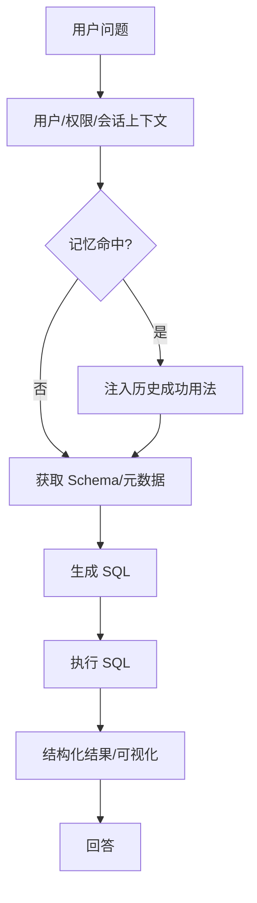

### 1.2 关键抽象速览（看懂这些就能读代码）

| 概念                | 负责什么                                 | 对应位置                                                  |
| ------------------- | ---------------------------------------- | --------------------------------------------------------- |
| `RequestContext`    | cookies/headers/metadata 等请求信息      | `src/vanna/core/user/request_context.py`                  |
| `UserResolver`      | 把请求解析成 `User`（含用户组）          | `src/vanna/core/user/resolver.py` + 示例中的实现          |
| `ConversationStore` | 会话存取与持久化                         | `src/vanna/core/storage/base.py`                          |
| `LlmService`        | 统一 LLM 调用（支持 stream）             | `src/vanna/core/llm/base.py` + `src/vanna/integrations/*` |
| `ToolRegistry`      | 工具注册、权限过滤、执行、审计、参数改写 | `src/vanna/core/registry.py`                              |
| `RunSqlTool`        | 执行 SQL 并输出 UI + 结果文件            | `src/vanna/tools/run_sql.py`                              |
| `AgentMemory`       | 记忆检索与保存（MemoryRAG）              | `src/vanna/tools/agent_memory.py`                         |
| `UiComponent`       | 流式 UI 协议（状态/任务/表格/卡片）      | `src/vanna/components/*`                                  |

### 1.3 为什么有两种 Agent：Tool Loop vs 状态图

**痛点：** 多阶段查询（查结构 → 生成 → 执行 → 修复 → 记忆）一旦复杂，线性代码会迅速膨胀。

**解决方案：** 同一套能力，两种编排方式：

- `Agent`：用“工具循环”跑完整流程，简单直接，适合工具少/流程线性的场景。
- `GraphAgent`：用“状态图”把阶段拆成节点，并用路由强约束流程，适合生产级 NL2SQL。

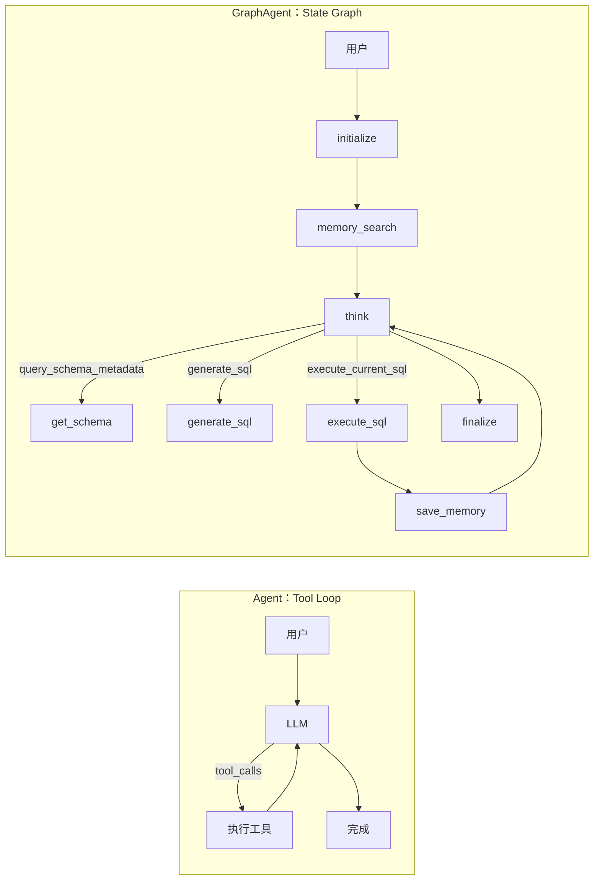

## 第二章. Vanna 整体架构（从“能跑”到“可上线”）

### 2.1 分层架构：谁负责什么

**痛点：** 组件太多，容易把“编排”“能力”“存储”“服务化”混成一锅。

**解决方案：** 按职责分层：服务层负责对外接口；编排层负责流程；能力层负责工具/LLM/数据库；数据层负责持久化。

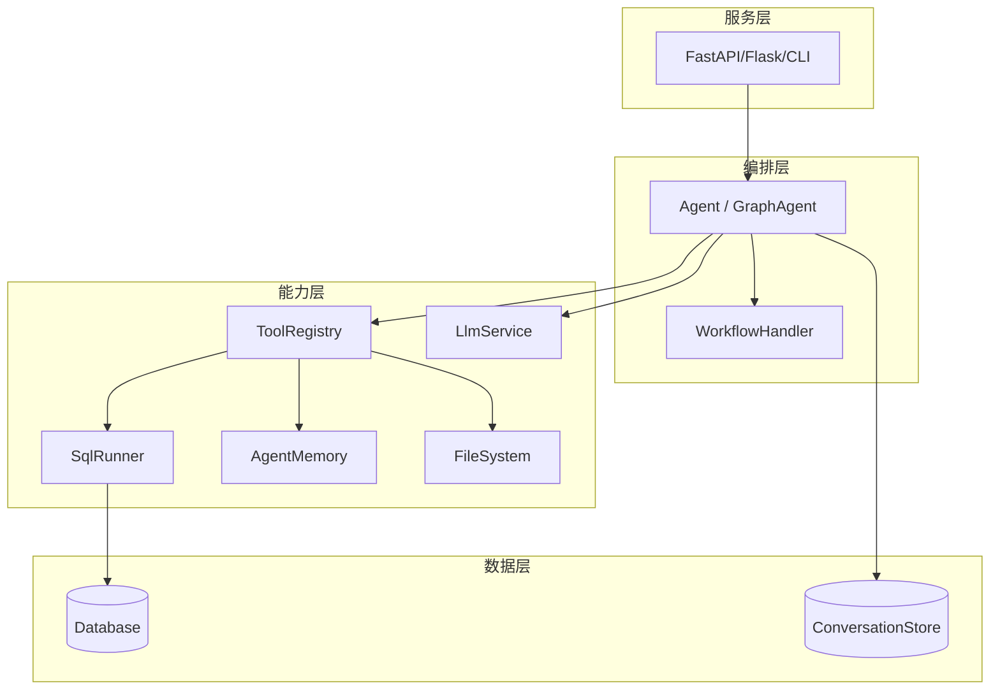

### 2.2 一次请求的端到端链路（谁先做什么）

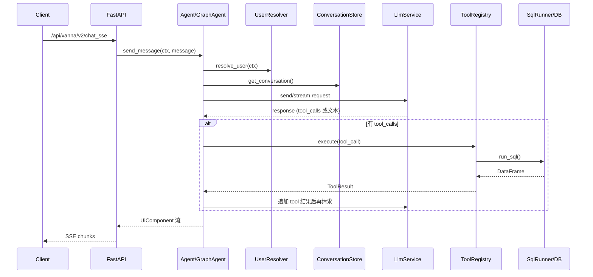

### 2.3 可扩展点（插拔式能力）

| 扩展点                  | 能解决什么                                    | 入口                         |
| ----------------------- | --------------------------------------------- | ---------------------------- |
| `WorkflowHandler`       | 命令/固定流程短路，不走 LLM                   | `workflow_handler=...`       |
| `LifecycleHook`         | before/after message/tool（配额、日志、脱敏） | `lifecycle_hooks=[...]`      |
| `LlmMiddleware`         | 统一改写请求/响应（缓存、路由、降级）         | `llm_middlewares=[...]`      |
| `ConversationFilter`    | 裁剪/去噪/脱敏历史消息                        | `conversation_filters=[...]` |
| `ToolContextEnricher`   | 给工具上下文注入租户、TraceId 等              | `context_enrichers=[...]`    |
| `LlmContextEnhancer`    | 把业务背景/记忆结果拼进 prompt 或 messages    | `llm_context_enhancer=...`   |
| `ObservabilityProvider` | span/metric（性能与链路追踪）                 | `observability_provider=...` |

## 第三章. 核心模块设计（工具、SQL、记忆、UI）

### 3.1 ToolRegistry：权限与安全的“总闸门”

**痛点：** 工具越多越乱：谁能用？参数安全吗？要不要记日志？

**解决方案：** 把“注册/权限/校验/改写/执行/审计”收口到 `ToolRegistry`（`src/vanna/core/registry.py`）。

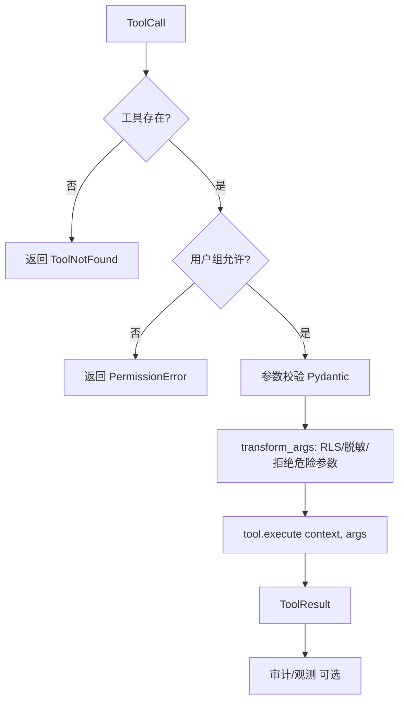

常用接口：

- `register_local_tool(tool, access_groups=[...])`
- `get_schemas(user)`：按用户组过滤可见工具
- `execute(tool_call, context)`：执行并返回 `ToolResult`
- `transform_args(...)`：实现 RLS/租户隔离/黑白名单

### 3.2 SQL 执行链路：SqlRunner + RunSqlTool + FileSystem

**痛点：**

- 你需要统一接入 SQLite/Postgres/MySQL…
- 结果既要给 LLM 用，又要给前端渲染，还要能被下游工具（可视化）复用。

**解决方案：**

- `SqlRunner` 只负责“把 SQL 跑出 DataFrame”（能力接口）。
- `RunSqlTool` 把 DataFrame 变成：UI 表格 + CSV 文件 + LLM 可读文本。

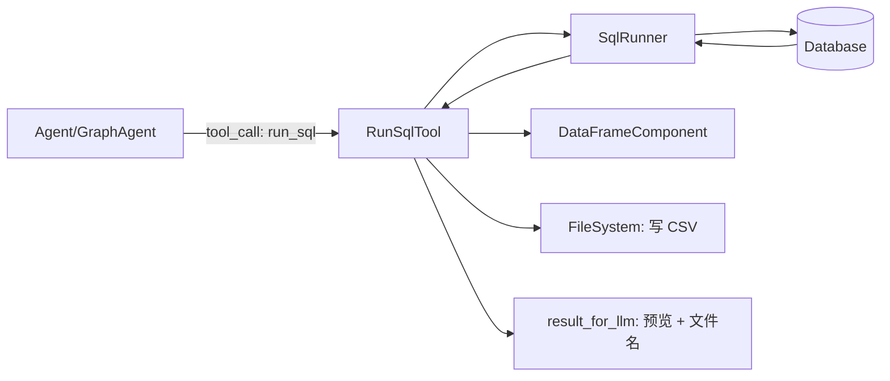

### 3.3 MemoryRAG：让系统越用越准

**痛点：** 同类问题反复出现，每次都从头生成 SQL，既慢又不稳定。

**解决方案：** 把“成功经验”结构化保存下来：

- `search_saved_correct_tool_uses`：检索相似问题的成功用法
- `save_question_tool_args`：SQL 跑通后保存“问题 + 工具 + 参数”

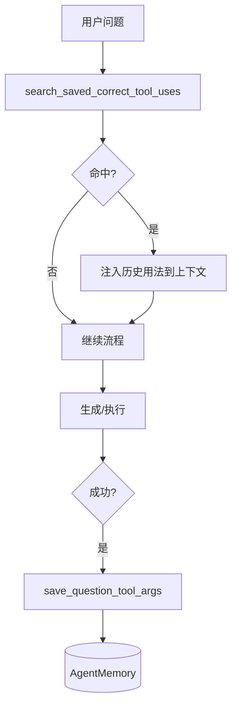

### 3.4 WorkflowHandler：进入 LLM 前的“确定性短路”

**痛点：** 例如 `/help`、`/reset`、固定报表、配额拦截，这些都不该浪费模型 token。

**解决方案：** 在 LLM 之前先跑 `workflow_handler.try_handle(...)`（`src/vanna/core/workflow/base.py`）。

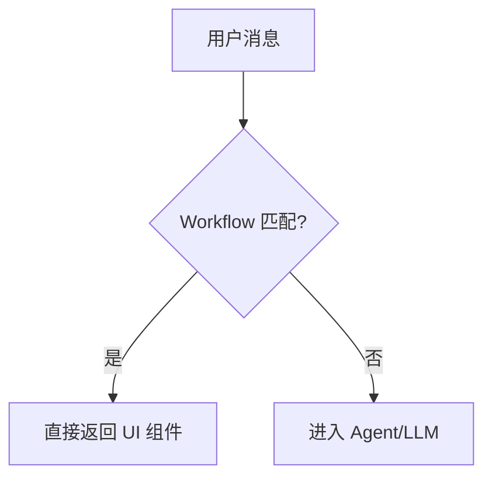

### 3.5 UI 组件与服务化：让用户“看见进度”

**痛点：** 查大表慢，用户以为卡死；工具执行过程也无法解释。

**解决方案：** 输出 `UiComponent` 流，前端按组件渲染：状态栏、任务列表、表格、图表、卡片。

FastAPI 路由见 `src/vanna/servers/fastapi/routes.py`：

| 接口                              | 说明               |
| --------------------------------- | ------------------ |
| `GET /`                           | 演示 UI            |
| `POST /api/vanna/v2/chat_sse`     | SSE 流式聊天       |
| `WS /api/vanna/v2/chat_websocket` | WebSocket 流式聊天 |
| `POST /api/vanna/v2/chat_poll`    | 轮询模式           |
| `GET /health`                     | 健康检查           |

## 第四章. Agent 模式（Tool Loop）：实现方式与致命缺陷

### 4.1 Tool Loop 的工作方式

**痛点：** 一段 while 循环里既要管会话、又要管工具、还要管协议细节，代码很快变“巨型函数”。

**解决方案：** 先记住它的基本形态：LLM 产出 tool_calls → 执行工具 → 把结果喂回 LLM → 直到不再调用工具。

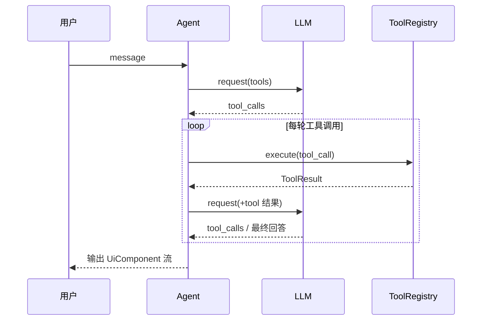

### 4.2 典型缺陷：为什么 NL2SQL 容易“跑偏”

| 缺陷                       | 典型表现                             | 后果                     |
| -------------------------- | ------------------------------------ | ------------------------ |
| **关键步骤难强制**         | 模型直接 `run_sql`，跳过查结构/校验  | 错表错字段、误查、不可控 |
| **多阶段边界不显式**       | 查结构/生成/执行/修复混在一锅 prompt | 调试困难，改一处影响全局 |
| **回环与纠错别扭**         | SQL 报错后“再问模型一轮”，不稳定     | 容易反复失败或乱修       |
| **安全边界更依赖 prompt**  | 只能在 prompt 里反复“不要做 X”       | 线上不可作为安全策略     |
| **中断恢复更容易踩协议坑** | 历史里残留未闭合 `tool_calls`        | OpenAI 兼容服务直接报错  |
| **可视化调试成本高**       | 逻辑集中在 `_send_message`           | 新人上手慢、维护成本高   |

### 4.3 典型翻车场景对比（Agent vs GraphAgent）

| 场景            | Agent 常见结果                       | GraphAgent 做法                                    |
| --------------- | ------------------------------------ | -------------------------------------------------- |
| 未知 schema     | 直接猜表字段，SQL 报错或查错         | 强制 `query_schema_metadata` → `get_schema`        |
| SQL 执行报错    | 可能重复执行错误 SQL 或胡乱修        | 可路由回 `generate_sql/think`，插入重试/校验更自然 |
| 断线/中断后继续 | 历史 `tool_calls` 未闭合导致协议错误 | `_sanitize_messages_for_llm` 清理未闭合 tool_calls |

### 4.4 什么时候仍然适合用 Agent

- 工具很少、流程线性（例如只查一个内部接口）
- PoC/快速验证（先跑通再谈工程化）
- 业务容忍“偶尔不稳”，且有人工兜底

## 第五章. GraphAgent 模式（状态图）：优势与实现方式

### 5.1 GraphAgent 的核心价值：把“应当如此”变成“只能如此”

**痛点：** 在 Agent 模式下，你只能“劝模型”先查 schema、失败要修复、不要越权。

**解决方案：** GraphAgent 用状态图拆阶段，用“虚拟工具 + 路由”把流程写死，让模型只负责表达意图。

### 5.2 状态图总览（GraphAgent 的主干流程）

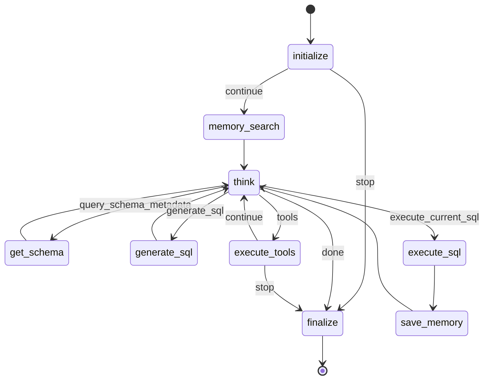

### 5.3 AgentState：一张“白板”贯穿全程

把一次请求的关键数据收敛在 `AgentState(TypedDict)`：

| 分组        | 关键字段（示例）                                                               |
| ----------- | ------------------------------------------------------------------------------ |
| 上下文      | `request_context` / `user` / `conversation_id` / `request_id` / `conversation` |
| UI 流式输出 | `ui_queue`                                                                     |
| LLM 交互    | `tool_schemas` / `system_prompt` / `messages` / `llm_response`                 |
| 执行控制    | `tool_iterations` / `tool_context`                                             |
| SQL 专用    | `schema_metadata` / `generated_sql` / `sql_result`                             |

### 5.4 虚拟工具：GraphAgent 的“强约束开关”

GraphAgent 在 `think` 节点里会：

- **隐藏真实 `run_sql`**（避免模型直接执行 SQL）
- **提供虚拟工具**让模型表达意图

| 虚拟工具                | 意图              | 路由到节点     | 节点里实际做什么                        |
| ----------------------- | ----------------- | -------------- | --------------------------------------- |
| `query_schema_metadata` | 我需要结构信息    | `get_schema`   | 使用真实 `run_sql` 执行元数据查询       |
| `generate_sql`          | 进入生成 SQL 阶段 | `generate_sql` | tools=None 强制输出纯 SQL               |
| `execute_current_sql`   | 执行当前 SQL      | `execute_sql`  | 使用真实 `run_sql` 执行 `generated_sql` |

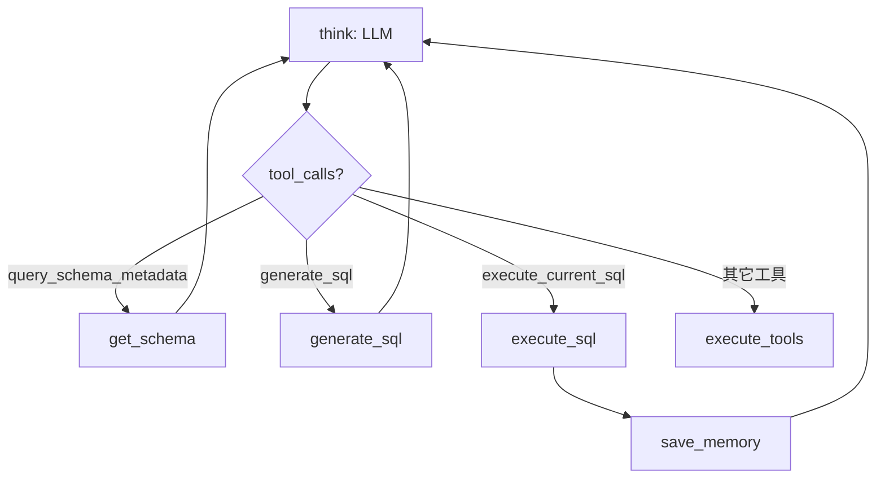

### 5.5 节点职责一览（读表更快）

| 节点            | 负责什么                              | 关键点                                          |
| --------------- | ------------------------------------- | ----------------------------------------------- |
| `initialize`    | 用户解析、会话加载、上下文/提示词准备 | 支持 Starter UI/Workflow 短路                   |
| `memory_search` | 检索相似成功用法                      | 命中后把结果注入 messages                       |
| `think`         | LLM 决策：下一步做什么                | 真实工具 + 虚拟工具；写入 assistant(tool_calls) |
| `get_schema`    | 执行结构查询并回写                    | 用 `tool_call_id` 闭合虚拟工具调用              |
| `generate_sql`  | 生成可执行 SQL                        | tools=None；输出 SQL 卡片                       |
| `execute_sql`   | 执行 SQL 并回写结果                   | 用 `tool_call_id` 闭合执行请求                  |
| `save_memory`   | 成功后保存“问题+SQL”                  | `save_question_tool_args`                       |
| `execute_tools` | 执行其它真实工具调用                  | 走 `ToolRegistry.execute`（权限/审计/校验）     |
| `finalize`      | 收尾与持久化                          | 状态栏/输入框复位，保存会话                     |

### 5.6 消息净化：让工具协议更抗中断

**痛点：** 历史里残留“assistant(tool_calls) 没有对应 tool 消息”，某些 OpenAI 兼容服务会直接报错。

**解决方案：** `_sanitize_messages_for_llm` 在发送前清理未闭合 `tool_calls`（保留文本内容）。

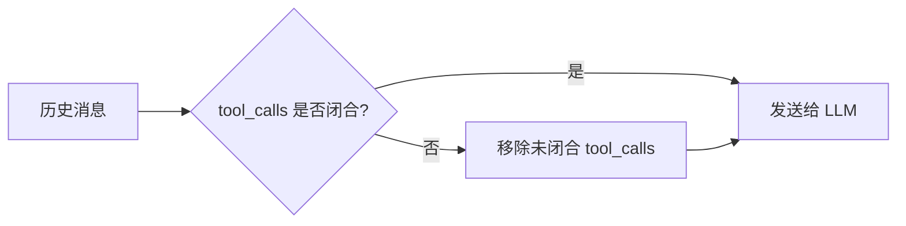

### 5.7 GraphAgent 如何解决 Agent 的缺陷

| Agent 痛点      | GraphAgent 对策                                         |
| --------------- | ------------------------------------------------------- |
| 关键步骤难强制  | 虚拟工具 + 路由强约束（先查结构再生成再执行）           |
| 多阶段边界不清  | 显式节点（每步职责单一）                                |
| 回环纠错别扭    | 天然支持回环/分支（按状态路由）                         |
| 安全依赖 prompt | 隐藏危险工具，框架掌控执行入口（结合 `transform_args`） |
| 中断恢复踩坑    | `_sanitize_messages_for_llm` 更稳                       |
| 排障困难        | 图结构 + 节点更新事件更容易定位                         |

## 第六章. 完整示例：SQLite 数据库助手（两套模式对照）

### 6.1 两套示例的共同装配

| 组件                         | 作用                            | 示例位置                                                                           |
| ---------------------------- | ------------------------------- | ---------------------------------------------------------------------------------- |
| `OpenAILlmService`           | LLM 调用（OpenAI 兼容）         | `src/vanna/integrations/openai/*`                                                  |
| `SqliteRunner`               | SQLite 执行器（SqlRunner 实现） | `src/vanna/integrations/sqlite/*`                                                  |
| `RunSqlTool`                 | 把 SQL 执行暴露成工具           | `src/vanna/tools/run_sql.py`                                                       |
| `ToolRegistry`               | 工具注册与权限控制              | `src/vanna/core/registry.py`                                                       |
| `DemoAgentMemory` + 记忆工具 | MemoryRAG                       | `src/vanna/integrations/local/agent_memory.py` + `src/vanna/tools/agent_memory.py` |
| `VannaFastAPIServer`         | 服务化                          | `src/vanna/servers/fastapi/app.py`                                                 |

### 6.2 关键差异（Agent vs GraphAgent）

| 维度                         | Agent 示例             | GraphAgent 示例                          |
| ---------------------------- | ---------------------- | ---------------------------------------- |
| Agent 类                     | `Agent`                | `GraphAgent`                             |
| 依赖                         | 不需要 `langgraph`     | 需要 `langgraph`                         |
| LLM 是否能直接看到 `run_sql` | 是                     | `think` 阶段隐藏，改用虚拟工具           |
| NL2SQL 流程                  | 更依赖 prompt/模型自觉 | 图驱动强约束（查结构 → 生成 → 执行）     |
| 记忆用法                     | 通过工具/增强器注入    | 显式节点 `memory_search` + `save_memory` |

### 6.3 运行命令

- `python -m vanna.examples openai_sqlite_example`
- `python -m vanna.examples graph_sqlite_example`

### 6.4 API 调用速览（SSE）

请求需要带 cookie（示例 `UserResolver` 使用 `vanna_email`）：

- `vanna_email=demo-user@example.com`

接口：`POST http://localhost:8000/api/vanna/v2/chat_sse`（body 为 `ChatRequest`：`message`/`conversation_id`/`metadata`）。

## 第七章. 最佳实践与常见坑

### 7.1 性能与稳定性

- **限制工具迭代**：`AgentConfig.max_tool_iterations` 防止无限调用工具。
- **裁剪历史**：用 `conversation_filters` 控制 token，避免长会话污染与超限。
- **缓存 schema/记忆**：GraphAgent 强制查结构，但可以用记忆/缓存减少重复。

### 7.2 安全（权限、RLS、只读）

- **最小权限**：`ToolRegistry.register_local_tool(..., access_groups=[...])`。
- **行级安全**：在 `ToolRegistry.transform_args` 里改写 SQL（加租户/部门过滤）。
- **只读连接**：数据库层面提供只读账号/只读库，避免写操作。

### 7.3 常见坑速查

| 现象                   | 常见原因                 | 处理建议                                        |
| ---------------------- | ------------------------ | ----------------------------------------------- |
| 缺 `OPENAI_API_KEY`    | 未配置 `.env` 或环境变量 | 参考第 0.2 节                                   |
| GraphAgent 导入失败    | 未安装 `langgraph`       | 安装 `pip install -e ".[fastapi,openai,graph]"` |
| 报 tool_calls 协议错误 | 历史未闭合 tool 响应     | GraphAgent 用净化；Agent 需确保闭合             |

## 总结

- 需要**快**：工具少、流程线性 → 先用 `Agent`。
- 需要**稳**：生产级 NL2SQL、阶段明确、强约束、可回环、可排障 → 优先 `GraphAgent`。
